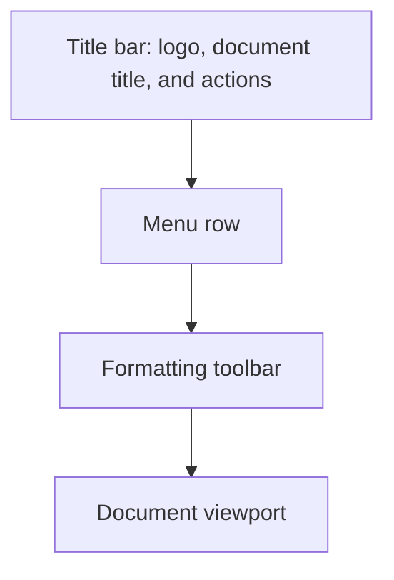

# Toolbar

Use root props to customize the packaged React editor. For a custom layout, compose the provider and toolbar components from `@docx-editor.dev/react`.

## Layout

The packaged editor places the title and menus above the formatting toolbar. Use title-bar slots for your logo and application actions.



## Customize the packaged editor

Pass title state and application actions through root props:

```tsx
import { useState } from 'react';
import { DocxEditor } from '@docx-editor.dev/react';
import '@docx-editor.dev/react/styles.css';

function App({ bytes }: { bytes: Uint8Array }) {
  const [title, setTitle] = useState('Untitled.docx');

  return (
    <DocxEditor
      document={bytes}
      title={title}
      onTitleChange={setTitle}
      renderTitleBarRight={() => <span>Draft</span>}
    />
  );
}
```

### Root toolbar props

| Prop | Type | Description |
| --- | --- | --- |
| `title` | `string` | Document title in the title bar. |
| `onTitleChange` | `(name: string) => void` | Receives document title edits. |
| `renderTitleBarLeft` | `() => ReactNode` | Custom content before the document title. |
| `renderTitleBarRight` | `() => ReactNode` | Custom actions after the document title. |
| `menu` | `boolean \| DocxEditorMenuProps` | Shows, hides, or customizes the menu row. |
| `chrome` | `boolean` | Shows or hides the packaged frame. Defaults to `true`. |

## Compose the toolbar

Place components under `DocxEditor.Root` to share the editor instance. Packaged compounds apply their own style scope. Use a `docx-editor` wrapper to scope custom controls and share theme tokens. Use `useChromeTranslate()` to supply labels for composed controls.

The custom button prevents a mouse press from moving focus away from the document:

```tsx
import { DocxEditor, useChromeTranslate, useEditorCommand } from '@docx-editor.dev/react';
import '@docx-editor.dev/react/styles.css';

function BoldButton() {
  const bold = useEditorCommand('text.bold');
  const t = useChromeTranslate();
  return (
    <button
      type="button"
      onMouseDown={(event) => event.preventDefault()}
      onClick={() => bold.execute()}
      disabled={!bold.isEnabled}
      aria-pressed={bold.isActive}
    >
      {t('formattingBar.bold')}
    </button>
  );
}

function EditorChrome() {
  const t = useChromeTranslate();
  return (
    <>
      <DocxEditor.Toolbar t={t} preset={false}>
        <BoldButton />
      </DocxEditor.Toolbar>
      <DocxEditor.Viewport>
        <DocxEditor.Navigation t={t} />
        <DocxEditor.Content />
        <DocxEditor.HyperLink />
        <DocxEditor.ContextMenu t={t} />
      </DocxEditor.Viewport>
    </>
  );
}

function MyEditor({ bytes }: { bytes: Uint8Array }) {
  return (
    <div className="docx-editor">
      <DocxEditor.Root document={bytes}>
        <EditorChrome />
      </DocxEditor.Root>
    </div>
  );
}
```

`DocxEditor.Root` owns the editor instance. `DocxEditor.Viewport` provides the scroll container, and `DocxEditor.Content` renders the document pages.

For more information, see [Customize the toolbar](site/content/guides/toolbar.mdx) and [React composition](site/content/react/composition.mdx).
