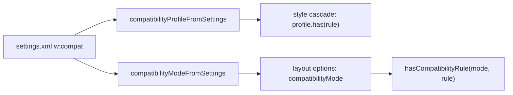

# Compatibility modes

A DOCX file declares the Word feature set it was saved with, and it can turn on legacy layout options. The layout engine reads both once, into a typed compatibility profile, and every layout branch that depends on them is a named rule in one registry. This page lists the modes, the options, and the rules, and explains how to add a rule.

The code lives in `packages/core/src/layout/compatibility/`:

- `compatibility-mode.ts` reads and classifies the mode declaration.
- `compatibility-settings.ts` catalogs every legacy option and Word compatibility setting, and reads them in one bounded walk.
- `compatibility-rules.ts` is the rule registry.
- `compatibility-profile.ts` combines the three into a `CompatibilityProfile`.

## Modes

The mode is a `w:compatSetting` in `settings.xml` with `w:name="compatibilityMode"` and `w:uri="http://schemas.microsoft.com/office/word"`. Its `w:val` is a decimal number.

| Value | Class | Feature set | Word object model name |
| --- | --- | --- | --- |
| None | `absent` | [MS-DOCX] names 12 the default | None |
| 11 | `word2003` | The binary format, [MS-DOC] | `wdWord2003` |
| 12 | `word2007` | ECMA-376 | `wdWord2007` |
| 13 | `unlisted` | Not defined by any Microsoft source | None |
| 14 | `word2010` | ISO/IEC 29500 and [MS-DOCX], without extensions added after Word 2010 | `wdWord2010` |
| 15 | `word2013` | ISO/IEC 29500 and every [MS-DOCX] extension | `wdWord2013` |
| 16 and above | `newer` | Not defined by any Microsoft source | None |

Word 2013 and later write 15. [MS-DOCX] covers Word 2007 through Word LTSC 2024 and documents no value above 15, and the `WdCompatibilityMode` enumeration ends at `wdWord2013 = 15`. Its `wdCurrent = 65535` is an object model alias for the running version, not a file value. Word 2010 ignores a declaration of 15.

The engine handles each declaration as follows:

- **Absent.** No declaration, or no settings part. Layout uses the `absent` class, and every rule treats it as 12, the [MS-DOCX] default.
- **Refused.** Two declarations, which is ambiguous, or a value that is not 1 to 4 digits or is below 11. Layout threads `undefined`, so mode rules read a refused declaration as `absent`. Only the `preserveExactLineBaseline` rule tells the two apart.
- **Known.** 11, 12, 14, or 15.
- **Unknown.** Any other bounded value. A value above 15 lays out as 15: every rule treats `newer` as `word2013`. The value 13 lays out with no mode rule.

Word 16 for Mac lays out a document without a declaration exactly as one that declares 12, and a document that declares 16 exactly as one that declares 15, in table and footnote probe documents. Declarations of 17, 99, and 9999 lay out as 15 in the table probes. Word reports a document that declares 13 as unreadable content and offers to recover it.

No source says that a mode implies a legacy option. Word writes each option it applies, so the engine reads only what the file states.

Sources:

- [[MS-DOCX] 2.3.5 compatibilityMode](https://learn.microsoft.com/en-us/openspecs/office_standards/ms-docx/90138c4d-eb18-4edc-aa6c-dfb799cb1d0d)
- [[MS-DOCX] Appendix B: Product Behavior](https://learn.microsoft.com/en-us/openspecs/office_standards/ms-docx/11e00e62-c73a-4371-93d5-cddcc63fcbf0), note 13
- [WdCompatibilityMode enumeration (Word)](https://learn.microsoft.com/en-us/office/vba/api/word.wdcompatibilitymode)
- ECMA-376 Part 1 §17.15.3, Language Compatibility Settings, and ECMA-376 Part 4 §14.8.3, Compatibility Settings. Run `bun run reference:fetch` to download both.

## How layout reads the profile



Layout threads the mode as a number (`compatibilityMode: number | undefined`) through its options. That value is public API, and cache keys include it, so it stays a number. Code that branches on it calls `hasCompatibilityRule(compatibilityMode, 'ruleName')`. The style cascade reads the options through `compatibilityProfileFromSettings(settingsRoot).has('ruleName')` and folds the rules it turns on into its cache token.

The `docx/no-raw-compatibility-mode` lint rule rejects the common raw forms in library code outside the compatibility module: a comparison of `compatibilityMode`, or of a local `mode` alias, with a number literal; `includes` of `compatibilityMode`, or of `mode` in a list of numbers; and `switch (compatibilityMode)`. Tests are exempt, because they state modes as fixtures. The rule cannot see every form, such as a comparison with a named constant, so reviewers still check new branches.

## Rules

Each rule has a name, the modes or options it applies in, the behavior, the specification section of the construct it acts on, the files that consult it, and the tests that fail when it is inverted. No published specification says which modes change these layout behaviors, so the pinning tests are the evidence for the mode dependence.

<!-- compatibility-rules:start -->

| Rule | Applies when | Behavior | Source | Consulted by | Pinned by |
| --- | --- | --- | --- | --- | --- |
| `adjustLineHeightInTable` | `w:adjustLineHeightInTable` is on (any value but `0`, `false`, `off`) | Paragraphs in table cells snap to the section line grid | ECMA-376 Part 1 §17.15.3.1 | `layout/style-cascade.ts` | `layout/__tests__/line-grid.test.ts` |
| `anchorOnlyParagraphSeeding` | Mode is `word2013`, `newer` | Seed the pages of consecutive anchor-only paragraphs before later bands wrap earlier text | ECMA-376 Part 1 §20.4.2.3 anchor | `layout/drawing-exclusion-passes.ts` | `layout/__tests__/empty-anchor-pagination.test.ts` |
| `anchorOnlyParagraphWrapExclusion` | Mode is `word2013`, `newer` | An anchor-only paragraph wraps around its own anchors before it is placed | ECMA-376 Part 1 §20.4.2.3 anchor | `layout/empty-anchor-exclusion.ts` | `layout/__tests__/empty-anchor-pagination.test.ts` |
| `anchorsLayOutInCell` | Mode is `word2013`, `newer` | Every anchored object in a table cell lays out in its cell; none is out of cell | ECMA-376 Part 1 §20.4.2.3 anchor (layoutInCell) | `layout/cell-anchor-layout.ts`, `layout/table-out-of-cell-floats.ts` | `layout/__tests__/layout-in-cell-exclusion.test.ts`, `layout/__tests__/table-out-of-cell-floats.test.ts` |
| `doNotBreakWrappedTables` | `w:doNotBreakWrappedTables` is on; only its first occurrence in the first `w:compat` counts | A floating table that fits a full page does not break across pages | ECMA-376 Part 4 §14.8.3.10 | `layout/style-cascade.ts` | `layout/__tests__/floating-table-page-break.test.ts` |
| `fixedParagraphSpacing` | `w:doNotUseHTMLParagraphAutoSpacing` is on; only its first occurrence in the first `w:compat` counts | Adjacent paragraph spacing adds up, and automatic spacing is a fixed 5pt before and 10pt after | ECMA-376 Part 4 §14.8.3.15 | `layout/style-cascade.ts` | `layout/__tests__/adjacent-paragraph-spacing.test.ts` |
| `fixedTableContentEdgeOrigin` | Mode is `absent`, `word2003`, `word2007`, `word2010` | A collapsed fixed left table aligns its leading cell content edge with the text column | ECMA-376 Part 1 §17.4.52 tblLayout | `layout/legacy-fixed-table-content.ts` | `layout/__tests__/legacy-fixed-table-content.test.ts`, `layout/__tests__/modern-edge-aligned-side-rules.test.ts` |
| `floatingTableContentOrigin` | Mode is `absent`, `word2003`, `word2007`, `word2010` | A floating table with a numeric text anchor positions its first cell content, not its outer edge | ECMA-376 Part 1 §17.4.57 tblpPr | `layout/table-origin.ts` | `layout/__tests__/legacy-table-float-origin.test.ts` |
| `headerFooterAnchorsWrapText` | Mode is `word2013`, `newer` | Header and footer text outside tables wraps around anchored objects | ECMA-376 Part 1 §20.4.2.3 anchor | `layout/hf-layout.ts` | `output/__tests__/header-margin-anchor.test.ts` |
| `headerRowsKeepWithBody` | Mode is `word2013`, `newer` | Header rows keep with the opening body rows; the table starts on the next page if both do not fit | ECMA-376 Part 1 §17.4.49 tblHeader | `layout/table-flow-pagination.ts`, `layout/table-row-keeps.ts` | `layout/__tests__/table-row-keep-chains.test.ts`, `layout/__tests__/table-row-keep-next.test.ts` |
| `ignoreIndentAsNumberingTabStop` | `w:doNotUseIndentAsNumberingTabStop` is on; only its first occurrence in the first `w:compat` counts | A numbering suffix tab ignores the hanging indent as a tab stop | ECMA-376 Part 4 §14.8.3.16 | `layout/style-cascade.ts` | `layout/__tests__/list-numbering-tab-stop.test.ts` |
| `justifiedSpaceShrink` | Mode is `word2013`, `newer` | Justified lines may shrink spaces to fit one more word | ECMA-376 Part 1 §17.3.1.13 jc | `layout/paragraph-break-request.ts` | `layout/__tests__/paragraph-space-shrink.test.ts` |
| `keepNextGivesTailLines` | Mode is `word2013`, `newer` | A keep-with-next paragraph that fits whole gives its last lines to the next page with its successor | ECMA-376 Part 1 §17.3.1.15 keepNext | `layout/pagination-keeps.ts` | `layout/__tests__/keep-next-natural-split.test.ts` |
| `legacyPercentTableContentWidth` | Mode is `absent`, `word2003`, `word2007`, `word2010` | A top-level percent-width table resolves its width against the legacy content width | ECMA-376 Part 1 §17.4.63 tblW | `layout/legacy-table-content-width.ts` | `layout/__tests__/legacy-table-content-width.test.ts` |
| `legacySharedGridLineSideRules` | Mode is `absent`, `word2003`, `word2007`, `word2010` | Collapsed side rules center on shared grid lines for every simple top-level table | ECMA-376 Part 1 §17.4.38 tblBorders | `layout/legacy-table-side-rules.ts` | `layout/__tests__/legacy-table-side-rules.test.ts` |
| `modernGridLineSideRules` | Mode is `word2013`, `newer` | Side rules center on grid lines only for covered dxa/auto width shapes; edge-aligned grids move by half a rule | ECMA-376 Part 1 §17.4.38 tblBorders | `layout/legacy-table-side-rules.ts` | `layout/__tests__/modern-edge-aligned-side-rules.test.ts`, `layout/__tests__/legacy-table-side-rules.test.ts` |
| `noteTableCellKeeps` | Mode is `word2013`, `newer` | Note reference bands in table rows honor cell widow control and keep-lines cuts | ECMA-376 Part 1 §17.11 Footnotes and Endnotes | `layout/note-fragment-geometry.ts`, `layout/note-table-row-cut.ts` | `layout/__tests__/footnote-table-row-bands.test.ts` |
| `optionalLigatures` | `enableOpenTypeFeatures` is on; without it, the mode is `word2013` or `newer`. A duplicated `enableOpenTypeFeatures` turns the rule off | Optional OpenType ligatures apply as run properties ask | [MS-DOCX] enableOpenTypeFeatures | `layout/style-cascade.ts` | `layout/__tests__/run-ligatures.test.ts` |
| `preserveExactLineBaseline` | `w:noExtraLineSpacing` is on, the mode is `absent`, `word2003`, `word2007` or `word2010`, and the mode declaration is not refused | An exact-height line keeps the face baseline instead of centering content | ECMA-376 Part 4 §14.8.3.28 | `layout/style-cascade.ts` | `layout/__tests__/exact-line-baseline.test.ts` |
| `rowPageBreakYieldsToKeep` | Mode is `word2013`, `newer` | A row with a page break does not start a page when the row before it keeps with it | ECMA-376 Part 1 §17.3.1.15 keepNext | `layout/table-row-keeps.ts` | `layout/__tests__/table-row-keep-chains.test.ts` |
| `strictTableStyleHierarchy` | `overrideTableStyleFontSizeAndJustification` is on (`1`, `true` or `on`) | Table style font size and justification apply over the default paragraph style | [MS-DOCX] 2.3.1 overrideTableStyleFontSizeAndJustification | `layout/style-cascade.ts` | `layout/__tests__/table-style-compatibility.test.ts` |
| `tableParagraphWidowControl` | Mode is `word2013`, `newer` | Paragraphs that split inside table cells apply widow and orphan control | ECMA-376 Part 1 §17.3.1.44 widowControl | `layout/semantic-table-layout.ts` | `layout/__tests__/table-paragraph-widows.test.ts` |
| `vMergeTextMovesPastHeadRow` | Mode is `word2013`, `newer` | Merged cell text moves whole into the next row when the head row cannot hold it | ECMA-376 Part 1 §17.4.84 vMerge | `layout/table-vmerge-boundary.ts` | `layout/__tests__/table-vmerge-head-row-boundary.test.ts` |

<!-- compatibility-rules:end -->

## Options

The profile reads every cataloged option, including options no rule consults yet. A reading has two parts:

- **Repeat.** `last` takes the last occurrence in any `w:compat`. `first-compat-first` takes only the first occurrence in the first `w:compat`. `refuse-duplicates` makes a repeated setting ambiguous.
- **Value.** `on-or-missing` is on for a missing value or `1`, `true`, `on`. `not-off` is off only for `0`, `false`, `off`. `explicit-on` is on only for `1`, `true`, `on`.

The readings of consulted options keep the behavior of the readers they replaced. They are not uniform.

<!-- compatibility-options:start -->

### Legacy options

| Option | Source | Meaning | Reading | Rules |
| --- | --- | --- | --- | --- |
| `w:adjustLineHeightInTable` | ECMA-376 Part 1 §17.15.3.1 | Add document grid line pitch to lines in table cells | `last`, `not-off` | `adjustLineHeightInTable` |
| `w:applyBreakingRules` | ECMA-376 Part 1 §17.15.3.2 | Use legacy Ethiopic and Amharic line breaking rules | `last`, `on-or-missing` | None |
| `w:balanceSingleByteDoubleByteWidth` | ECMA-376 Part 1 §17.15.3.3 | Balance single byte and double byte characters | `last`, `on-or-missing` | None |
| `w:doNotExpandShiftReturn` | ECMA-376 Part 1 §17.15.3.5 | Do not justify lines ending in a soft line break | `last`, `on-or-missing` | None |
| `w:doNotLeaveBackslashAlone` | ECMA-376 Part 1 §17.15.3.6 | Display backslash as yen sign | `last`, `on-or-missing` | None |
| `w:spaceForUL` | ECMA-376 Part 1 §17.15.3.7 | Add space below baseline for underlined East Asian text | `last`, `on-or-missing` | None |
| `w:ulTrailSpace` | ECMA-376 Part 1 §17.15.3.8 | Underline all trailing spaces | `last`, `on-or-missing` | None |
| `w:alignTablesRowByRow` | ECMA-376 Part 4 §14.8.3.1 | Align table rows independently | `last`, `on-or-missing` | None |
| `w:allowSpaceOfSameStyleInTable` | ECMA-376 Part 4 §14.8.3.2 | Allow contextual spacing of paragraphs in tables | `last`, `on-or-missing` | None |
| `w:autofitToFirstFixedWidthCell` | ECMA-376 Part 4 §14.8.3.3 | Allow table columns to exceed preferred widths of constituent cells | `last`, `on-or-missing` | None |
| `w:autoSpaceLikeWord95` | ECMA-376 Part 4 §14.8.3.4 | Adjust text spacing for specific Unicode ranges | `last`, `on-or-missing` | None |
| `w:cachedColBalance` | ECMA-376 Part 4 §14.8.3.5 | Use cached paragraph information for column balancing | `last`, `on-or-missing` | None |
| `w:convMailMergeEsc` | ECMA-376 Part 4 §14.8.3.6 | Treat backslash quotation delimiter as two quotation marks | `last`, `on-or-missing` | None |
| `w:displayHangulFixedWidth` | ECMA-376 Part 4 §14.8.3.7 | Always use fixed width for Hangul characters | `last`, `on-or-missing` | None |
| `w:doNotAutofitConstrainedTables` | ECMA-376 Part 4 §14.8.3.8 | Do not AutoFit tables to fit next to wrapped objects | `last`, `on-or-missing` | None |
| `w:doNotBreakConstrainedForcedTable` | ECMA-376 Part 4 §14.8.3.9 | Do not break table rows around floating tables | `last`, `on-or-missing` | None |
| `w:doNotBreakWrappedTables` | ECMA-376 Part 4 §14.8.3.10 | Do not allow floating tables to break across pages | `first-compat-first`, `on-or-missing` | `doNotBreakWrappedTables` |
| `w:doNotSnapToGridInCell` | ECMA-376 Part 4 §14.8.3.11 | Do not snap to document grid in table cells with objects | `last`, `on-or-missing` | None |
| `w:doNotSuppressIndentation` | ECMA-376 Part 4 §14.8.3.12 | Do not ignore floating objects when calculating paragraph indentation | `last`, `on-or-missing` | None |
| `w:doNotSuppressParagraphBorders` | ECMA-376 Part 4 §14.8.3.13 | Do not suppress paragraph borders next to frames | `last`, `on-or-missing` | None |
| `w:doNotUseEastAsianBreakRules` | ECMA-376 Part 4 §14.8.3.14 | Do not compress compressible characters when using document grid | `last`, `on-or-missing` | None |
| `w:doNotUseHTMLParagraphAutoSpacing` | ECMA-376 Part 4 §14.8.3.15 | Use fixed paragraph spacing for HTML auto setting | `first-compat-first`, `on-or-missing` | `fixedParagraphSpacing` |
| `w:doNotUseIndentAsNumberingTabStop` | ECMA-376 Part 4 §14.8.3.16 | Ignore hanging indent when creating tab stop after numbering | `first-compat-first`, `on-or-missing` | `ignoreIndentAsNumberingTabStop` |
| `w:doNotVertAlignCellWithSp` | ECMA-376 Part 4 §14.8.3.17 | Do not vertically align cells containing floating objects | `last`, `on-or-missing` | None |
| `w:doNotVertAlignInTxbx` | ECMA-376 Part 4 §14.8.3.18 | Ignore vertical alignment in text boxes | `last`, `on-or-missing` | None |
| `w:doNotWrapTextWithPunct` | ECMA-376 Part 4 §14.8.3.19 | Do not allow hanging punctuation with character grid | `last`, `on-or-missing` | None |
| `w:footnoteLayoutLikeWW8` | ECMA-376 Part 4 §14.8.3.20 | Ignore page break from continuous section break | `last`, `on-or-missing` | None |
| `w:forgetLastTabAlignment` | ECMA-376 Part 4 §14.8.3.21 | Ignore width of last tab stop when aligning paragraph if it is not left aligned | `last`, `on-or-missing` | None |
| `w:growAutofit` | ECMA-376 Part 4 §14.8.3.22 | Allow tables to AutoFit into page margins | `last`, `on-or-missing` | None |
| `w:layoutRawTableWidth` | ECMA-376 Part 4 §14.8.3.23 | Ignore space before table when deciding if table should wrap floating object | `last`, `on-or-missing` | None |
| `w:layoutTableRowsApart` | ECMA-376 Part 4 §14.8.3.24 | Allow table rows to wrap inline objects independently | `last`, `on-or-missing` | None |
| `w:lineWrapLikeWord6` | ECMA-376 Part 4 §14.8.3.25 | Ignore compression of full-width punctuation ending a line | `last`, `on-or-missing` | None |
| `w:mwSmallCaps` | ECMA-376 Part 4 §14.8.3.26 | Use specific small caps algorithm | `last`, `on-or-missing` | None |
| `w:noColumnBalance` | ECMA-376 Part 4 §14.8.3.27 | Do not balance text columns within a section | `last`, `on-or-missing` | None |
| `w:noExtraLineSpacing` | ECMA-376 Part 4 §14.8.3.28 | Do not center content on lines with exact line height | `last`, `on-or-missing` | `preserveExactLineBaseline` |
| `w:noLeading` | ECMA-376 Part 4 §14.8.3.29 | Do not add leading between lines of text | `last`, `on-or-missing` | None |
| `w:noSpaceRaiseLower` | ECMA-376 Part 4 §14.8.3.30 | Do not increase line height for raised or lowered text | `last`, `on-or-missing` | None |
| `w:noTabHangInd` | ECMA-376 Part 4 §14.8.3.31 | Do not create custom tab stop for hanging indent | `last`, `on-or-missing` | None |
| `w:printBodyTextBeforeHeader` | ECMA-376 Part 4 §14.8.3.32 | Print body text before header and footer contents | `last`, `on-or-missing` | None |
| `w:printColBlack` | ECMA-376 Part 4 §14.8.3.33 | Print colors as black and white without dithering | `last`, `on-or-missing` | None |
| `w:selectFldWithFirstOrLastChar` | ECMA-376 Part 4 §14.8.3.34 | Select field when first or last character is selected | `last`, `on-or-missing` | None |
| `w:shapeLayoutLikeWW8` | ECMA-376 Part 4 §14.8.3.35 | Ignore text wrapping around objects at bottom of page | `last`, `on-or-missing` | None |
| `w:showBreaksInFrames` | ECMA-376 Part 4 §14.8.3.36 | Display page and column breaks present in frames | `last`, `on-or-missing` | None |
| `w:spacingInWholePoints` | ECMA-376 Part 4 §14.8.3.37 | Only expand or condense text by whole points | `last`, `on-or-missing` | None |
| `w:splitPgBreakAndParaMark` | ECMA-376 Part 4 §14.8.3.38 | Always move paragraph mark to page after a page break | `last`, `on-or-missing` | None |
| `w:subFontBySize` | ECMA-376 Part 4 §14.8.3.39 | Require exact size during font substitution | `last`, `on-or-missing` | None |
| `w:suppressBottomSpacing` | ECMA-376 Part 4 §14.8.3.40 | Ignore exact line height for last line on page | `last`, `on-or-missing` | None |
| `w:suppressSpacingAtTopOfPage` | ECMA-376 Part 4 §14.8.3.41 | Ignore minimum line height for first line on page | `last`, `on-or-missing` | None |
| `w:suppressSpBfAfterPgBrk` | ECMA-376 Part 4 §14.8.3.42 | Do not use space before on first line after a page break | `last`, `on-or-missing` | None |
| `w:suppressTopSpacing` | ECMA-376 Part 4 §14.8.3.43 | Ignore minimum and exact line height for first line on page | `last`, `on-or-missing` | None |
| `w:suppressTopSpacingWP` | ECMA-376 Part 4 §14.8.3.44 | Use static text leading | `last`, `on-or-missing` | None |
| `w:swapBordersFacingPages` | ECMA-376 Part 4 §14.8.3.45 | Swap paragraph borders on odd numbered pages | `last`, `on-or-missing` | None |
| `w:truncateFontHeightsLikeWP6` | ECMA-376 Part 4 §14.8.3.46 | Use truncated integer division for font calculation | `last`, `on-or-missing` | None |
| `w:underlineTabInNumList` | ECMA-376 Part 4 §14.8.3.47 | Underline following character following numbering | `last`, `on-or-missing` | None |
| `w:useAltKinsokuLineBreakRules` | ECMA-376 Part 4 §14.8.3.48 | Use alternate set of East Asian line breaking rules | `last`, `on-or-missing` | None |
| `w:useAnsiKerningPairs` | ECMA-376 Part 4 §14.8.3.49 | Use ANSI kerning pairs from fonts | `last`, `on-or-missing` | None |
| `w:useFELayout` | ECMA-376 Part 4 §14.8.3.50 | Do not bypass East Asian and complex script layout code | `last`, `on-or-missing` | None |
| `w:useNormalStyleForList` | ECMA-376 Part 4 §14.8.3.51 | Do not automatically apply list paragraph style to bulleted or numbered text | `last`, `on-or-missing` | None |
| `w:usePrinterMetrics` | ECMA-376 Part 4 §14.8.3.52 | Use printer metrics to display documents | `last`, `on-or-missing` | None |
| `w:useSingleBorderforContiguousCells` | ECMA-376 Part 4 §14.8.3.53 | Use simplified rules for table border conflicts | `last`, `on-or-missing` | None |
| `w:useWord2002TableStyleRules` | ECMA-376 Part 4 §14.8.3.54 | Display top border of conditional columns with Word 2002 rules | `last`, `on-or-missing` | None |
| `w:useWord97LineBreakRules` | ECMA-376 Part 4 §14.8.3.55 | Use Word 97 inter-character spacing rules | `last`, `on-or-missing` | None |
| `w:wpJustification` | ECMA-376 Part 4 §14.8.3.56 | Fit to expanded width when performing full justification | `last`, `on-or-missing` | None |
| `w:wpSpaceWidth` | ECMA-376 Part 4 §14.8.3.57 | Use specific space width | `last`, `on-or-missing` | None |
| `w:wrapTrailSpaces` | ECMA-376 Part 4 §14.8.3.58 | Line wrap trailing spaces | `last`, `on-or-missing` | None |

### Word compatibility settings

| Setting | Source | Meaning | Reading | Rules |
| --- | --- | --- | --- | --- |
| `overrideTableStyleFontSizeAndJustification` | [MS-DOCX] 2.3.1 overrideTableStyleFontSizeAndJustification | Apply the table style font size and justification over the default paragraph style | `last`, `explicit-on` | `strictTableStyleHierarchy` |
| `enableOpenTypeFeatures` | [MS-DOCX] enableOpenTypeFeatures | Enable OpenType ligatures and other font features | `refuse-duplicates`, `explicit-on` | `optionalLigatures` |
| `doNotFlipMirrorIndents` | [MS-DOCX] 2.3.2 doNotFlipMirrorIndents | Do not swap mirrored paragraph indents | `refuse-duplicates`, `explicit-on` | None |
| `differentiateMultirowTableHeaders` | [MS-DOCX] 2.3.4 differentiateMultirowTableHeaders | Apply header-row conditional formatting to each row of a multi-row header | `refuse-duplicates`, `explicit-on` | None |
| `allowTextAfterFloatingTableBreak` | [MS-DOCX] 2.3.6 allowTextAfterFloatingTableBreak | Let content after a floating table that breaks across pages share its pages | `refuse-duplicates`, `explicit-on` | None |
| `allowHyphenationAtTrackBottom` | [MS-DOCX] 2.3.7 allowHyphenationAtTrackBottom | Allow a hyphenated word to end a page or column | `refuse-duplicates`, `explicit-on` | None |
| `useWord2013TrackBottomHyphenation` | [MS-DOCX] 2.3.8 useWord2013TrackBottomHyphenation | Move the whole line of a hyphenated word that ends a page or column | `refuse-duplicates`, `explicit-on` | None |

<!-- compatibility-options:end -->

## Add a rule

1. Add the rule to `MODE_COMPATIBILITY_RULES` or `PROFILE_COMPATIBILITY_RULES` in `compatibility-rules.ts`. Give it the mode classes or the condition, a one-line behavior, the specification section of the construct, and the tests that pin it.
1. If the rule reads an option that is not cataloged, add the option to `compatibility-settings.ts` with its specification section.
1. Branch on the rule with `hasCompatibilityRule(compatibilityMode, 'ruleName')`, or with `profile.has('ruleName')` where you have the parsed settings.
1. Add the rule to `MODE_MATRIX` or `PROFILE_MATRIX` in `packages/core/src/layout/__tests__/compatibility-rules.test.ts`.
1. Give `absent` the same answer as `word2007`, and `newer` the same answer as `word2013`. The matrix test fails otherwise.
1. Regenerate the tables on this page:

   ```bash
   UPDATE_COMPATIBILITY_DOCS=1 bun test packages/core/src/layout/__tests__/compatibility-rules.test.ts
   ```

1. If the rule changes what a cache reuses, make sure the producer key covers it. Rules evaluated over the threaded mode are covered by keys that include `compatibilityMode`. Profile rules are covered by the style cascade's cache token.
