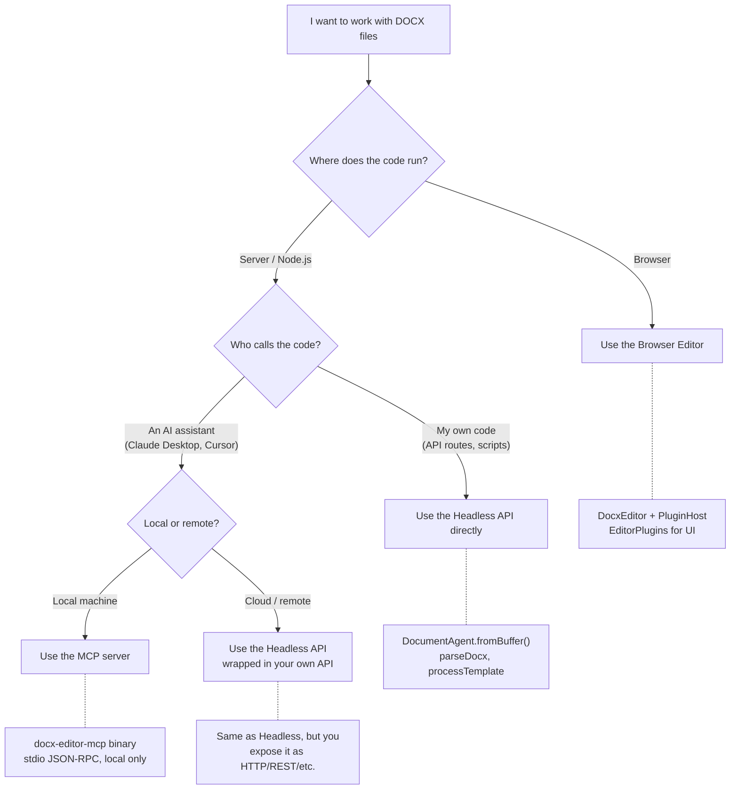
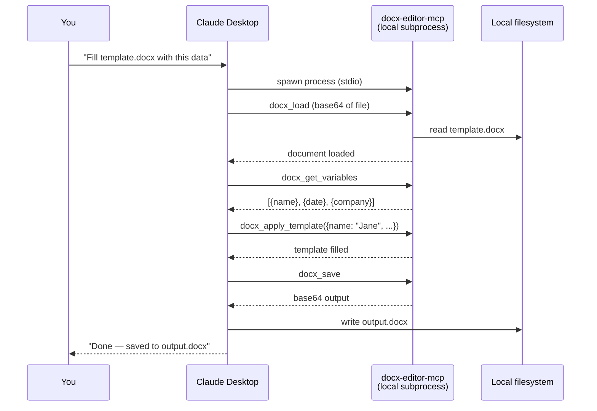

# CorePlugin & MCP Integration

## Architecture: Three Things in One Package

The `@eigenpal/docx-js-editor` package ships three independent pieces:

```
┌─────────────────────────────────────────────────────────┐
│  npm install @eigenpal/docx-js-editor                   │
│                                                         │
│  1. Browser Editor (React)        src/index.ts          │
│     DocxEditor, PluginHost, EditorPlugins               │
│     → Runs in the browser, needs DOM                    │
│                                                         │
│  2. Headless API (Node.js)        src/headless.ts       │
│     DocumentAgent, parseDocx, pluginRegistry            │
│     → Runs in Node.js, no DOM needed                    │
│                                                         │
│  3. MCP CLI (Node.js)             dist/mcp-cli.js       │
│     docx-editor-mcp binary                              │
│     → Standalone process, Claude Desktop connects to it │
└─────────────────────────────────────────────────────────┘
```

**The MCP server is NOT part of the browser editor.** It's a separate Node.js process that Claude Desktop (or any MCP client) spawns as a local subprocess. It uses the headless API to manipulate DOCX files over stdio JSON-RPC.

The browser editor and MCP server never talk to each other. They share the same `Document` model and parsers, but run in completely different processes.

## Deployment Scenarios

### Which piece do I use?



### Next.js app: use the Headless API, not MCP

If you deploy a Next.js app and want server-side document processing, **import the headless API directly** in your API routes. MCP adds no value here — it's an indirection layer for AI tool discovery that you don't need when you're writing the code yourself.

```ts
// app/api/fill-template/route.ts
import { processTemplate } from '@eigenpal/docx-js-editor/headless';

export async function POST(req: Request) {
  const formData = await req.formData();
  const file = formData.get('file') as File;
  const variables = JSON.parse(formData.get('variables') as string);

  const buffer = await file.arrayBuffer();
  const filled = await processTemplate(buffer, variables);

  return new Response(filled, {
    headers: {
      'Content-Type': 'application/vnd.openxmlformats-officedocument.wordprocessingml.document',
    },
  });
}
```

### Local AI workflow: use MCP

MCP is for **local development** — Claude Desktop or Cursor spawns `docx-editor-mcp` as a subprocess on your machine and manipulates files on your local disk.



### What does NOT work

- **Claude Code connecting to your cloud app** — MCP is stdio-based (stdin/stdout). There's no HTTP transport. Claude can't reach into a remote server.
- **Remote AI editing a browser session** — the MCP server and browser editor are separate processes that don't communicate.
- **MCP as a production API** — it's designed for local tool discovery, not as a scalable HTTP service.

For production server-side AI integration, wrap the headless API in your own HTTP endpoints and call them from your AI agent.

## Where CorePlugin Fits

CorePlugins bridge both the headless API and the MCP server:

```
CorePlugin
  ├── commandHandlers     → used by DocumentAgent (headless scripts, API routes)
  └── mcpTools            → collected by MCP server (local AI subprocess)
```

- `commandHandlers` are pure functions: `(Document, Command) → Document`. Used when you call `DocumentAgent` programmatically.
- `mcpTools` are tool definitions that the MCP server exposes over stdio. Used when Claude Desktop asks "what tools do you have?" and then calls them.

You don't need MCP to use CorePlugins. If you're writing API routes or Node.js scripts, `commandHandlers` alone are useful. MCP tools are only relevant if you want a local AI assistant to discover and call them.

## When to Use CorePlugin

Use a CorePlugin when you need:

- **Headless document manipulation** — Node.js scripts or API routes that transform DOCX files
- **Local AI integration** — tools callable by Claude Desktop or Cursor on your machine
- **Custom DocumentAgent commands** — extending the agent with domain-specific operations

If you need UI panels, overlays, or ProseMirror decorations, use an [EditorPlugin](./editor-plugins.md) instead. A single feature can use both (see the docxtemplater plugin).

## CorePlugin Interface

```ts
interface CorePlugin {
  id: string;
  name: string;
  version?: string;
  description?: string;
  commandHandlers?: Record<string, CommandHandler>;
  mcpTools?: McpToolDefinition[];
  initialize?: () => void | Promise<void>;
  destroy?: () => void | Promise<void>;
  dependencies?: string[];
}
```

### Fields

| Field             | Required | Description                                  |
| ----------------- | -------- | -------------------------------------------- |
| `id`              | Yes      | Unique identifier                            |
| `name`            | Yes      | Human-readable name                          |
| `version`         | No       | Semver version string                        |
| `description`     | No       | Short description                            |
| `commandHandlers` | No       | Map of command type → handler function       |
| `mcpTools`        | No       | MCP tool definitions exposed to AI clients   |
| `initialize`      | No       | Called once during registration              |
| `destroy`         | No       | Cleanup on unregistration                    |
| `dependencies`    | No       | IDs of plugins that must be registered first |

## Command Handlers

A command handler is a pure function that receives a `Document` and a command, then returns a new `Document`:

```ts
type CommandHandler = (doc: Document, command: PluginCommand) => Document;

interface PluginCommand {
  type: string;
  id?: string;
  position?: Position;
  range?: Range;
  [key: string]: unknown;
}
```

Example:

```ts
import type { CorePlugin, PluginCommand } from '@eigenpal/docx-js-editor';
import type { Document } from '@eigenpal/docx-js-editor';

const myPlugin: CorePlugin = {
  id: 'watermark',
  name: 'Watermark',
  commandHandlers: {
    addWatermark(doc: Document, cmd: PluginCommand) {
      const text = (cmd as { text: string }).text;
      // ... transform doc to add watermark header
      return doc;
    },
  },
};
```

Use it in a Node.js script or API route:

```ts
import { pluginRegistry } from '@eigenpal/docx-js-editor';

pluginRegistry.register(myPlugin);

const handler = pluginRegistry.getCommandHandler('addWatermark');
if (handler) {
  const newDoc = handler(doc, { type: 'addWatermark', text: 'DRAFT' });
}
```

## PluginRegistry

The global `pluginRegistry` manages all CorePlugins:

```ts
import { pluginRegistry } from '@eigenpal/docx-js-editor';

// Register
pluginRegistry.register(myPlugin);

// Query
pluginRegistry.has('watermark'); // true
pluginRegistry.getAll(); // CorePlugin[]
pluginRegistry.getCommandTypes(); // ['addWatermark']

// MCP tools
pluginRegistry.getMcpTools(); // McpToolDefinition[]
pluginRegistry.getMcpTool('add_watermark');

// Unregister
pluginRegistry.unregister('watermark');

// Batch registration
import { registerPlugins } from '@eigenpal/docx-js-editor';
registerPlugins([pluginA, pluginB]);
```

## MCP Tools

### What is MCP?

[MCP (Model Context Protocol)](https://modelcontextprotocol.io) is an open standard that lets AI assistants call tools provided by **local** servers. The MCP server is stdio-based — an AI client spawns it as a subprocess on your machine and communicates via stdin/stdout JSON-RPC.

The docx-editor MCP server collects tools from all registered CorePlugins plus built-in core tools, so a local AI assistant can read, edit, and fill DOCX templates without you manually opening files.

### Defining MCP Tools

Each tool has a name, description (shown to the AI), an input schema, and a handler:

```ts
import type { McpToolDefinition, McpToolContext } from '@eigenpal/docx-js-editor';

const addWatermarkTool: McpToolDefinition = {
  name: 'add_watermark',
  description: 'Add a text watermark to the document header',
  inputSchema: {
    type: 'object',
    properties: {
      text: { type: 'string', description: 'Watermark text' },
      opacity: { type: 'number', minimum: 0, maximum: 1 },
    },
    required: ['text'],
  },
  handler: async (input, context: McpToolContext) => {
    const { text } = input as { text: string };
    // context.document — current Document (if loaded via docx_load)
    // context.session  — persistent state across tool calls
    // context.log()    — debug logger (writes to stderr)
    return {
      content: [{ type: 'text', text: `Watermark "${text}" added` }],
    };
  },
};
```

Then attach the tool to your plugin:

```ts
const watermarkPlugin: CorePlugin = {
  id: 'watermark',
  name: 'Watermark',
  mcpTools: [addWatermarkTool],
};
```

### McpToolContext

```ts
interface McpToolContext {
  document?: Document; // Current document (if loaded via docx_load)
  documentBuffer?: ArrayBuffer; // Raw DOCX bytes
  session: McpSession; // Persistent state across tool calls within a session
  log: (msg: string, data?: unknown) => void;
}
```

### McpToolResult

Handlers return content blocks:

```ts
interface McpToolResult {
  content: McpToolContent[];
  isError?: boolean;
}

type McpToolContent =
  | { type: 'text'; text: string }
  | { type: 'image'; data: string; mimeType: string }
  | { type: 'resource'; uri: string; mimeType?: string; text?: string };
```

## Running the MCP Server

### CLI binary (for Claude Desktop / Cursor)

Add to `~/Library/Application Support/Claude/claude_desktop_config.json` (macOS):

```json
{
  "mcpServers": {
    "docx-editor": {
      "command": "npx",
      "args": ["-y", "@eigenpal/docx-js-editor", "--mcp"]
    }
  }
}
```

After restarting Claude Desktop, these tools appear in the tool picker:

**Core tools**: `docx_load`, `docx_save`, `docx_close`, `docx_get_info`, `docx_get_text`, `docx_insert_text`, `docx_replace_text`, `docx_delete_text`, `docx_format_text`, `docx_apply_style`

**Docxtemplater tools**: `docx_get_variables`, `docx_insert_variable`, `docx_apply_template`, `docx_validate_template`

### Programmatic (for custom setups)

```ts
import { pluginRegistry, docxtemplaterPlugin } from '@eigenpal/docx-js-editor';
import { createMcpServer, startStdioServer } from '@eigenpal/docx-js-editor/mcp';

pluginRegistry.register(docxtemplaterPlugin);
startStdioServer({ debug: true });
```

Or create a server instance without stdio for embedding in your own transport:

```ts
const server = createMcpServer({ debug: true });
server.listTools();                                 // McpToolInfo[]
await server.handleToolCall('docx_load', { ... });  // call a tool
```

## Reference Implementation: Docxtemplater Plugin

The built-in `docxtemplaterPlugin` in `src/core-plugins/docxtemplater/` demonstrates both halves:

- **Command handlers**: `insertTemplateVariable`, `replaceWithTemplateVariable` — used by `DocumentAgent` in headless scripts
- **MCP tools**: `get_template_variables`, `insert_template_variable`, `apply_template`, `validate_template` — exposed to local AI clients
- Lazy dependency validation — `processTemplate` checks for `docxtemplater`/`pizzip` at call time, no eager `initialize()` needed

Note: there is also a separate **EditorPlugin** for template UI (`src/plugins/template/`) that handles syntax highlighting, decorations, and the annotation panel in the browser. The two plugin systems are independent but complement each other.

## Next Steps

- [EditorPlugin API](./editor-plugins.md) — browser-side UI plugins
- [Examples & Cookbook](./examples.md) — advanced patterns
- [Getting Started](./getting-started.md) — overview and hello world
