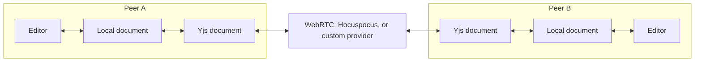

Real-time collaboration replicates the document across peers.

It covers text, structure, formatting, tables, headers, footers, notes,
drawings, relationships, and embedded parts. Peers also share presence and
remote selections across paragraphs.

Collaboration requires the collaboration module from
[`@docx-editor.dev/pro`](/docs/2.x/pro).

Without that module, the editor does not attach a replica. Local undo remains
active. `snapshot().collaborationStatus` is `'inactive'`.



## Prerequisites

Install the Pro package and Yjs. Add `y-webrtc` for the WebRTC helper. Add
`@hocuspocus/provider` for the Hocuspocus helper.

```bash
npm install @docx-editor.dev/pro yjs y-webrtc
```

`yjs`, `y-webrtc`, and `@hocuspocus/provider` are optional Pro peer
dependencies. Pro installs `y-protocols`.

## Open a room with the hook

`useWebrtcCollaboration` owns the WebRTC room. It creates the replica and
builds `modules`. It destroys the room when you leave.

The WebRTC subpath keeps the network provider out of review-only bundles.
Import `@docx-editor.dev/pro/react/webrtc` or
`@docx-editor.dev/pro/vue/webrtc`.

Pass `room` to connect when the component mounts. Call `leave` to end the
session. Do not mount the editor while `pending` is true.

The hook returns a `CollaborationSession`. It exposes identity, status,
presence, and undo. It does not expose `attach` or `gateOperations`.
`CollaborationSession`, `CollaborationStatus`, and `CollaborationFailure` are
exported types from `@docx-editor.dev/pro/react` and
`@docx-editor.dev/pro/vue`.

`connect` and `rejoin` resolve with a `CollaborationFailure`, or `null` on
success. They do not reject, so `onClick={() => connect(options)}` is safe.
`error` reports the same failure for renderers:

```tsx
const failure = await connect(options);
if (failure?.code === 'initialization-timeout') {
  // No room server answered.
}
```

Branch on `failure.code` or `error.code` instead of matching message strings. It reports two things: a connect that failed, and a session
that failed after connecting. A token that expires on reconnect, a
`concurrent-seed`, or a digest mismatch all happen after a successful join, so
checking `error` is enough to know that collaboration is not working.

The `<DocxEditor>` host accepts `document` and `modules`. You do not need
`DocxEditor.Root` for collaboration.

<FrameworkTabs>
<Framework value="react">

```tsx
import { useRef } from 'react';
import { DocxEditor, type DocxEditorRef } from '@docx-editor.dev/react';
import { useWebrtcCollaboration } from '@docx-editor.dev/pro/react/webrtc';

type CollaborativeEditorProps = {
  roomId: string;
  bytes: Uint8Array;
};

export function CollaborativeEditor({ roomId, bytes }: CollaborativeEditorProps) {
  const editorRef = useRef<DocxEditorRef>(null);
  const { document, modules, session, pending, error, leave } = useWebrtcCollaboration({
    room: {
      roomId,
      identity: { actorId: 'alex', name: 'Alex' },
      bootstrap: { kind: 'create-or-join', document: bytes },
    },
  });

  async function leaveRoom() {
    // `leave` requires current bytes. The hook cannot read them.
    const saved = await editorRef.current?.save();
    if (saved) {
      leave(new Uint8Array(saved));
    }
  }

  if (error) return <p>{error.detail ?? error.code}</p>;
  if (pending || !document) return <p>Connecting…</p>;

  return (
    <>
      <button type="button" onClick={leaveRoom}>
        Leave
      </button>
      <DocxEditor ref={editorRef} key={session?.sessionId} document={document} modules={modules} />
    </>
  );
}
```

</Framework>
<Framework value="vue">

```vue
<script setup lang="ts">
import { ref } from 'vue';
import { DocxEditor, type DocxEditorRef } from '@docx-editor.dev/vue';
import { useWebrtcCollaboration } from '@docx-editor.dev/pro/vue/webrtc';

const props = defineProps<{ roomId: string; bytes: Uint8Array }>();

const editorRef = ref<DocxEditorRef | null>(null);
const { document, modules, session, pending, error, leave } = useWebrtcCollaboration({
  room: {
    roomId: props.roomId,
    identity: { actorId: 'alex', name: 'Alex' },
    bootstrap: { kind: 'create-or-join', document: props.bytes },
  },
});

async function leaveRoom() {
  // `leave` requires current bytes.
  const saved = await editorRef.value?.save();
  if (saved) {
    leave(new Uint8Array(saved));
  }
}
</script>

<template>
  <p v-if="error">{{ error.detail ?? error.code }}</p>
  <p v-else-if="pending || !document">Connecting…</p>
  <template v-else>
    <button type="button" @click="leaveRoom">Leave</button>
    <DocxEditor ref="editorRef" :key="session?.sessionId" :document="document" :modules="modules" />
  </template>
</template>
```

</Framework>
</FrameworkTabs>

With `create-or-join`, every peer uses the same options. The first peer seeds
the empty room from `document`. Later peers join the existing room. Use
`create` or `join` when each host already knows its role.

Two isolated peers can seed the same room at the same time. This creates a room
that clients cannot repair. Each replica reports `concurrent-seed` and stops.
Create a new room from saved bytes.

Omit `room` when the user chooses to share or join later. Then call `connect`
with the same options. `connect` and `leave` keep stable identities across
renders.

The editor reads `modules` at construction time. Set `key` to the session
`sessionId`, as shown in the examples. Without `key`, a connection after mount
does not register the collaboration module. The editor continues local editing,
and no changes replicate. The session logs a warning if you create it without
attaching it.

The hook also returns `ydoc` and `provider`. Both values are `null` while the
connection is pending. Use them for persistence or direct provider access.
`rejoin(bytes)` leaves with saved bytes and rejoins the same room after an
`error` status.

The default Pro entry exports `collaborationModule` without a network provider.
Import `@docx-editor.dev/pro/collaboration` for Yjs factories. Import
`@docx-editor.dev/pro/collaboration/webrtc` for room helpers such as
`createCollaborationRoomId`.

## Mount the editor

A collaborative Root takes three props from the room, and each one fails quietly if you get
it wrong: the `key`, so a new session remounts and the collaboration module attaches; the
`document`, which must be the room's bytes; and the `modules`, which must be the hook's array.
`DocxEditorCollaborationRoot` writes all three:

```tsx
const collaboration = useHocuspocusCollaboration({ modules: MODULES, room });

<DocxEditorCollaborationRoot collaboration={collaboration} fallback={<p>Connecting…</p>}>
  <DocxEditor.Toolbar />
  <DocxEditor.Viewport>
    <DocxEditor.Content />
    <DocxEditorCollaboration.CaretLabels />
  </DocxEditor.Viewport>
</DocxEditorCollaborationRoot>;
```

It also takes `author` from the room's identity, so comments and tracked changes are signed
with the name the room shows. Set `author` yourself to override it. Everything else
`DocxEditor.Root` accepts passes through.

Use `DocxEditor.Root` directly when one page mounts two rooms, or when the bytes come from
somewhere the component cannot see:

```tsx
<DocxEditor.Root
  key={collaboration.session?.sessionId ?? 'local'}
  document={collaboration.document}
  modules={collaboration.modules}
  author={identity.name}
/>
```

## Show status and participants

`useCollaborationStatus()` returns the live status and last failure, plus three
derived flags:

- `live`: edits made now reach the room.
- `diverged`: this replica no longer agrees with the room. Only `rejoin`
  recovers it, so this is separate from "not live".
- `attached`: an editor has attached its document port. False with a live
  session means the host did not remount the editor when the session appeared,
  so nothing replicates whatever `status` says.

`useCollaborationParticipants()` returns the room participants.

Neither takes a `session` argument. Both read the one the editor above them
holds, which `useCollaborationSession()` also returns. Pass a session
explicitly only for a room this editor does not own. The presence parts follow
the same rule: `session` is optional on `DocxEditorCollaboration.Avatars` and
`DocxEditorCollaboration.CaretLabels`.

All of these are available from `@docx-editor.dev/pro/react` and
`@docx-editor.dev/pro/vue`.

If you own the Yjs resources, use `useDocumentCollaboration` from the same
entries. It provides the same `connect` and `leave` lifecycle without WebRTC.

## Presence UI

`DocxEditorCollaboration` provides presence controls. Import it from
`@docx-editor.dev/pro/react` or `@docx-editor.dev/pro/vue`. Mount its parts
anywhere in the editor provider tree.

`DocxEditorCollaboration.Avatars` renders participant initials. It puts the
local participant first.

```tsx
<DocxEditorCollaboration.Avatars session={session} max={4} />
```

Avatar colors match each collaborator's tracked changes and comments. `max`
collapses extra avatars into a `+N` chip. Use
`DocxEditorCollaboration.Avatar` to render one participant.

Avatars show the picture declared for a collaborator, so one declaration covers
every surface that draws that person:

```tsx
<DocxEditor.AuthorStyle author="Alex Kim" color="#1f7a4d" avatarUrl="/team/alex.jpg" />
```

The review card, the caret label, and the avatar stack all resolve it by display
name, which is the string `w:author` carries in the saved file. A declared color
outranks the one a peer publishes in `identity.color`: the declaration is your
own record of who someone is, and a peer must not be able to make their caret
disagree with their comment cards. `identity.color` still applies to anyone you
have not declared.

`DocxEditorCollaboration.CaretLabels` replaces each remote caret label. The
engine positions and colors the label. Your renderer mounts in the adapter
tree, so editor and review hooks work inside it.

<FrameworkTabs>
<Framework value="react">

```tsx
<DocxEditorCollaboration.CaretLabels session={session}>
  {({ selection, color }) => <MyLabel name={selection.name} color={color} />}
</DocxEditorCollaboration.CaretLabels>
```

</Framework>
<Framework value="vue">

```vue
<DocxEditorCollaboration.CaretLabels :session="session" v-slot="{ selection, color }">
  <MyLabel :name="selection.name" :color="color" />
</DocxEditorCollaboration.CaretLabels>
```

</Framework>
</FrameworkTabs>

In Vue, the renderer is the default scoped slot. It receives
`{ selection, participant, color }`. Without a renderer, the label shows the
collaborator's name.

The engine marks the label layer `aria-hidden` and disables pointer events.
Screen readers do not announce label content. Label content cannot receive
clicks or focus. Put interactive or announced presence controls in your own
chrome.

For CSS styling, use the `docx-remote-caret-label` class,
`--doc-remote-color` custom property, and `data-docx-remote-actor` attribute.

## Recover a diverged replica

`status` `error` is terminal: the replica refused an update and kept the copy it
had, so it is editing a document the others do not have. Waiting does not fix
it. `rejoin` does:

```tsx
const { session, rejoin } = useHocuspocusCollaboration({ room });
const { diverged } = useCollaborationStatus();

if (diverged) {
  return (
    <button onClick={() => editor.save().then((bytes) => rejoin(new Uint8Array(bytes)))}>
      Rejoin
    </button>
  );
}
```

`rejoin` leaves with the bytes you pass, then joins the same room again with
`{ kind: 'join' }`. If the join succeeds, the server's copy replaces those bytes
and the edits made while diverged are gone. If it fails, nothing is lost: the
bytes stay mounted locally.

## Edit offline

Set `offlineEditing: true` in the `room` or `connect` options. The session then
accepts edits while its status is `disconnected`. It merges buffered updates
after reconnection. Show the status so users know when edits have not reached
the room. The `error` status remains terminal. Every room factory and hook
accepts this option.

## Use your own signaling

`DEMO_SIGNALING_ENDPOINTS` is a public demo signaling service. Do not use it
for production.

For production, pass your signaling URLs to `connect` or `room`. Also provide
your own Traversal Using Relays around NAT (TURN) servers. Many networks block
direct WebRTC connections without TURN.

## Hocuspocus

`useHocuspocusCollaboration` owns a room on a
[Hocuspocus](https://tiptap.dev/docs/hocuspocus) server. It has the same
options, return values, and lifecycle as `useWebrtcCollaboration`. A
server-backed room does not need signaling or TURN configuration.

Import the hook from `@docx-editor.dev/pro/react/hocuspocus`. Import the Vue
composable from `@docx-editor.dev/pro/vue/hocuspocus`.

```tsx
import { DocxEditor } from '@docx-editor.dev/react';
import { useHocuspocusCollaboration } from '@docx-editor.dev/pro/react/hocuspocus';

export function ServerBackedEditor({
  roomId,
  token,
  bytes,
}: {
  roomId: string;
  token: string;
  bytes: Uint8Array;
}) {
  const { document, modules, session, pending, error } = useHocuspocusCollaboration({
    room: {
      url: 'wss://collab.example.test',
      roomId,
      token,
      identity: { actorId: 'alex', name: 'Alex' },
      bootstrap: { kind: 'create-or-join', document: bytes },
    },
  });

  if (error) return <p>{error.detail ?? error.code}</p>;
  if (pending || !document) return <p>Connecting…</p>;

  return <DocxEditor key={session?.sessionId} document={document} modules={modules} />;
}
```

`token` reaches the server's `onAuthenticate` hook. If tokens expire, pass a
callback instead of a string. The provider calls it for each reconnection.

A rejected token during the initial join produces `initialization-aborted`.
After a successful join, rejection sets the status to `error` and `error.code`
to `authentication-failed`. Handle that code by refreshing the credential and
calling `rejoin`; `transport-disconnected` recovers on its own. `syncedTimeoutMs` limits the initial sync wait. Its
default is 30 seconds. A timeout produces `initialization-timeout`.

The `createHocuspocusCollaboration` factory accepts the same options. Import it
from `@docx-editor.dev/pro/collaboration/hocuspocus`. It returns the room,
`ydoc`, and `provider`.

The Hocuspocus v4 server runs on Node, not Bun. Use
`@hocuspocus/provider` for the required authentication handshake.

## Read a room from a server

`readCollaborationDocument(ydoc)` returns the room's document as `.docx` bytes.
Use it for export, autosave to your own storage, search indexing, or rendering.

```ts
import { readCollaborationDocument } from '@docx-editor.dev/pro/collaboration';

// Hocuspocus hands `onStoreDocument` the synchronized Y.Doc already.
async onStoreDocument({ documentName, document }) {
  await writeFile(`${documentName}.docx`, readCollaborationDocument(document));
}
```

It joins nothing. There is no identity, no `Awareness`, and no session, so the
job never appears in a room's participant list, and it creates no editing gate.
It does not write to the `Y.Doc`.

The `Y.Doc` must already hold the room's state. Connect your provider and wait
for its initial sync first. A document nobody seeded throws `not-initialized`
instead of returning a truncated file.

## Write a provider

`@docx-editor.dev/core/collaboration/replication` holds the seam a replication
implementation binds to: the document port an adapter writes through, the
primitive journal it reads, and the descriptors that journal is made of.

```ts
import type {
  CollaborationDocumentPort,
  CanonicalPrimitiveJournal,
} from '@docx-editor.dev/core/collaboration/replication';
```

A host that renders presence and reads a status needs none of it, which is why
it is a separate subpath. Import `@docx-editor.dev/core/collaboration` for the
consumer types: identity, participants, remote selections, status, and failures.

## Own a Yjs document

If you own a `Y.Doc` and awareness instance, call
`createDocumentCollaboration` from `@docx-editor.dev/pro/collaboration`. It
replicates the complete canonical package. You must destroy these resources.

Four rules make a bring-your-own-provider integration work:

1. Connect the provider before you use `bootstrap: { kind: 'join' }`. The
   factory reads synchronized shared state. Without a connection, the join
   fails with `initialization-timeout` after 30 seconds.
2. Pass an `Awareness` instance from `y-protocols/awareness`. It carries
   presence and remote selections.
3. Send provider connection events to `session.setTransportStatus`. Without
   this call, the status remains `ready` during an outage.
4. Some transports limit message size. The WebRTC wrapper provides message
   framing. A WebSocket provider does not need it.

This example wires `y-websocket`:

```ts
import * as Y from 'yjs';
import { Awareness } from 'y-protocols/awareness';
import { WebsocketProvider } from 'y-websocket';
import { createDocumentCollaboration } from '@docx-editor.dev/pro/collaboration';

const ydoc = new Y.Doc();
const awareness = new Awareness(ydoc);
const provider = new WebsocketProvider('wss://example.test', 'room-1', ydoc, { awareness });

await new Promise((resolve) => provider.once('sync', resolve));

const room = await createDocumentCollaboration({
  ydoc,
  awareness,
  documentId: 'room-1',
  identity: { actorId: 'alex', name: 'Alex' },
  bootstrap: { kind: 'join' },
});

provider.on('status', ({ status }: { status: string }) => {
  room.session.setTransportStatus(
    status === 'connected' ? 'ready' : 'disconnected',
    status === 'connected' ? undefined : 'transport-disconnected',
    status === 'connected' ? undefined : 'websocket disconnected'
  );
});
```

The second argument is a `CollaborationFailureCode`, not free text. Use
`transport-disconnected` for a socket that retries itself and
`authentication-failed` for a credential the server rejected. Those need
opposite responses from the host, so they must not share a code. Put your
provider's own wording in the third argument.

The factory rejects with a typed `CollaborationSchemaError`. Handle these
codes:

- `initialization-timeout`: No synchronized room appeared.
- `document-id-mismatch`: The room has a different `documentId`.
- `protocol-version-mismatch`: The room uses a different protocol version.
- `schema-version-mismatch`: The room uses a different schema version.

Use Yjs 13 on the server. The `y-websocket` server (`bin/server.cjs`) and
Hocuspocus support it. `@y/websocket-server` targets the Yjs 14 release
candidate. It synchronizes initial state and presence, but not live Yjs 13
updates. This incompatibility makes the document appear frozen.

### Recover from an error

An `error` session cannot repair itself. Recover it as follows:

1. Save the editor bytes with `await editor.save()`.
2. Call `room.destroy()`, then destroy the provider.
3. Create a new `Y.Doc`, `Awareness`, and provider.
4. Connect the provider.
5. Call `createDocumentCollaboration` with
   `bootstrap: { kind: 'join' }`.

Keep the editor mounted with the saved bytes until the room is ready. If the
join fails, the saved bytes preserve the local work.

The same entry exports the experimental `createTextCollaboration`. It only
replicates paragraph text and rejects structural edits. Use
`createDocumentCollaboration`.

## Headless replica

`DocxEditor.createCollaborative` from `@docx-editor.dev/editor-api` opens a
Document Object Model (DOM)-free replica.

```ts
import { DocxEditor } from '@docx-editor.dev/editor-api';
import { createDocumentCollaboration } from '@docx-editor.dev/pro/collaboration';

const room = await createDocumentCollaboration({
  ydoc,
  awareness,
  documentId: 'room-1',
  identity: { actorId: 'agent', name: 'Agent', role: 'agent' },
  bootstrap: { kind: 'join' },
});

const runtime = await DocxEditor.createCollaborative(room.document, room.session, {
  author: 'Agent',
});
```

Call `room.destroy()` to stop the replica.

## Compose the editor

Use `DocxEditor.Root`, `Viewport`, and `Content` for custom controls. Pass the
same `document` and `modules` values.

<FrameworkTabs>
<Framework value="react">

```tsx
import { DocxEditor } from '@docx-editor.dev/react';
import { useCollaborationStatus, type CollaborationSession } from '@docx-editor.dev/pro/react';
import { useWebrtcCollaboration } from '@docx-editor.dev/pro/react/webrtc';

function Status({ session }: { session: CollaborationSession | null }) {
  const { status } = useCollaborationStatus(session);
  return <span>{status}</span>;
}

type CollaborativeEditorProps = {
  roomId: string;
  bytes: Uint8Array;
};

export function CollaborativeEditor({ roomId, bytes }: CollaborativeEditorProps) {
  const collaboration = useWebrtcCollaboration({
    room: {
      roomId,
      identity: { actorId: 'alex', name: 'Alex' },
      bootstrap: { kind: 'create', document: bytes },
    },
  });
  if (collaboration.pending || !collaboration.document) {
    return <p>Connecting…</p>;
  }
  return (
    <DocxEditor.Root document={collaboration.document} modules={collaboration.modules}>
      <Status session={collaboration.session} />
      <DocxEditor.Viewport>
        <DocxEditor.Content />
      </DocxEditor.Viewport>
    </DocxEditor.Root>
  );
}
```

</Framework>
<Framework value="vue">

```vue
<script setup lang="ts">
import { DocxEditor } from '@docx-editor.dev/vue';
import { useCollaborationStatus } from '@docx-editor.dev/pro/vue';
import { useWebrtcCollaboration } from '@docx-editor.dev/pro/vue/webrtc';

const props = defineProps<{ roomId: string; bytes: Uint8Array }>();

const { document, modules, pending, session } = useWebrtcCollaboration({
  room: {
    roomId: props.roomId,
    identity: { actorId: 'alex', name: 'Alex' },
    bootstrap: { kind: 'create-or-join', document: props.bytes },
  },
});
const { status } = useCollaborationStatus(session);
</script>

<template>
  <p v-if="pending || !document">Connecting…</p>
  <DocxEditor.Root v-else :document="document" :modules="modules">
    <span>{{ status }}</span>
    <DocxEditor.Viewport>
      <DocxEditor.Content />
    </DocxEditor.Viewport>
  </DocxEditor.Root>
</template>
```

</Framework>
</FrameworkTabs>

Destructure the composable return into top-level bindings. Vue unwraps these
bindings in the template.

Do not destroy the room from an effect that depends on the room object.
StrictMode can run the cleanup before remounting. The hook owns the room
lifecycle.

## Limits

The WebRTC helper connects peers directly. A room exists while at least one
peer remains connected.

Attached replicas synchronize comments, tracked-change decisions, tables of
contents, and custom nodes. Named review actions include these operations:

- Add, reply to, resolve, and delete comments.
- Resolve tracked changes.
- Write package-scoped content, such as tables of contents and custom nodes.

The replica rejects two write paths. It rejects an edited ProseMirror document.
It also rejects review writes without a named intent.

The replica rejects tree edits when the session is destroyed, not ready, or
not attached. A transport interruption pauses editing until reconnection. To
continue editing, enable [`offlineEditing`](#edit-offline).

The session undo manager treats one typing run as one undo step.

### Numeric limits

Most exceeded limits produce a typed failure code.

| Limit                               | Value          | Failure code                                | Remedy                                                 |
| ----------------------------------- | -------------- | ------------------------------------------- | ------------------------------------------------------ |
| Seed document                       | 20 MB          | `baseline-too-large`                        | Reduce the document.                                   |
| One embedded file                   | 32 MiB         | `blob-too-large`                            | Compress the media.                                    |
| All embedded files                  | 64 MiB         | `blob-store-full`                           | Remove media and create a new room.                    |
| `actorId`, `name`, and `documentId` | 256 characters | `invalid-identity` or `invalid-document-id` | Shorten the value.                                     |
| Presence participants               | 256            | None                                        | Keep the room below 256 participants.                  |
| Initial synchronization             | 30 seconds     | `initialization-timeout`                    | Connect the provider and confirm that the room exists. |

Presence reads return only the first 256 participants. For Hocuspocus, increase
`syncedTimeoutMs` when the initial synchronization needs more time.

For module registration and licensing, see the
[Pro package documentation](/docs/2.x/pro).
