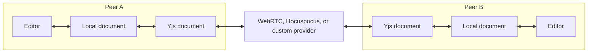

This reference documents the complete configuration and API behavior for
real-time DOCX collaboration with the Pro package. It covers providers, room
lifecycles, presence, recovery, and resource limits.

For a basic WebRTC setup, use the
[real-time collaboration quickstart](/docs/2.x/collaboration).

The Pro module replicates text, structure, formatting, tables, headers, footers,
notes, drawings, relationships, and embedded parts. Peers also share presence
and remote selections across paragraphs.

Collaboration requires the collaboration module from
[`@docx-editor.dev/pro`](/docs/2.x/pro).

Without that module, the editor does not attach a replica. Local undo remains
active. `snapshot().collaborationStatus` is `'inactive'`.



## Prerequisites

Install the Pro package, Yjs, and the provider for your transport.

For WebRTC, run:

```bash
npm install @docx-editor.dev/pro yjs y-webrtc
```

For Hocuspocus, run:

```bash
npm install @docx-editor.dev/pro yjs @hocuspocus/provider
```

`yjs`, `y-webrtc`, and `@hocuspocus/provider` are optional Pro peer
dependencies. Pro installs `y-protocols`.

## Connect with `useWebrtcCollaboration`

`useWebrtcCollaboration` owns the WebRTC room. It creates the replica and
builds `modules`. It destroys the room when you leave.

The WebRTC subpath keeps the network provider out of review-only bundles.
Import `@docx-editor.dev/pro/react/webrtc` or
`@docx-editor.dev/pro/vue/webrtc`.

Pass `room` to connect when the component mounts. Call `leave` to end the
session. Do not mount the editor while `pending` is true.

The hook returns an object. Its `session` field contains a
`CollaborationSession`. The session exposes identity, status, presence, and
undo. It does not expose `attach` or `gateOperations`.
`CollaborationSession`, `CollaborationStatus`, and `CollaborationFailure` are
exported types from `@docx-editor.dev/pro/react` and
`@docx-editor.dev/pro/vue`.

Room failures make `connect` and `rejoin` resolve to a
`CollaborationFailure`. Success resolves to `null`. `rejoin` still throws if
you call it before a connection attempt. The hook also puts room failures in
`error` for rendering:

```tsx
const failure = await connect(options);
if (failure?.code === 'initialization-timeout') {
  // No room server answered.
}
```

Branch on `failure.code` or `error.code` instead of matching message strings.
`error` reports an initial connection failure or a session failure after
connection. An expired token, `concurrent-seed`, or digest mismatch can occur
after a successful join. Always handle `error`, even when `document` is not
`null`.

The `<DocxEditor>` host accepts `document` and `modules`. You do not need
`DocxEditor.Root` for collaboration.

<FrameworkTabs>
<Framework value="react">

```tsx
import { useRef } from 'react';
import { DocxEditor, type DocxEditorRef } from '@docx-editor.dev/react';
import { useWebrtcCollaboration } from '@docx-editor.dev/pro/react/webrtc';

type CollaborativeEditorProps = {
  roomId: string;
  bytes: Uint8Array;
  actorId: string;
  name: string;
};

export function CollaborativeEditor({ roomId, bytes, actorId, name }: CollaborativeEditorProps) {
  const editorRef = useRef<DocxEditorRef>(null);
  const { document, modules, session, pending, error, leave } = useWebrtcCollaboration({
    room: {
      roomId,
      identity: { actorId, name },
      bootstrap: { kind: 'create-or-join', document: bytes },
    },
  });

  async function leaveRoom() {
    // `leave` requires current bytes. The hook cannot read them.
    const saved = await editorRef.current?.save();
    if (saved) {
      leave(new Uint8Array(saved));
    }
  }

  if (error) return <p>{error.detail ?? error.code}</p>;
  if (pending || !document) return <p>Connecting…</p>;

  return (
    <>
      <button type="button" onClick={leaveRoom}>
        Leave
      </button>
      <DocxEditor ref={editorRef} key={session?.sessionId} document={document} modules={modules} />
    </>
  );
}
```

</Framework>
<Framework value="vue">

```vue
<script setup lang="ts">
import { ref } from 'vue';
import { DocxEditor, type DocxEditorRef } from '@docx-editor.dev/vue';
import { useWebrtcCollaboration } from '@docx-editor.dev/pro/vue/webrtc';

const props = defineProps<{
  roomId: string;
  bytes: Uint8Array;
  actorId: string;
  name: string;
}>();

const editorRef = ref<DocxEditorRef | null>(null);
const { document, modules, session, pending, error, leave } = useWebrtcCollaboration({
  room: {
    roomId: props.roomId,
    identity: { actorId: props.actorId, name: props.name },
    bootstrap: { kind: 'create-or-join', document: props.bytes },
  },
});

async function leaveRoom() {
  // `leave` requires current bytes.
  const saved = await editorRef.value?.save();
  if (saved) {
    leave(new Uint8Array(saved));
  }
}
</script>

<template>
  <p v-if="error">{{ error.detail ?? error.code }}</p>
  <p v-else-if="pending || !document">Connecting…</p>
  <template v-else>
    <button type="button" @click="leaveRoom">Leave</button>
    <DocxEditor ref="editorRef" :key="session?.sessionId" :document="document" :modules="modules" />
  </template>
</template>
```

</Framework>
</FrameworkTabs>

With `create-or-join`, every peer uses the same room and bootstrap settings.
Each peer must use a unique `actorId`. The first peer seeds the empty room from
`document`. Later peers join the existing room. Use `create` or `join` when each
host already knows its role.

Two isolated peers can seed the same room at the same time. This creates a room
that clients cannot repair. Each replica reports `concurrent-seed` and stops.
Create a new room from saved bytes.

Omit `room` when the user chooses to share or join later. Then call `connect`
with the same options. `connect` and `leave` keep stable identities across
renders.

The editor reads `modules` at construction time. Set `key` to the session
`sessionId`, as shown in the examples. Without `key`, a connection after mount
does not register the collaboration module. The editor continues local editing,
and no changes replicate. The session logs a warning if you create it without
attaching it.

The hook also returns `ydoc` and `provider`. Both values are `null` while the
connection is pending. Use them for persistence or direct provider access.
`rejoin(bytes)` leaves with saved bytes and rejoins the same room after an
`error` status.

The default Pro entry exports `collaborationModule` without a network provider.
Import `@docx-editor.dev/pro/collaboration` for Yjs factories. Import
`@docx-editor.dev/pro/collaboration/webrtc` for room helpers such as
`createCollaborationRoomId`.

## Mount the editor

A collaborative root needs three values from the room. `key` remounts the
editor for a new session. `document` contains the room bytes. `modules` contains
the hook modules. Incorrect values can create a working editor that does not
replicate edits.

`DocxEditorCollaborationRoot` sets all three values. Import it with
`DocxEditorCollaboration` from the framework entry. It also uses the room
identity name as `author`. Set `author` to override this value. Other
`DocxEditor.Root` props pass through.

<FrameworkTabs>
<Framework value="react">

```tsx
import { DocxEditor } from '@docx-editor.dev/react';
import { DocxEditorCollaboration, DocxEditorCollaborationRoot } from '@docx-editor.dev/pro/react';
import {
  useHocuspocusCollaboration,
  type UseHocuspocusCollaborationConnectOptions,
} from '@docx-editor.dev/pro/react/hocuspocus';

interface CollaborativeEditorProps {
  room: UseHocuspocusCollaborationConnectOptions;
}

export function CollaborativeEditor({ room }: CollaborativeEditorProps) {
  const collaboration = useHocuspocusCollaboration({ room });

  if (collaboration.error) {
    return <p>{collaboration.error.detail ?? collaboration.error.code}</p>;
  }

  return (
    <DocxEditorCollaborationRoot collaboration={collaboration} fallback={<p>Connecting…</p>}>
      <DocxEditor.Toolbar />
      <DocxEditor.Viewport>
        <DocxEditor.Content />
        <DocxEditorCollaboration.CaretLabels />
      </DocxEditor.Viewport>
    </DocxEditorCollaborationRoot>
  );
}
```

React renders the `fallback` prop whenever `document` is `null`. The root
cannot distinguish a pending connection from a failure. Handle `error` before
you render the root.

</Framework>
<Framework value="vue">

```vue
<script setup lang="ts">
import { reactive } from 'vue';
import { DocxEditor } from '@docx-editor.dev/vue';
import { DocxEditorCollaboration, DocxEditorCollaborationRoot } from '@docx-editor.dev/pro/vue';
import {
  useHocuspocusCollaboration,
  type UseHocuspocusCollaborationConnectOptions,
} from '@docx-editor.dev/pro/vue/hocuspocus';

const props = defineProps<{ room: UseHocuspocusCollaborationConnectOptions }>();
const collaboration = reactive(useHocuspocusCollaboration({ room: props.room }));
</script>

<template>
  <p v-if="collaboration.error">
    {{ collaboration.error.detail ?? collaboration.error.code }}
  </p>
  <DocxEditorCollaborationRoot v-else :collaboration="collaboration">
    <DocxEditor.Toolbar />
    <DocxEditor.Viewport>
      <DocxEditor.Content />
      <DocxEditorCollaboration.CaretLabels />
    </DocxEditor.Viewport>
    <template #fallback><p>Connecting…</p></template>
  </DocxEditorCollaborationRoot>
</template>
```

Vue composables return refs. Wrap the return with `reactive` before you pass it
to `DocxEditorCollaborationRoot`. Vue renders the named `fallback` slot whenever
`document` is `null`. Without that slot, it renders nothing. Handle `error`
before you render the root.

</Framework>
</FrameworkTabs>

Use `DocxEditor.Root` directly when one page mounts two rooms, or when the bytes come from
somewhere the component cannot see:

```tsx
if (collaboration.error) {
  return <p>{collaboration.error.detail ?? collaboration.error.code}</p>;
}
if (!collaboration.document) {
  return <p>Connecting…</p>;
}

return (
  <DocxEditor.Root
    key={collaboration.session?.sessionId ?? 'local'}
    document={collaboration.document}
    modules={collaboration.modules}
    author={collaboration.session?.identity.name}
  >
    <DocxEditor.Viewport>
      <DocxEditor.Content />
    </DocxEditor.Viewport>
  </DocxEditor.Root>
);
```

## Show status and participants

`useCollaborationStatus()` returns these fields:

- `status` gives the session state, or `inactive` when no session exists.
- `reason` gives the failure for the present state. It clears after recovery.
- `lastFailure` keeps the latest terminal error after the status changes.
- `live` is true when edits made now reach the room.
- `diverged` is true when `status` is `error` or `destroyed`. Call `rejoin` to
  recover a room that the hook connected before.
- `attached` is true when an editor has attached its document port. A live,
  unattached session usually means the editor did not remount for the session.

`useCollaborationParticipants()` returns the room participants.

Both hooks accept an optional `session`. Omit it to read the session from the
editor provider. Pass it for a room that the editor does not own. The presence
parts use the same rule. `session` is optional on
`DocxEditorCollaboration.Avatars` and
`DocxEditorCollaboration.CaretLabels`.

All of these are available from `@docx-editor.dev/pro/react` and
`@docx-editor.dev/pro/vue`.

If you own the Yjs resources, use `useDocumentCollaboration` from the same
entries. It provides the same `connect` and `leave` lifecycle without WebRTC.

## Show avatars and caret labels

`DocxEditorCollaboration` provides presence controls. Import it from
`@docx-editor.dev/pro/react` or `@docx-editor.dev/pro/vue`. Mount its parts
anywhere in the editor provider tree.

`DocxEditorCollaboration.Avatars` renders participant initials. It puts the
local participant first.

```tsx
<DocxEditorCollaboration.Avatars max={4} />
```

Avatar colors match each collaborator's tracked changes and comments. `max`
collapses extra avatars into a `+N` chip. Use
`DocxEditorCollaboration.Avatar` to render one participant.

You can replace each avatar disc with a renderer. It receives `participant`,
`color`, `initials`, and the locally resolved optional `avatarUrl`.

```tsx
<DocxEditorCollaboration.Avatars max={4}>
  {({ participant, avatarUrl, initials }) =>
    avatarUrl ? (
      
    ) : (
      <span aria-label={participant.name}>{initials}</span>
    )
  }
</DocxEditorCollaboration.Avatars>
```

`participant` contains `actorId`, `name`, optional `color`, optional `role`, and
`isLocal`.

Avatars show the picture declared for a collaborator, so one declaration covers
every surface that draws that person:

```tsx
<DocxEditor.AuthorStyle author="Alex Kim" color="#1f7a4d" avatarUrl="/team/alex.jpg" />
```

The review card, the caret label, and the avatar stack all resolve it by display
name, which is the string `w:author` carries in the saved file. A declared color
outranks the one a peer publishes in `identity.color`: the declaration is your
own record of who someone is, and a peer must not be able to make their caret
disagree with their comment cards. `identity.color` still applies to anyone you
have not declared.

`DocxEditorCollaboration.CaretLabels` replaces each remote caret label. The
engine positions and colors the label. Your renderer mounts in the adapter
tree, so editor and review hooks work inside it.

<FrameworkTabs>
<Framework value="react">

```tsx
<DocxEditorCollaboration.CaretLabels>
  {({ selection, participant, color, avatarUrl }) => (
    <MyLabel name={participant?.name ?? selection.name} color={color} avatarUrl={avatarUrl} />
  )}
</DocxEditorCollaboration.CaretLabels>
```

</Framework>
<Framework value="vue">

```vue
<DocxEditorCollaboration.CaretLabels v-slot="{ selection, participant, color, avatarUrl }">
  <MyLabel
    :name="participant?.name ?? selection.name"
    :color="color"
    :avatar-url="avatarUrl"
  />
</DocxEditorCollaboration.CaretLabels>
```

</Framework>
</FrameworkTabs>

The renderer receives `selection`, optional `participant`, `color`, and optional
`avatarUrl`. In Vue, it is the default scoped slot. Without a renderer, the
label shows the collaborator's name.

The engine marks the label layer `aria-hidden` and disables pointer events.
Screen readers do not announce label content. Label content cannot receive
clicks or focus. Put interactive or announced presence controls in your own
chrome.

For CSS styling, use the `docx-remote-caret-label` class,
`--doc-remote-color` custom property, and `data-docx-remote-actor` attribute.

## Recover a diverged replica

A status of `error` is terminal. The replica refused an update and kept its
copy. The session now refuses edits, and other peers might not have its latest
changes. Waiting does not fix the replica. Call `rejoin`:

```tsx
const { rejoin } = useHocuspocusCollaboration({ room });

async function rejoinRoom() {
  const saved = await editorRef.current?.save();
  if (saved) {
    await rejoin(new Uint8Array(saved));
  }
}
```

Save the editor bytes before you call `rejoin`. It leaves with those bytes, then
joins the same room with `{ kind: 'join' }`. A successful join uses the room
copy. It can drop unreplicated changes that existed when the session failed.
After a failed join, the saved bytes stay mounted locally.

## Edit offline

Set `offlineEditing: true` in the `room` or `connect` options. The session then
accepts edits while its status is `disconnected`. It merges buffered updates
after reconnection. Show the status so users know when edits have not reached
the room. The `error` status remains terminal. Every room factory and hook
accepts this option.

## Use your own signaling

`DEMO_SIGNALING_ENDPOINTS` is a public demo signaling service. Do not use it
for production.

For production, pass your signaling URLs to `connect` or `room`. Also provide
your own Traversal Using Relays around NAT (TURN) servers. Many networks block
direct WebRTC connections without TURN.

## Connect to a Hocuspocus server

`useHocuspocusCollaboration` owns a room on a
[Hocuspocus](https://tiptap.dev/docs/hocuspocus) server. It has the same
options, return values, and lifecycle as `useWebrtcCollaboration`. A
server-backed room does not need signaling or TURN configuration.

Import the hook from `@docx-editor.dev/pro/react/hocuspocus`. Import the Vue
composable from `@docx-editor.dev/pro/vue/hocuspocus`.

```tsx
import { DocxEditor } from '@docx-editor.dev/react';
import { useHocuspocusCollaboration } from '@docx-editor.dev/pro/react/hocuspocus';

export function ServerBackedEditor({
  roomId,
  token,
  bytes,
  actorId,
  name,
}: {
  roomId: string;
  token: string;
  bytes: Uint8Array;
  actorId: string;
  name: string;
}) {
  const { document, modules, session, pending, error } = useHocuspocusCollaboration({
    room: {
      url: 'wss://collab.example.test',
      roomId,
      token,
      identity: { actorId, name },
      bootstrap: { kind: 'create-or-join', document: bytes },
    },
  });

  if (error) return <p>{error.detail ?? error.code}</p>;
  if (pending || !document) return <p>Connecting…</p>;

  return <DocxEditor key={session?.sessionId} document={document} modules={modules} />;
}
```

`token` reaches the server's `onAuthenticate` hook. If tokens expire, pass a
callback instead of a string. The provider calls it for each reconnection.

A rejected token during the initial join produces `initialization-aborted`.
After a successful join, rejection sets the status to `error` and `error.code`
to `authentication-failed`. Handle that code by refreshing the credential and
calling `rejoin`. A `transport-disconnected` failure recovers on its own.

`syncedTimeoutMs` limits the initial sync wait. Its default is 30 seconds. A
timeout produces `initialization-timeout`.

The `createHocuspocusCollaboration` factory accepts the same options. Import it
from `@docx-editor.dev/pro/collaboration/hocuspocus`. It returns the room,
`ydoc`, and `provider`.

The Hocuspocus v4 server runs on Node, not Bun. Use
`@hocuspocus/provider` for the required authentication handshake.

## Read a room from a server

`readCollaborationDocument(ydoc)` returns the room's document as `.docx` bytes.
Use it for export, autosave to your own storage, search indexing, or rendering.

```ts
import { writeFile } from 'node:fs/promises';
import type * as Y from 'yjs';
import { readCollaborationDocument } from '@docx-editor.dev/pro/collaboration';

async function exportRoom(documentName: string, document: Y.Doc) {
  await writeFile(`${documentName}.docx`, readCollaborationDocument(document));
}
```

Call `exportRoom` from Hocuspocus `onStoreDocument`, which receives the
synchronized `Y.Doc`.

It joins nothing. There is no identity, no `Awareness`, and no session, so the
job never appears in a room's participant list, and it creates no editing gate.
It does not write to the `Y.Doc`.

The `Y.Doc` must already hold the room's state. Connect your provider and wait
for its initial sync first. A document nobody seeded throws `not-initialized`
instead of returning a truncated file.

The function throws `CollaborationSchemaError` for `not-initialized`,
`concurrent-seed`, `blob-digest-mismatch`, materialization failures, and
resource-limit failures. Handle the error and keep the last valid export.

See the
[server-backed Hocuspocus example](https://github.com/eigenpal/docx-editor/tree/main/examples/collaboration-hocuspocus)
for persistence and DOCX export.

## The room is the document

While a room is live, the room holds the authoritative copy. An exported `.docx`
file is a snapshot of the room at one moment, not a branch of it.

A file edited outside the room cannot merge back in. Seeding the edited file
creates a new room with new identity, and no three-way merge exists between a
room and an external copy. This is the same rule the
[recovery flow](#recover-a-diverged-replica) applies within a room: when two
copies disagree, the room copy wins.

Keep one authority per document at a time:

- While people collaborate, treat the room as the document. Export snapshots for
  backup, indexing, or review, and treat them as read-only.
- When collaboration ends, export the room and make the file the authority
  again.
- To bring external edits into a live room, apply them as edits inside the room
  — for example, paste the changed content — rather than re-seeding the file.
- To restart collaboration on an externally edited file, create a new room from
  those bytes and retire the old room.

## Use the replication contracts

`@docx-editor.dev/core/collaboration/replication` holds the seam a replication
implementation binds to: the document port an adapter writes through, the
primitive journal it reads, and the descriptors that journal is made of.

```ts
import type {
  CollaborationDocumentPort,
  CanonicalPrimitiveJournal,
} from '@docx-editor.dev/core/collaboration/replication';
```

A host that renders presence and reads a status needs none of it, which is why
it is a separate subpath. Import `@docx-editor.dev/core/collaboration` for the
consumer types: identity, participants, remote selections, status, and failures.

## Integrate a custom Yjs provider

If you own a `Y.Doc` and awareness instance, call
`createDocumentCollaboration` from `@docx-editor.dev/pro/collaboration`. It
replicates the complete canonical package. You must destroy these resources.

Four rules make a bring-your-own-provider integration work:

1. Connect the provider before you use `bootstrap: { kind: 'join' }`. The
   factory reads synchronized shared state. Without a connection, the join
   fails with `initialization-timeout` after 30 seconds.
2. Pass an `Awareness` instance from `y-protocols/awareness`. It carries
   presence and remote selections.
3. Send provider connection events to `session.setTransportStatus`. Without
   this call, the status remains `ready` during an outage.
4. Some transports limit message size. The WebRTC wrapper provides message
   framing. A WebSocket provider does not need it.

This example wires `y-websocket`:

```ts
import * as Y from 'yjs';
import { Awareness } from 'y-protocols/awareness';
import { WebsocketProvider } from 'y-websocket';
import { createDocumentCollaboration } from '@docx-editor.dev/pro/collaboration';

const ydoc = new Y.Doc();
const awareness = new Awareness(ydoc);
const provider = new WebsocketProvider('wss://example.test', 'room-1', ydoc, { awareness });
declare const currentUser: { id: string; name: string };
const identity = { actorId: currentUser.id, name: currentUser.name };

await new Promise((resolve) => provider.once('sync', resolve));

const room = await createDocumentCollaboration({
  ydoc,
  awareness,
  documentId: 'room-1',
  identity,
  bootstrap: { kind: 'join' },
});

provider.on('status', ({ status }: { status: string }) => {
  room.session.setTransportStatus(
    status === 'connected' ? 'ready' : 'disconnected',
    status === 'connected' ? undefined : 'transport-disconnected',
    status === 'connected' ? undefined : 'websocket disconnected'
  );
});
```

The second argument is a `CollaborationFailureCode`, not free text. Use
`transport-disconnected` for a socket that retries itself and
`authentication-failed` for a credential the server rejected. Those need
opposite responses from the host, so they must not share a code. Put your
provider's own wording in the third argument.

The factory rejects with a typed `CollaborationSchemaError`. Handle these
codes:

- `initialization-timeout`: No synchronized room appeared.
- `document-id-mismatch`: The room has a different `documentId`.
- `protocol-version-mismatch`: The room uses a different protocol version.
- `schema-version-mismatch`: The room uses a different schema version.

Use Yjs 13 on the server. The `y-websocket` server (`bin/server.cjs`) and
Hocuspocus support it. `@y/websocket-server` targets the Yjs 14 release
candidate. It synchronizes initial state and presence, but not live Yjs 13
updates. This incompatibility makes the document appear frozen.

### Recover from an error

An `error` session cannot repair itself. Recover it as follows:

1. Save the editor bytes with `await editor.save()`.
2. Call `room.destroy()`, then destroy the provider.
3. Create a new `Y.Doc`, `Awareness`, and provider.
4. Connect the provider.
5. Call `createDocumentCollaboration` with
   `bootstrap: { kind: 'join' }`.

Keep the editor mounted with the saved bytes until the room is ready. If the
join fails, the saved bytes preserve the local work.

The same entry exports the experimental `createTextCollaboration`. It only
replicates paragraph text and rejects structural edits. Use
`createDocumentCollaboration`.

## Create a headless replica

`DocxEditor.createCollaborative` from `@docx-editor.dev/editor-api` opens a
Document Object Model (DOM)-free replica.

```ts
import { DocxEditor } from '@docx-editor.dev/editor-api';
import { createDocumentCollaboration } from '@docx-editor.dev/pro/collaboration';

const room = await createDocumentCollaboration({
  ydoc,
  awareness,
  documentId: 'room-1',
  identity: { actorId: 'agent', name: 'Agent', role: 'agent' },
  bootstrap: { kind: 'join' },
});

const runtime = await DocxEditor.createCollaborative(room.document, room.session, {
  author: 'Agent',
});
```

Call `room.destroy()` to stop the replica.

## Compose custom controls

Add custom controls as children of the collaboration root shown in
[Mount the editor](#mount-the-editor). The root supplies `key`, `document`,
`modules`, and the default author. Status and presence hooks inside it find the
session without a `session` argument.

In Vue, wrap the composable return with `reactive` before you pass it to
`DocxEditorCollaborationRoot`.

Let the room hook manage cleanup. An effect cleanup can destroy the room before
React StrictMode remounts the component.

## Collaboration behavior and limits

The WebRTC helper connects peers directly. A room exists while at least one
peer remains connected.

Attached replicas synchronize comments, tracked-change decisions, tables of
contents, and custom nodes. Named review actions include these operations:

- Add, reply to, resolve, and delete comments.
- Resolve tracked changes.
- Write package-scoped content, such as tables of contents and custom nodes.

The replica rejects two write paths. It rejects an edited ProseMirror document.
It also rejects review writes without a named intent.

The replica rejects tree edits when the session is destroyed, not ready, or
not attached. A transport interruption pauses editing until reconnection. To
continue editing, enable [`offlineEditing`](#edit-offline).

The session undo manager treats one typing run as one undo step.

One simultaneous run-formatting split converges without duplicate text. A later
split after one concurrent run-formatting round can duplicate text. All replicas
still converge on the same document.

### Numeric limits

Most exceeded limits produce a typed failure code.

| Limit                               | Value          | Failure code                                | Remedy                                                 |
| ----------------------------------- | -------------- | ------------------------------------------- | ------------------------------------------------------ |
| Seed document                       | 20 MB          | `baseline-too-large`                        | Reduce the document.                                   |
| One embedded file                   | 32 MiB         | `blob-too-large`                            | Compress the media.                                    |
| All embedded files                  | 64 MiB         | `blob-store-full`                           | Remove media and create a new room.                    |
| `actorId`, `name`, and `documentId` | 256 characters | `invalid-identity` or `invalid-document-id` | Shorten the value.                                     |
| Presence participants               | 256            | None                                        | Keep the room below 256 participants.                  |
| Initial synchronization             | 30 seconds     | `initialization-timeout`                    | Connect the provider and confirm that the room exists. |

Presence reads return only the first 256 participants. For Hocuspocus, increase
`syncedTimeoutMs` when the initial synchronization needs more time.

### Watch a room's size

A room only grows. Deletion writes a tombstone, and deleted media bytes stay in
the shared state, so a long-lived room under heavy editing moves toward the
node and media limits. Crossing a limit is a terminal error for the room.

Watch the growth and archive the room before that happens.
`session.resourceUsage()` returns the replicated counts next to the limits:

```ts
const usage = session.resourceUsage();
if (usage.nodes > usage.maxNodes * 0.8) {
  // Export the room and create a new one from the saved bytes.
}
```

On a server, call `readCollaborationResourceUsage(ydoc)` from
`@docx-editor.dev/pro/collaboration`. It reads a synchronized `Y.Doc` the same
way `readCollaborationDocument` does: it joins nothing and writes nothing.

Both probes walk the node map once per call. Read them on a schedule, not on
every edit.

For module registration and licensing, see the
[Pro package documentation](/docs/2.x/pro).
