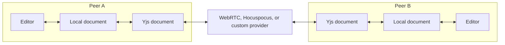

This reference documents the complete configuration and API behavior for real-time DOCX collaboration with the Pro package. It covers providers, room lifecycles, presence, recovery, and resource limits.

For a basic WebRTC setup, use the [real-time collaboration quickstart](/docs/2.x/collaboration).

The Pro module replicates text, structure, formatting, tables, headers, footers, notes, drawings, relationships, and embedded parts. Peers also share presence and remote selections across paragraphs. Your caret and each remote caret stay beside the same character while others type, delete, split, or join the paragraph around it.

Collaboration requires the collaboration module from [`@docx-editor.dev/pro`](/docs/2.x/pro).

Without that module, the editor does not attach a replica. Local undo remains active. `snapshot().collaborationStatus` is `'inactive'`.


```mermaid
flowchart LR
  accTitle: Collaboration between two document editors
  accDescr: Each editor updates a local document and Yjs document. A provider synchronizes both Yjs documents.
  subgraph A[Peer A]
    EA[Editor] <--> DA[Local document]
    DA <--> YA[Yjs document]
  end
  YA <--> T[WebRTC, Hocuspocus, or custom provider]
  T <--> YB[Yjs document]
  subgraph B[Peer B]
    YB <--> DB[Local document]
    DB <--> EB[Editor]
  end
```

## Prerequisites

Install the Pro package, Yjs, and the provider for your transport.

For WebRTC, run:

```bash
npm install @docx-editor.dev/pro yjs y-webrtc
```

For Hocuspocus, run:

```bash
npm install @docx-editor.dev/pro yjs @hocuspocus/provider
```

`yjs`, `y-webrtc`, and `@hocuspocus/provider` are optional Pro peer dependencies. Pro installs `y-protocols`.

## Plan deployment and upgrades

Use the dedicated [collaboration format version](/docs/2.x/pro/collaboration-versions) to check clients before synchronization. Check saved rooms separately before loading them. The guide covers server admission, offline work, and migration.

## Connect with `useWebrtcCollaboration`

`useWebrtcCollaboration` owns the WebRTC room. It creates the replica and builds `modules`. It destroys the room when you leave.

The WebRTC subpath keeps the network provider out of review-only bundles. Import `@docx-editor.dev/pro/react/webrtc` or `@docx-editor.dev/pro/vue/webrtc`.

Pass `room` to connect when the component mounts. Call `leave` to end the session. Do not mount the editor while `pending` is true.

The hook returns an object. Its `session` field contains a `CollaborationSession`. The session exposes identity, status, presence, and undo. It does not expose `attach` or `gateOperations`. `CollaborationSession`, `CollaborationStatus`, and `CollaborationFailure` are exported types from `@docx-editor.dev/pro/react` and `@docx-editor.dev/pro/vue`.

Room failures make `connect` and `rejoin` resolve to a `CollaborationFailure`. Success resolves to `null`. `rejoin` still throws if you call it before a connection attempt. The hook also puts room failures in `error` for rendering:

```tsx
const failure = await connect(options);
if (failure?.code === 'initialization-timeout') {
  // No room server answered.
}
```

Branch on `failure.code` or `error.code` instead of matching message strings. `error` reports an initial connection failure or a session failure after connection. An expired token, `concurrent-seed`, or digest mismatch can occur after a successful join. Always handle `error`, even when `document` is not `null`.

The `<DocxEditor>` host accepts `document` and `modules`. You do not need `DocxEditor.Root` for collaboration.

<FrameworkTabs>
<Framework value="react">

```tsx
import { useRef } from 'react';
import { DocxEditor, type DocxEditorRef } from '@docx-editor.dev/react';
import { useWebrtcCollaboration } from '@docx-editor.dev/pro/react/webrtc';

type CollaborativeEditorProps = {
  roomId: string;
  bytes: Uint8Array;
  actorId: string;
  name: string;
};

export function CollaborativeEditor({ roomId, bytes, actorId, name }: CollaborativeEditorProps) {
  const editorRef = useRef<DocxEditorRef>(null);
  const { document, modules, session, pending, error, leave } = useWebrtcCollaboration({
    room: {
      roomId,
      identity: { actorId, name },
      bootstrap: { kind: 'create-or-join', document: bytes },
    },
  });

  async function leaveRoom() {
    // `leave` requires current bytes. The hook cannot read them.
    const saved = await editorRef.current?.save();
    if (saved) {
      leave(new Uint8Array(saved));
    }
  }

  if (error) return <p>Could not join this document. Save any local work and contact support.</p>;
  if (pending || !document) return <p>Connecting…</p>;

  return (
    <>
      <button type="button" onClick={leaveRoom}>
        Leave
      </button>
      <DocxEditor ref={editorRef} key={session?.sessionId} document={document} modules={modules} />
    </>
  );
}
```

</Framework>
<Framework value="vue">

```vue
<script setup lang="ts">
import { ref } from 'vue';
import { DocxEditor, type DocxEditorRef } from '@docx-editor.dev/vue';
import { useWebrtcCollaboration } from '@docx-editor.dev/pro/vue/webrtc';

const props = defineProps<{
  roomId: string;
  bytes: Uint8Array;
  actorId: string;
  name: string;
}>();

const editorRef = ref<DocxEditorRef | null>(null);
const { document, modules, session, pending, error, leave } = useWebrtcCollaboration({
  room: {
    roomId: props.roomId,
    identity: { actorId: props.actorId, name: props.name },
    bootstrap: { kind: 'create-or-join', document: props.bytes },
  },
});

async function leaveRoom() {
  // `leave` requires current bytes.
  const saved = await editorRef.value?.save();
  if (saved) {
    leave(new Uint8Array(saved));
  }
}
</script>

<template>
  <p v-if="error">Could not join this document. Save any local work and contact support.</p>
  <p v-else-if="pending || !document">Connecting…</p>
  <template v-else>
    <button type="button" @click="leaveRoom">Leave</button>
    <DocxEditor ref="editorRef" :key="session?.sessionId" :document="document" :modules="modules" />
  </template>
</template>
```

</Framework>
</FrameworkTabs>

With `create-or-join`, every peer uses the same room and bootstrap settings. Each peer must use a unique `actorId`. The first peer seeds the empty room from `document`. Later peers join the existing room. Use `create` or `join` when each host already knows its role.

With Hocuspocus, `create` waits for the server's state before it seeds. If the room already holds a document, `create` fails with `already-initialized` and seeds nothing. If the server does not answer within `syncedTimeoutMs`, `create` fails with `initialization-timeout`.

Two isolated peers can seed the same room at the same time. This creates a room that clients cannot repair. Each replica reports `concurrent-seed` and stops. Create a new room from saved bytes.

Omit `room` when the user chooses to share or join later. Then call `connect` with the same options. `connect` and `leave` keep stable identities across renders.

If you change the room, server, bootstrap kind, or `actorId` in `room`, the hook leaves the old room and connects to the new one. If you set `room` to `null`, the hook leaves. A room you open with `connect` stays connected until you call `leave`.

The editor reads `modules` at construction time. Set `key` to the session `sessionId`, as shown in the examples. Without `key`, a connection after mount does not register the collaboration module. The editor continues local editing, and no changes replicate. The session logs a warning if you create it without attaching it.

The hook also returns `ydoc` and `provider`. Both values are `null` while the connection is pending. Use them for persistence or direct provider access. `rejoin(bytes)` leaves with saved bytes and rejoins the same room after an `error` status.

The default Pro entry exports `collaborationModule` without a network provider. Import `@docx-editor.dev/pro/collaboration` for Yjs factories. Import `@docx-editor.dev/pro/collaboration/webrtc` for room helpers such as `createCollaborationRoomId`.

## Mount the editor

A collaborative root needs three values from the room. `key` remounts the editor for a new session. `document` contains the room bytes. `modules` contains the hook modules. Incorrect values can create a working editor that does not replicate edits.

`DocxEditorCollaborationRoot` sets all three values. Import it with `DocxEditorCollaboration` from the framework entry. It also uses the room identity name as `author`. Set `author` to override this value. Other `DocxEditor.Root` props pass through.

<FrameworkTabs>
<Framework value="react">

```tsx
import { DocxEditor } from '@docx-editor.dev/react';
import { DocxEditorCollaboration, DocxEditorCollaborationRoot } from '@docx-editor.dev/pro/react';
import {
  useHocuspocusCollaboration,
  type UseHocuspocusCollaborationConnectOptions,
} from '@docx-editor.dev/pro/react/hocuspocus';

interface CollaborativeEditorProps {
  room: UseHocuspocusCollaborationConnectOptions;
}

export function CollaborativeEditor({ room }: CollaborativeEditorProps) {
  const collaboration = useHocuspocusCollaboration({ room });

  if (collaboration.error) {
    return <p>Could not join this document. Save any local work and contact support.</p>;
  }

  return (
    <DocxEditorCollaborationRoot collaboration={collaboration} fallback={<p>Connecting…</p>}>
      <DocxEditor.Toolbar />
      <DocxEditor.Viewport>
        <DocxEditor.Content />
        <DocxEditorCollaboration.CaretLabels />
      </DocxEditor.Viewport>
    </DocxEditorCollaborationRoot>
  );
}
```

React renders the `fallback` prop whenever `document` is `null`. The root cannot distinguish a pending connection from a failure. Handle `error` before you render the root.

</Framework>
<Framework value="vue">

```vue
<script setup lang="ts">
import { reactive } from 'vue';
import { DocxEditor } from '@docx-editor.dev/vue';
import { DocxEditorCollaboration, DocxEditorCollaborationRoot } from '@docx-editor.dev/pro/vue';
import {
  useHocuspocusCollaboration,
  type UseHocuspocusCollaborationConnectOptions,
} from '@docx-editor.dev/pro/vue/hocuspocus';

const props = defineProps<{ room: UseHocuspocusCollaborationConnectOptions }>();
const collaboration = reactive(useHocuspocusCollaboration(() => ({ room: props.room })));
</script>

<template>
  <p v-if="collaboration.error">
    Could not join this document. Save any local work and contact support.
  </p>
  <DocxEditorCollaborationRoot v-else :collaboration="collaboration">
    <DocxEditor.Toolbar />
    <DocxEditor.Viewport>
      <DocxEditor.Content />
      <DocxEditorCollaboration.CaretLabels />
    </DocxEditor.Viewport>
    <template #fallback><p>Connecting…</p></template>
  </DocxEditorCollaborationRoot>
</template>
```

Pass the options as a getter so the composable follows a change to the `room` prop. Vue composables return refs. Wrap the return with `reactive` before you pass it to `DocxEditorCollaborationRoot`. Vue renders the named `fallback` slot whenever `document` is `null`. Without that slot, it renders nothing. Handle `error` before you render the root.

</Framework>
</FrameworkTabs>

Use `DocxEditor.Root` directly when one page mounts two rooms, or when the bytes come from somewhere the component cannot see:

```tsx
if (collaboration.error) {
  return <p>Could not join this document. Save any local work and contact support.</p>;
}
if (!collaboration.document) {
  return <p>Connecting…</p>;
}

return (
  <DocxEditor.Root
    key={collaboration.session?.sessionId ?? 'local'}
    document={collaboration.document}
    modules={collaboration.modules}
    author={collaboration.session?.identity.name}
  >
    <DocxEditor.Viewport>
      <DocxEditor.Content />
    </DocxEditor.Viewport>
  </DocxEditor.Root>
);
```

## Show status and participants

`useCollaborationStatus()` returns these fields:

- `status` gives the session state, or `inactive` when no session exists.
- `reason` gives the cause of the present state, such as a failing WebRTC peer link while the status is `ready`. It clears after recovery.
- `lastFailure` keeps the latest `error` failure after the status changes. A reason that comes with `ready` or `disconnected` does not set it.
- `live` is true when edits made now reach the room.
- `diverged` is true when `status` is `destroyed`, or `error` that does not heal on its own. Call `rejoin` to recover a room that the hook connected before.
- `recovering` is true when `status` is `error` but the session heals on the next update. Show a short notice, not a rejoin action.
- `waiting` is true while edits wait for the room: the editor cannot show a change until an update that it depends on arrives. The editor refuses edits meanwhile and accepts them again when the update arrives.
- `failureCount` counts the failures the session recorded. It changes with each new failure, also when `lastFailure` repeats the same code, so you can tell users each time the room refuses an edit.
- `attached` is true when an editor has attached its document port. A live, unattached session usually means the editor did not remount for the session.

`useCollaborationParticipants()` returns the room participants.

Both hooks accept an optional `session`. Omit it to read the session from the editor provider. Pass it for a room that the editor does not own. The presence parts use the same rule. `session` is optional on `DocxEditorCollaboration.Avatars` and `DocxEditorCollaboration.CaretLabels`.

All of these are available from `@docx-editor.dev/pro/react` and `@docx-editor.dev/pro/vue`.

If you own the Yjs resources, use `useDocumentCollaboration` from the same entries. It provides the same `connect` and `leave` lifecycle without WebRTC.

## Show the room status

`DocxEditorCollaboration.Status` tells users what they need to know about the room. It shows nothing while everything is in order. It reports these states:

- Connecting to the room.
- Offline. The message says whether users can keep editing, which depends on `offlineEditing`.
- Catching up after an update that the session could not apply yet.
- Edits wait for the latest changes from the room. If the wait lasts longer than 10 seconds, the part offers **Rejoin**.
- The room refused an edit, and the editor undid it.
- Out of sync. If you handle the rejoin, the part shows a **Rejoin** button.
- An upgrade is required, because this client and the room use different collaboration formats. Either side can be the older one; for the steps, see [collaboration upgrades](/docs/2.x/pro/collaboration-versions). Rejoining cannot fix this, so the part shows no button.
- A new room is required, because the room itself cannot continue: two seeds merged, a stored file is damaged, or the room reached a resource limit. Rejoining the same room cannot fix this, so the part shows no button. Save a copy and share it in a new room.

The messages come from the editor's translations. The part keeps an empty region with `role="status"` mounted, so screen readers announce each message when it appears.

To show the **Rejoin** button, save the editor and pass the bytes to the `rejoin` function of your provider hook:

<FrameworkTabs>
<Framework value="react">

```tsx
const { rejoin } = useHocuspocusCollaboration({ room });

async function rejoinRoom() {
  const saved = await editorRef.current?.save();
  if (saved) await rejoin(new Uint8Array(saved));
}

<DocxEditorCollaboration.Status onRejoin={rejoinRoom} />;
```

</Framework>
<Framework value="vue">

```vue
<DocxEditorCollaboration.Status @rejoin="rejoinRoom" />
```

</Framework>
</FrameworkTabs>

To render your own notice, pass a render function in React or a default slot in Vue. It receives `kind`, the translated `message`, and `rejoin` when the copy is out of sync. For CSS styling, use the `docx-collaboration-status` class and the `data-collaboration-status` attribute.

## Show avatars and caret labels

`DocxEditorCollaboration` provides presence controls. Import it from `@docx-editor.dev/pro/react` or `@docx-editor.dev/pro/vue`. Mount its parts anywhere in the editor provider tree.

`DocxEditorCollaboration.Avatars` renders participant initials. It puts the local participant first.

```tsx
<DocxEditorCollaboration.Avatars max={4} />
```

Avatar colors match each collaborator's tracked changes and comments. `max` collapses extra avatars into a `+N` chip. Use `DocxEditorCollaboration.Avatar` to render one participant.

You can replace each avatar disc with a renderer. It receives `participant`, `color`, `initials`, and the locally resolved optional `avatarUrl`.

```tsx
<DocxEditorCollaboration.Avatars max={4}>
  {({ participant, avatarUrl, initials }) =>
    avatarUrl ? (
      
    ) : (
      <span aria-label={participant.name}>{initials}</span>
    )
  }
</DocxEditorCollaboration.Avatars>
```

`participant` contains `actorId`, `name`, optional `color`, optional `role`, and `isLocal`.

Avatars show the picture declared for a collaborator, so one declaration covers every surface that draws that person:

```tsx
<DocxEditor.AuthorStyle author="Alex Kim" color="#1f7a4d" avatarUrl="/team/alex.jpg" />
```

The review card, the caret label, and the avatar stack all resolve it by display name, which is the string `w:author` carries in the saved file. A declared color outranks the one a peer publishes in `identity.color`: the declaration is your own record of who someone is, and a peer must not be able to make their caret disagree with their comment cards. `identity.color` still applies to anyone you have not declared.

`DocxEditorCollaboration.CaretLabels` replaces each remote caret label. The engine positions and colors the label. Your renderer mounts in the adapter tree, so editor and review hooks work inside it.

<FrameworkTabs>
<Framework value="react">

```tsx
<DocxEditorCollaboration.CaretLabels>
  {({ selection, participant, color, avatarUrl }) => (
    <MyLabel name={participant?.name ?? selection.name} color={color} avatarUrl={avatarUrl} />
  )}
</DocxEditorCollaboration.CaretLabels>
```

</Framework>
<Framework value="vue">

```vue
<DocxEditorCollaboration.CaretLabels v-slot="{ selection, participant, color, avatarUrl }">
  <MyLabel
    :name="participant?.name ?? selection.name"
    :color="color"
    :avatar-url="avatarUrl"
  />
</DocxEditorCollaboration.CaretLabels>
```

</Framework>
</FrameworkTabs>

The renderer receives `selection`, optional `participant`, `color`, and optional `avatarUrl`. In Vue, it is the default scoped slot. Without a renderer, the label shows the collaborator's name.

The engine marks the label layer `aria-hidden` and disables pointer events. Screen readers do not announce label content. Label content cannot receive clicks or focus. Put interactive or announced presence controls in your own chrome.

For CSS styling, use the `docx-remote-caret-label` class, `--doc-remote-color` custom property, and `data-docx-remote-actor` attribute.

## Recover a diverged replica

A status of `error` pauses editing. The replica keeps its last good copy of the document.

Some errors heal on their own. If the replica could not show a peer's update yet, for example `remote-apply-failed` or `materialize-dropped-content`, it returns to its earlier status when a later update completes the shared state. Other errors are terminal: version mismatches, `concurrent-seed`, `blob-digest-mismatch`, resource limits, and `authentication-failed`. For those, waiting does not fix the replica.

On WebRTC, a peer link that keeps losing large updates keeps the status `ready` and sets the reason `transport-disconnected` with the detail `a peer link cannot carry large updates`. Editing continues for every participant, and the other peers still receive each edit. The reason clears when that link recovers.

For `collaboration-format-mismatch`, `protocol-version-mismatch`, or `schema-version-mismatch`, preserve local work and follow [collaboration upgrades](/docs/2.x/pro/collaboration-versions). Rejoining the same incompatible room cannot resolve these errors.

For other failures, resolve the cause before calling `rejoin`:

```tsx
const { rejoin } = useHocuspocusCollaboration({ room });

async function rejoinRoom() {
  const saved = await editorRef.current?.save();
  if (saved) {
    await rejoin(new Uint8Array(saved));
  }
}
```

Save the editor bytes before you call `rejoin`. It leaves with those bytes, then joins the same room with `{ kind: 'join' }`. A successful join uses the room copy. It can drop unreplicated changes that existed when the session failed. After a failed join, the saved bytes stay mounted locally.

## Edit offline

The session accepts edits while its status is `disconnected`. It merges buffered updates after reconnection. Show the status so users know when edits have not reached the room.

Buffered edits live in the browser's memory until they reach the room. A reload, an unmount, or a change of the `room` option drops them. To keep them across reloads, persist the Yjs document. For example, attach `y-indexeddb` to the `ydoc` you pass to `useDocumentCollaboration`.

`useHocuspocusCollaboration` and `useWebrtcCollaboration` return `unsyncedChanges`, the number of local changes that no one else has yet:

- With Hocuspocus, it counts the changes that the server has not confirmed.
- With WebRTC, it counts the changes made while no peer was connected. A WebRTC room has no server, so these changes exist only in your browser until a peer connects and syncs. To warn users before they close a page with unsent edits, add a `beforeunload` listener while the count is above zero:

```tsx
const { unsyncedChanges } = useHocuspocusCollaboration({ room });

useEffect(() => {
  if (unsyncedChanges === 0) return;
  const warn = (event: BeforeUnloadEvent) => event.preventDefault();
  window.addEventListener('beforeunload', warn);
  return () => window.removeEventListener('beforeunload', warn);
}, [unsyncedChanges]);
```

To pause editing while disconnected, set `offlineEditing: false` in the `room` or `connect` options. Every room factory and hook accepts this option. The session refuses edits in the `error` status in both cases.

## Use your own signaling

`DEMO_SIGNALING_ENDPOINTS` is a public demo signaling service. Do not use it for production.

For production, pass your signaling URLs to `connect` or `room`. Also provide your own Traversal Using Relays around NAT (TURN) servers. Many networks block direct WebRTC connections without TURN.

## Connect to a Hocuspocus server

`useHocuspocusCollaboration` owns a room on a [Hocuspocus](https://tiptap.dev/docs/hocuspocus) server. It has the same options, return values, and lifecycle as `useWebrtcCollaboration`. A server-backed room does not need signaling or TURN configuration.

Import the hook from `@docx-editor.dev/pro/react/hocuspocus`. Import the Vue composable from `@docx-editor.dev/pro/vue/hocuspocus`.

```tsx
import { DocxEditor } from '@docx-editor.dev/react';
import { useHocuspocusCollaboration } from '@docx-editor.dev/pro/react/hocuspocus';

export function ServerBackedEditor({
  roomId,
  token,
  bytes,
  actorId,
  name,
}: {
  roomId: string;
  token: string;
  bytes: Uint8Array;
  actorId: string;
  name: string;
}) {
  const { document, modules, session, pending, error } = useHocuspocusCollaboration({
    room: {
      url: 'wss://collab.example.test',
      roomId,
      token,
      identity: { actorId, name },
      bootstrap: { kind: 'create-or-join', document: bytes },
    },
  });

  if (error) return <p>Could not join this document. Save any local work and contact support.</p>;
  if (pending || !document) return <p>Connecting…</p>;

  return <DocxEditor key={session?.sessionId} document={document} modules={modules} />;
}
```

`token` reaches the server's `onAuthenticate` hook. If tokens expire, pass a callback instead of a string. The provider calls it for each reconnection.

The provider preserves recognized collaboration failure codes from the server both during the initial join and after reconnecting. For `collaboration-format-mismatch`, follow the [upgrade guide](/docs/2.x/pro/collaboration-versions); refreshing credentials cannot resolve a version mismatch.

An unrecognized authentication refusal produces `initialization-aborted` during initialization or `authentication-failed` after joining. For a rejected credential, refresh it before calling `rejoin`. A `transport-disconnected` failure recovers on its own.

`syncedTimeoutMs` limits the initial sync wait. Its default is 30 seconds. A timeout produces `initialization-timeout`.

The `createHocuspocusCollaboration` factory accepts the same options. Import it from `@docx-editor.dev/pro/collaboration/hocuspocus`. It returns the room, `ydoc`, and `provider`.

The Hocuspocus v4 server runs on Node, not Bun. Use `@hocuspocus/provider` for the required authentication handshake.

## Prepare the room document on a server

If your server holds each room's `Y.Doc`, as a Hocuspocus server does, pass that document to `prepareCollaborationServerDocument` when the server creates or loads it. Call it before the server applies any update, including the room's saved state.

Yjs removes formatting markers that it finds redundant after it receives an update. On a server, that removal is a change of the server's own, which the server sends to every participant. It can remove the formatting of text that a participant is typing. A prepared document does not remove markers.

The client chooses `documentName`, so treat it as untrusted. The examples in this guide accept only the room ID shape before they use the name in a file path. They omit authentication. A production server also checks in `onAuthenticate` that the user may open the room.

```ts
import { readFile } from 'node:fs/promises';
import path from 'node:path';
import { Server } from '@hocuspocus/server';
import * as Y from 'yjs';
import { prepareCollaborationServerDocument } from '@docx-editor.dev/pro/collaboration';

const ROOMS_DIR = '/var/lib/rooms';
// No `.`, `/`, or `\`, so a room name cannot leave ROOMS_DIR.
const ROOM_ID = /^[A-Za-z0-9_-]{24,256}$/;

function roomFile(documentName: string): string {
  if (!ROOM_ID.test(documentName)) throw new Error('unknown room');
  return path.join(ROOMS_DIR, `${documentName}.ydoc`);
}

const server = new Server({
  async onLoadDocument({ documentName, document }) {
    prepareCollaborationServerDocument(document);
    // Load the saved state after the preparation.
    const saved = await readFile(roomFile(documentName)).catch(() => null);
    if (saved) Y.applyUpdate(document, new Uint8Array(saved));
    return document;
  },
});
```

A server that only relays updates, and holds no `Y.Doc`, needs no preparation.

## Compact rooms on a server

Yjs state only grows. Deleted text and records, formatting history, and media that nothing references stay in a room. A server keeps each room's size bounded by compacting it into a new generation: a fresh document that holds the room's current content.

Compact a room when the server loads it, before any participant syncs. Pass the stored state to `compactCollaborationState`. It returns the new generation's state, or `null` when compaction would not gain enough. By default, a room is compacted when its stored state is at least twice the size of a fresh build of its current content, which also covers content that participants deleted. Store the new state in place of the old one.

Every server that holds rooms must also call `checkCollaborationRoomGeneration` from `beforeHandleMessage`. A participant that still holds the previous generation is refused before any of its state merges into the new one.

The example uses the `roomFile` function from [Prepare the room document on a server](#prepare-the-room-document-on-a-server). It writes the new state to a temporary file and renames it, so a crash during the write keeps the old state.

```ts
import { readFile, rename, writeFile } from 'node:fs/promises';
import { Server } from '@hocuspocus/server';
import * as Y from 'yjs';
import {
  checkCollaborationRoomGeneration,
  compactCollaborationState,
  prepareCollaborationServerDocument,
} from '@docx-editor.dev/pro/collaboration';

const server = new Server({
  async onLoadDocument({ documentName, document }) {
    prepareCollaborationServerDocument(document);
    const file = roomFile(documentName);
    const saved = await readFile(file).catch(() => null);
    if (!saved) return document;
    // A damaged room throws CollaborationSchemaError. Keep the stored state unchanged.
    const compacted = await compactCollaborationState(new Uint8Array(saved)).catch(() => null);
    if (compacted) {
      await writeFile(`${file}.tmp`, compacted);
      await rename(`${file}.tmp`, file);
    }
    Y.applyUpdate(document, compacted ?? new Uint8Array(saved));
    return document;
  },
  async beforeHandleMessage(payload) {
    checkCollaborationRoomGeneration(payload);
  },
});
```

A check reads the whole room and builds it again. `compactCollaborationState` remembers each stored state that it found not worth compacting, so a client that opens a room again and again causes one check. A room that changed is checked again.

`compactCollaborationState` throws `CollaborationSchemaError` when it cannot read the stored state as a room, as `readCollaborationDocument` does. The example catches the error and keeps the stored state unchanged, so the server never overwrites its only copy of a damaged room.

The new generation keeps the document, its comments, and its tracked changes. Participants who connect after the compaction join it as usual. Undo history does not carry over.

A participant whose replica held the previous generation, because it stayed open while everyone left and the room was compacted, gets status `error` with reason `room-generation-changed`. Its document stays in the editor. Call `rejoin` to continue in the new generation. If the participant edited while disconnected, those edits are not in the room: save the editor's document first and offer it to the participant as a copy.

```ts
if (session.statusSnapshot().reason?.code === 'room-generation-changed') {
  const saved = await editor.save();
  if (saved) {
    const failure = await rejoin(new Uint8Array(saved));
    if (failure) showRecoveryMessage(failure.code);
  }
}
```

`save()` resolves with `null` when the editor has no document to save. `rejoin` resolves with the failure, or `null` after a successful join; it does not reject. `showRecoveryMessage` stands for your application's own recovery UI.

`readCollaborationRoomGeneration(ydoc)` returns the generation a room holds, or an empty string for a room that was never compacted.

## Run many rooms

One server process or one page can host many rooms, for example one room for each tenant or document. Each room is its own Yjs document, and the session keeps every index, undo step, and caret anchor with that document. Rooms seeded from the same file do not share edits, undo history, or presence.

Keep tenants apart in these places:

- Give each document its own room name. On Hocuspocus, the room name is the `documentName`, so an `onAuthenticate` hook that checks the tenant of the name keeps one tenant out of another tenant's rooms.
- Call `prepareCollaborationServerDocument`, `compactCollaborationState`, and `checkCollaborationRoomGeneration` for each room. They read only the room document or message that you pass.
- Create one awareness instance for each room. Presence travels with the awareness instance, so a shared instance would show one room's carets in another.

The collaboration hooks keep one room for each hook call. This holds for pages with several React roots, including server-rendered roots that hydrate the same component tree, and for Vue composables called outside a component, for example in a store that holds one room for each tenant.

## Read a room from a server

`readCollaborationDocument(ydoc)` returns the room's document as `.docx` bytes. Use it for export, autosave to your own storage, search indexing, or rendering.

```ts
import { writeFile } from 'node:fs/promises';
import type * as Y from 'yjs';
import { readCollaborationDocument } from '@docx-editor.dev/pro/collaboration';

async function exportRoom(documentName: string, document: Y.Doc) {
  // `roomFile` refuses a name that is not a room ID.
  await writeFile(`${roomFile(documentName)}.docx`, readCollaborationDocument(document));
}
```

Call `exportRoom` from Hocuspocus `onStoreDocument`, which receives the synchronized `Y.Doc`.

It joins nothing. There is no identity, no `Awareness`, and no session, so the job never appears in a room's participant list, and it creates no editing gate. It does not write to the `Y.Doc`.

The `Y.Doc` must already hold the room's state. Connect your provider and wait for its initial sync first. A document nobody seeded throws `not-initialized` instead of returning a truncated file.

The function throws `CollaborationSchemaError` for `not-initialized`, `concurrent-seed`, `blob-digest-mismatch`, materialization failures, and resource-limit failures. Handle the error and keep the last valid export.

See the [server-backed Hocuspocus example](https://github.com/eigenpal/docx-editor/tree/main/examples/collaboration-hocuspocus) for persistence and DOCX export.

## The room is the document

While a room is live, the room holds the authoritative copy. An exported `.docx` file is a snapshot of the room at one moment, not a branch of it.

A file edited outside the room cannot merge back in. Seeding the edited file creates a new room with new identity, and no three-way merge exists between a room and an external copy. This is the same rule the [recovery flow](#recover-a-diverged-replica) applies within a room: when two copies disagree, the room copy wins.

Keep one authority per document at a time:

- While people collaborate, treat the room as the document. Export snapshots for backup, indexing, or review, and treat them as read-only.
- When collaboration ends, export the room and make the file the authority again.
- To bring external edits into a live room, apply them as edits inside the room — for example, paste the changed content — rather than re-seeding the file.
- To restart collaboration on an externally edited file, create a new room from those bytes and retire the old room.

## Use the replication contracts

`@docx-editor.dev/core/collaboration/replication` holds the seam a replication implementation binds to: the document port an adapter writes through, the primitive journal it reads, and the descriptors that journal is made of.

```ts
import type {
  CollaborationDocumentPort,
  CanonicalPrimitiveJournal,
} from '@docx-editor.dev/core/collaboration/replication';
```

A host that renders presence and reads a status needs none of it, which is why it is a separate subpath. Import `@docx-editor.dev/core/collaboration` for the consumer types: identity, participants, remote selections, status, and failures.

## Integrate a custom Yjs provider

If you own a `Y.Doc` and awareness instance, call `createDocumentCollaboration` from `@docx-editor.dev/pro/collaboration`. It replicates the complete canonical package. You must destroy these resources.

Four rules make a bring-your-own-provider integration work:

1. Connect the provider before you use `bootstrap: { kind: 'join' }`. The factory reads synchronized shared state. Without a connection, the join fails with `initialization-timeout` after 30 seconds.
2. Pass an `Awareness` instance from `y-protocols/awareness`. It carries presence and remote selections.
3. Send provider connection events to `session.setTransportStatus`. Without this call, the status remains `ready` during an outage.
4. Some transports limit message size. The WebRTC wrapper provides message framing. A WebSocket provider does not need it.

This example wires `y-websocket`:

```ts
import * as Y from 'yjs';
import { Awareness } from 'y-protocols/awareness';
import { WebsocketProvider } from 'y-websocket';
import { createDocumentCollaboration } from '@docx-editor.dev/pro/collaboration';

const ydoc = new Y.Doc();
const awareness = new Awareness(ydoc);
const provider = new WebsocketProvider('wss://example.test', 'room-1', ydoc, { awareness });
declare const currentUser: { id: string; name: string };
const identity = { actorId: currentUser.id, name: currentUser.name };

await new Promise((resolve) => provider.once('sync', resolve));

const room = await createDocumentCollaboration({
  ydoc,
  awareness,
  documentId: 'room-1',
  identity,
  bootstrap: { kind: 'join' },
});

provider.on('status', ({ status }: { status: string }) => {
  room.session.setTransportStatus(
    status === 'connected' ? 'ready' : 'disconnected',
    status === 'connected' ? undefined : 'transport-disconnected',
    status === 'connected' ? undefined : 'websocket disconnected'
  );
});
```

The second argument is a `CollaborationFailureCode`, not free text. Use `transport-disconnected` for a socket that retries itself and `authentication-failed` for a credential the server rejected. Those need opposite responses from the host, so they must not share a code. Put your provider's own wording in the third argument.

The factory rejects with a typed `CollaborationSchemaError`. Handle these codes:

- `invalid-document-id`, `invalid-session-id`, `invalid-identity`, or `invalid-identity-color`: An option is empty or too long. Fix the value.
- `initialization-timeout` or `initialization-aborted`: No synchronized room appeared, or your `signal` aborted the join.
- `already-initialized`: A `create` bootstrap found a room that is already seeded. Use `join` or `create-or-join`.
- `document-id-mismatch`: The room has a different `documentId`.
- `protocol-version-mismatch` or `schema-version-mismatch`: The room is incompatible with this app deployment.
- `baseline-too-large`, `invalid-baseline`, or `no-main-document-part`: The seed bytes cannot open as a document.
- `concurrent-seed`, `blob-digest-mismatch`, or a resource-limit code: The room cannot be used.

For the cause and action of each code, see [Failure codes](#failure-codes).

### Version compatibility

Collaboration has a dedicated compatibility contract, independent of package release numbers. Check clients before synchronization and check saved rooms before loading them. The transport hooks do not configure your server's admission policy.

See [Collaboration versions and upgrades](/docs/2.x/pro/collaboration-versions) for the client/server setup and deployment checks.

### Upgrade a persisted room

When a release requires a room upgrade, export with the compatible previous build and create a fresh room from the verified DOCX. Keep local work and backups. Collaboration undo history starts afresh.

Follow [Upgrade saved rooms](/docs/2.x/pro/collaboration-versions#upgrade-saved-rooms) for the complete procedure, including offline edits and rollback.

### Recover from an error

An `error` session cannot repair itself. First inspect the failure code. For `collaboration-format-mismatch`, `schema-version-mismatch`, or `protocol-version-mismatch`, stop reconnect attempts: connect a compatible application version to that room, or follow the [saved-room upgrade procedure](/docs/2.x/pro/collaboration-versions#upgrade-saved-rooms). A fresh `Y.Doc` joining the same incompatible persisted room will fail again. Never relabel its version metadata.

Custom ports and direct store integrations must call `room.session.gateOperations(ops, scope)` before committing edits. Stop if it returns an error code. A successful local transaction does not prove that peers received the edit. If the session becomes incompatible, save the local document before replacing the store.

For other errors, resolve the cause, then recreate the session:

1. If the editor mounted successfully, preserve local work with `await editor.save()`.
2. Call `room.destroy()`, then destroy the provider.
3. Create a new `Y.Doc`, `Awareness`, and provider.
4. Connect the provider.
5. Call `createDocumentCollaboration` with `bootstrap: { kind: 'join' }`.

Keep the editor mounted with the saved bytes until the room is ready. If the join fails, retain the saved DOCX for recovery. Rejoining does not automatically merge those local bytes into the room; reconcile outstanding changes separately.

## Create a headless replica

`DocxEditor.createCollaborative` from `@docx-editor.dev/editor-api` opens a Document Object Model (DOM)-free replica.

```ts
import { DocxEditor } from '@docx-editor.dev/editor-api';
import { createDocumentCollaboration } from '@docx-editor.dev/pro/collaboration';

const room = await createDocumentCollaboration({
  ydoc,
  awareness,
  documentId: 'room-1',
  identity: { actorId: 'agent', name: 'Agent', role: 'agent' },
  bootstrap: { kind: 'join' },
});

const runtime = await DocxEditor.createCollaborative(room.document, room.session, {
  author: 'Agent',
});
```

When the job finishes, call `runtime.dispose()` and then `room.destroy()` to release the runtime and stop the replica.

## Let a server agent propose redlines

A background worker can join the same Hocuspocus room as the browser peers with `role: 'agent'`, then attach `DocxEditor.createCollaborative` as described in [Create a headless replica](#create-a-headless-replica). The worker owns its connection, so closing the initiating browser does not stop its job.

Set the tracking mode before editing to create Word tracked changes:

```ts
await runtime.run(async (context) => {
  const matches = context.document.body.search('within 7 days', { matchCase: true });
  matches.load('items');
  await context.sync();
  if (matches.items.length !== 1) throw new Error('Choose a unique target');
  const range = matches.items[0]!;
  range.load('text');
  await context.sync();

  // Decide from the loaded snapshot; sync refuses if the replica changed meanwhile.
  context.document.changeTrackingMode = 'TrackMineOnly';
  range.insertText('within 30 days', 'Replace');
  await context.sync();
});
```

`range.insertText(text, 'Before' | 'After')`, `range.delete()`, and `range.clear()` use the same transaction path. Configure an `author` on the runtime. `TrackMineOnly` persists across runs on that runtime. Peers retain their own editing mode. `Off` makes ordinary edits. `TrackAll` fails with `NotSupported`. Browser tracked writes require the Pro review module; the runtime setting does not change the editor UI mode. The local mode is not saved as a document-wide policy. Tracked edits support inline text within one paragraph, including table cells. Targets touching pending revisions, structural changes, and formatting changes under tracking refuse atomically.

Commit one logical suggestion per sync. Send progress through a separate job/event channel, while the collaboration session publishes committed redlines to peers. On a stale snapshot, reread and reconsider the edit. A local revision check cannot see remote changes that have not reached the worker yet.

The [server agent review example](https://github.com/eigenpal/docx-editor/tree/main/examples/server-agent-review) includes a React review room, Hocuspocus persistence, a Node worker, scripted and AI modes, snapshot tokens, deduplication, cancellation, and browser-independent jobs. It also shows how to wait for outbound transport acknowledgement and clean up both the runtime and the room. Browser peers need the review module to display and accept or reject suggestions.

## Compose custom controls

Add custom controls as children of the collaboration root shown in [Mount the editor](#mount-the-editor). The root supplies `key`, `document`, `modules`, and the default author. Status and presence hooks inside it find the session without a `session` argument.

In Vue, wrap the composable return with `reactive` before you pass it to `DocxEditorCollaborationRoot`.

Let the room hook manage cleanup. An effect cleanup can destroy the room before React StrictMode remounts the component.

## Collaboration behavior and limits

The WebRTC helper connects peers directly. A room exists while at least one peer remains connected.

Attached replicas synchronize comments, tracked-change decisions, tables of contents, and custom nodes. Named review actions include these operations:

- Add, reply to, resolve, and delete comments.
- Resolve tracked changes.
- Write package-scoped content, such as tables of contents and custom nodes.

The replica rejects two write paths. It rejects an edited ProseMirror document. It also rejects review writes without a named intent.

The replica rejects tree edits when the session is destroyed, not ready, or not attached. A transport interruption does not pause editing unless you turn off [`offlineEditing`](#edit-offline).

The session undo manager uses short typing groups with the same pause and duration limits as local editing. Runs end at the same points as local undo steps. Separate editor deletion and formatting commands have separate undo steps. Undo restores the original selection; redo restores the final selection. For the rules, see [Typing and undo](/docs/2.x/core#typing-and-undo).

Direct automation writes retain timed capture and can share an undo step within 5 seconds.

Caret formatting has a separate local undo step. It does not create a shared document edit. Undo and redo preserve other participants' edits.

Concurrent typing, formatting, splitting, joining, and undo keep every participant's text:

- If one participant deletes or reformats a run while another participant types inside it, the typed text stays.
- If one participant joins a paragraph into the one before it while another participant types in it, the typed text moves with the joined text.
- If one participant presses Enter while another participant types after the split point, the typed text moves into the new paragraph with the text around it.
- If one participant undoes an Enter while another participant types in the new paragraph, the typed text moves back with the text around it.
- If two participants split or join the same text at the same time, each character shows once, in document order.
- If two participants join the same paragraph at the same time, one into the paragraph before it and one taking in the paragraph after it, all of the text stays.
- If one participant deletes text while another participant moves it, for example by pressing Enter inside it, the text stays deleted. This also holds when another participant undoes a change around it. The participant who deleted the text can undo the deletion.

Your caret stays next to the character you typed while other participants edit the same paragraph, also when their changes arrive together after a reconnect. If another participant presses Enter before your caret or joins its paragraph into another, your caret moves with the text around it. Text that another participant types exactly at your caret goes after it. Other participants see your caret beside the same character, also when a join removed the paragraph it was in.

If one participant replaces a word while another participant deletes that word, the new word stays whole.

Sometimes an update from the room cannot apply until an earlier update arrives. While the editor cannot show that update, and in any paragraph whose text the update carries, the editor refuses edits before they apply and reports `collaboration-session-not-ready`. Nothing that you typed disappears, and you can edit other paragraphs meanwhile. Editing continues when the missing update arrives.

If you type text and another participant then presses Enter before it or joins its paragraph into another, the text moves with the paragraph. Undo still removes your text where it moved to, and redo brings it back there.

If a connection loses or repeats updates, the sync that runs when the connection returns brings every missing change, and every participant ends with the same document.

If one participant joins or splits a paragraph while another participant formats text that the join or split moves, the moved text keeps the formatting it had before the move. Apply the formatting again after the edits synchronize.

If one participant splits a paragraph and another joins it back while a third participant types after a character of the moved text, the typed text shows once but can stand earlier in the paragraph than where it was typed. Every participant sees the same text. Move the text after the edits synchronize.

If two participants change different properties of the same paragraph at the same time, such as the alignment and the indent, both changes apply. The same is true for character formatting: if one participant applies bold and another applies italic to overlapping text, the overlap gets both. If they set the same property to different values, every participant keeps the same one of the two values, including participants who join later and server exports.

If two participants add comments at the same time, both comments stay, also when the document had no comments before. Undo removes only your own comment, and redo brings it back.

If two participants move, resize, or change the wrapping of the same image at the same time, every participant keeps the same one of the two values. If one participant deletes an image while another changes it, the image is deleted.

If two participants paste several paragraphs at the same position at the same time, both pastes stay in the document. The text before the paste position stays first, and the text after it shows once.

### Concurrent line breaks and tabs

Text insertion and deletion survive a concurrent line break or tab in the same text run. Two concurrent splits of the same text keep one replacement, including only one participant's break or tab. Undo of the other split can restore the original text over both splits. A concurrent formatting change in the same run can still remove an inserted line break. For that limitation, see [Concurrent formatting and line breaks](https://github.com/eigenpal/docx-editor/issues/1133).

### Numeric limits

Most exceeded limits produce a typed failure code.

| Limit | Value | Failure code | Remedy |
| --- | --- | --- | --- |
| Seed document | 20 MiB, both compressed and uncompressed | `baseline-too-large` or `invalid-baseline` | Reduce the document. |
| Files in the seed document | 10,000 | `invalid-baseline` | Remove parts from the document. |
| One embedded file | 32 MiB | `blob-too-large` | Compress the media. |
| All embedded files | 64 MiB | `blob-store-full` | Remove media and create a new room. |
| Document nodes, deleted nodes included | 200,000 | `too-many-nodes` | Export the room and create a new one. |
| Nesting depth | 256 levels | `tree-too-deep` | Flatten nested tables or content controls. |
| Children of one node | 100,000 | `too-many-children` | Split the content. |
| Attributes of one element | 4,096 | `too-many-attributes` | Reduce the document. |
| Package parts | 512 | `too-many-parts` | Remove parts and create a new room. |
| Relationships | 10,000 | `too-many-relationships` | Remove links or media and create a new room. |
| Text in one paragraph | 1,048,576 characters | `text-too-long` | Split the paragraph. |
| One inserted text | 1,048,576 characters | `collaboration-text-limit` | Insert the text in smaller pieces. |
| `actorId`, `name`, `documentId`, and `sessionId` | 256 characters | `invalid-identity`, `invalid-document-id`, or `invalid-session-id` | Shorten the value. |
| Identity `color` | 64 characters | `invalid-identity-color` | Shorten the value. |
| Presence participants | 256 | None | Keep the room below 256 participants. |
| Initial synchronization | 30 seconds | `initialization-timeout` | Connect the provider and confirm that the room exists. |

An insert longer than the shared text limit is refused before it applies, so the editor keeps its document and the session stays `ready`.

Presence reads return only the first 256 participants. For Hocuspocus, increase `syncedTimeoutMs` when the initial synchronization needs more time.

### Watch a room's size

Between compactions, a room grows. Deletion writes a tombstone, and deleted media bytes stay in the shared state, so a long-lived room under heavy editing moves toward the node and media limits. Crossing a limit is a terminal error for the room. A server that compacts rooms when it loads them keeps each room well below the limits; see [Compact rooms on a server](#compact-rooms-on-a-server). A WebRTC room has no server to compact it.

Watch the growth. `session.resourceUsage()` returns the replicated counts next to the limits:

```ts
const usage = session.resourceUsage();
if (usage.nodes > usage.maxNodes * 0.8) {
  // Export the room and create a new one from the saved bytes.
}
```

On a server, call `readCollaborationResourceUsage(ydoc)` from `@docx-editor.dev/pro/collaboration`. It reads a synchronized `Y.Doc` the same way `readCollaborationDocument` does: it joins nothing and writes nothing.

Both probes walk the node map once per call. Read them on a schedule, not on every edit.

`formattingMarkers` counts the formatting markers in paragraph text. Each formatting change leaves some, and deleting the formatted text does not remove them, because a participant who edited offline can still depend on them. Compaction removes them.

## Failure codes

Every failure carries a `CollaborationFailureCode`. A session reports it in `statusSnapshot().reason`, and the factories and server helpers throw it as `CollaborationSchemaError.code`. Branch on the code, and keep `detail` in diagnostic logs.

The **Recovery** column uses these terms:

- **Refused edit**: The session gate refuses the edit before it applies. The status does not change.
- **Thrown**: A factory or server helper throws `CollaborationSchemaError`. No session exists.
- **Heals**: The status is `error` until a later update completes the shared state. Then the session returns to its earlier status.
- **Terminal**: The status stays `error`. Waiting does not fix the replica.

| Code | Cause | Recovery | What the host does |
| --- | --- | --- | --- |
| `collaboration-session-not-ready` | The status is `initializing` or `error`, or `disconnected` with `offlineEditing: false`. Edits also wait while a peer's update is held back for an update it depends on. | Refused edit | Wait for `ready`, then edit again. |
| `collaboration-session-not-attached` | No editor attached its document port to the session. | Refused edit | Remount the editor with the room's `modules`. |
| `collaboration-session-destroyed` | The session was destroyed. | Refused edit | Mount a new session. |
| `collaboration-text-limit` | One insert is longer than the shared text limit. | Refused edit | Insert the text in smaller pieces. |
| `experimental-collaboration-body-text-only` | A review write has no named intent. | Refused edit | Use a named review command. |
| `invalid-document-id`, `invalid-session-id`, `invalid-identity`, `invalid-identity-color` | An option is empty or too long. `setIdentity` also throws the identity codes. | Thrown | Fix the value. |
| `already-initialized` | A `create` bootstrap found a seeded room. | Thrown | Use `join` or `create-or-join`. |
| `document-id-mismatch` | The room holds another `documentId`, or an editor of another document attached. | Thrown or terminal | Check the room id and the document id. |
| `initialization-timeout` | No synchronized room appeared in time. | Thrown | Connect the provider, confirm that the room exists, or raise the timeout. |
| `initialization-aborted` | The `signal` aborted the join, or the server refused the credential during the join. | Thrown | Refresh the credential and connect again. |
| `not-initialized` | A server helper read a room that nobody seeded. | Thrown | Wait for the provider's sync. Create a room only when your storage confirms that none exists. |
| `baseline-too-large`, `invalid-baseline`, `no-main-document-part`, `blob-read`, `missing-local-blob` | The seed bytes cannot open as a document. | Thrown | Fix or reduce the file. |
| `collaboration-format-mismatch`, `protocol-version-mismatch`, `schema-version-mismatch` | This client and the room have different collaboration formats. | Thrown or terminal | Save local work. Open a compatible deployment, or [upgrade the saved room](/docs/2.x/pro/collaboration-versions#upgrade-saved-rooms). |
| `concurrent-seed` | Two peers seeded the room at the same time. | Thrown or terminal | Save local work and create a new room from the saved bytes. |
| `blob-digest-mismatch` | An embedded file does not match its digest. | Thrown or terminal | Save local work and create a new room from the saved bytes. |
| `port-already-attached` | A second editor attached to one session. | Terminal | Give each editor its own session. |
| `remote-apply-failed`, `materialize-dropped-content`, `missing-blob`, `missing-root`, `invalid-relationships` | A peer's update is not complete yet. During join, the room does not form a document. | Heals, or thrown during join | Wait. If the error stays, save local work and call `rejoin`. |
| `duplicate-paragraph-id`, `unknown-paragraph-id` | A custom integration sent a paragraph text update the document port cannot apply. | Port result | Send updates for paragraphs the port lists. |
| `text-too-long`, `too-many-nodes`, `too-many-children`, `too-many-attributes`, `too-many-parts`, `too-many-relationships`, `tree-too-deep`, `blob-too-large`, `blob-store-full` | A document or edit crosses a [numeric limit](#numeric-limits). | Thrown, heals, or terminal | For one refused local edit, the replica realigns to the room and continues. For shared state over a limit, export the room and create a new one. |
| `invalid-blob-descriptor`, `invalid-bound`, `invalid-logical-id`, `invalid-string`, `prototype-key`, `unknown-logical-id`, `unsafe-part-name` | Shared state or an edit fails a trust-boundary check. | Thrown, heals, or terminal | Treat the room as untrusted. Save local work and create a new room if the error stays. |
| `transport-disconnected` | The connection dropped. On WebRTC, one peer link cannot carry large updates. | Recovers | Wait. Show the status. |
| `authentication-failed` | The server rejected the credential after the join. | Terminal | Refresh the credential, then call `rejoin`. |
| `room-generation-changed` | The server compacted the room while this replica was away. | Terminal | Save a copy if the replica holds unsent edits, then call `rejoin`. |
| `transport` | A framework hook could not connect, and the provider gave no recognized code. | Hook `error` | Retry the connection. |
| `invalid-saved-room`, `saved-room-unavailable` | Your room server refused to load a saved room. The provider passes these codes through. | Terminal | Repair the server's storage. |

`baseline-digest-mismatch`, `experimental-collaboration-existing-paragraphs-only`, `experimental-collaboration-text-only`, `experimental-collaboration-untracked-text-only`, `immutable-baseline-changed`, `immutable-metadata-changed`, `invalid-shared-metadata`, `local-mirror-failed`, `paragraph-set-mismatch`, `shared-schema-invalid`, and `unsupported-root-key` are deprecated. Nothing emits them. They stay in the type for compatibility.

For module registration and licensing, see the [Pro package documentation](/docs/2.x/pro).
