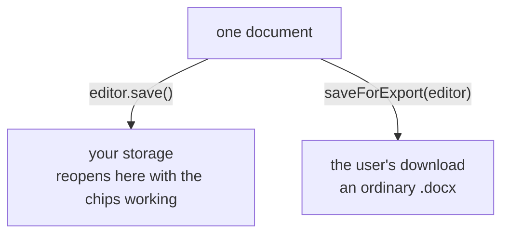

A custom node is an inline node type you define: a citation, a mention, a merge field, a clause reference. It is stored as an inline Word content control (`w:sdt`), so Word opens the document, renders the node's text, and returns it unchanged.

A node stores what it knows in two places:

| Location    | Holds               | Limit                                        |
| ----------- | ------------------- | -------------------------------------------- |
| `w:tag`     | The node's identity | 64 characters, including the prefix and name |
| The payload | Everything else     | 256 KB                                       |

The payload is a customXml data part that the control binds to through `w:dataBinding`. Word preserves both.

Requires the custom-nodes module from [`@docx-editor.dev/pro`](/docs/2.x/pro).

<Callout>
  Custom nodes render fine in Word and Word Online, so `editor.save()` is usually the whole answer.
  Reach for [`saveForExport`](#save-vs-export) only when a recipient should not have the nodes at
  all.
</Callout>

## Define a node

```tsx
import { z } from 'zod';
import { defineCustomNode, customNodesModule } from '@docx-editor.dev/pro';

const CitationData = z.object({
  sourceId: z.string().min(1),
  locator: z.string(),
  authors: z.array(z.string()).max(64),
  year: z.number().int(),
});

const Citation = defineCustomNode({
  name: 'citation',
  tagPrefix: 'docx',
  schema: CitationData,
  text: (data) => `(${data.authors[0]} ${String(data.year)})`,
});

const MODULES = [customNodesModule({ nodes: [Citation] })];
```

`schema` is the shape of the payload: a zod schema, or any [Standard Schema](https://standardschema.dev). Nothing is bundled, bring your own. It does two jobs. A write is rejected before anything reaches the document when the data does not fit, and a read comes back as that type instead of `unknown`. Payloads also arrive from `.docx` files someone else wrote, so it is what stands between that JSON and your code. A schema that validates asynchronously is refused.

`text` turns the payload into the words the document shows. It reads the schema's OUTPUT, so a `.default()` or a `.transform()` has already been applied.

A node can skip `schema` and keep everything in its tag. See [Nodes without a payload](#nodes-without-a-payload).

Modules are read once, when the editor is constructed. Changing the array afterwards has no effect; remount the Root to change them.

### Parameters

Required:

| Parameter   | Type     | Description                                                |
| ----------- | -------- | ---------------------------------------------------------- |
| `name`      | `string` | Node type name. The second segment of the tag.             |
| `tagPrefix` | `string` | The prefix this definition claims. `docx` claims `docx:*`. |

What the node carries and shows:

| Parameter | Type                                                       | Description                                                                                                  |
| --------- | ---------------------------------------------------------- | ------------------------------------------------------------------------------------------------------------ |
| `schema`  | zod (or any [Standard Schema](https://standardschema.dev)) | Shape of the payload. Nothing is bundled; bring your own. A schema that validates asynchronously is refused. |
| `text`    | `(data) => string`                                         | What the document shows, from the payload.                                                                   |

Presentation and interaction:

| Parameter             | Type                                                   | Description                                  |
| --------------------- | ------------------------------------------------------ | -------------------------------------------- |
| `label`               | `string`                                               | Display name for chrome. Defaults to `name`. |
| `chrome.color`        | `string`                                               | Chip tint and border.                        |
| `reviewCard`          | `({ attrs, text, data }) => { title, detail } \| null` | Contributes a sidebar card per node.         |
| `onClick` / `onHover` | `(node: ActivatedCustomNode) => void`                  | Pointer events on the painted chip.          |
| `onEdit`              | `(node: ActivatedCustomNode) => void`                  | The context menu's "Edit \{label}" row.      |

Advanced, skip these until you need them:

| Parameter          | Type                                       | When                                                                                                                                                                        |
| ------------------ | ------------------------------------------ | --------------------------------------------------------------------------------------------------------------------------------------------------------------------------- |
| `preserveOnExport` | `boolean \| 'text'`                        | The node should not travel intact. See [preserveOnExport](#preserveonexport).                                                                                               |
| `tagAttrs`         | `(data) => Record<string, string>`         | A reader without the payload store should still identify the node.                                                                                                          |
| `payloadNamespace` | `string`                                   | You need a specific customXml namespace. Defaults to one from `tagPrefix`. It goes into an XPath prefix declaration, so quotes, angle brackets and ampersands are rejected. |
| `fromDocx`         | `({ attrs, text, data }) => attrs \| null` | The node has **no** schema and keeps its data in the tag, or you need to disown a control by returning `null`.                                                              |

## Render the chips

`CustomNodeChrome` paints the recognized nodes and dispatches interaction. `CustomNodeContextMenu` adds a section on top of the packaged context menu, which is the editing entry point since chips are content-locked by default:

```tsx
import { DocxEditor } from '@docx-editor.dev/react';
import { CustomNodeChrome, CustomNodeContextMenu } from '@docx-editor.dev/pro/react';

export function Editor({ bytes }: { bytes: Uint8Array }) {
  return (
    <DocxEditor.Root document={bytes} modules={MODULES}>
      <DocxEditor.Viewport>
        <DocxEditor.Content />
        <CustomNodeChrome onNodeClick={(node) => openPopover(node)} />
        <DocxEditor.ContextMenu>
          <CustomNodeContextMenu onEditNode={(node) => openEditForm(node)} />
        </DocxEditor.ContextMenu>
      </DocxEditor.Viewport>
    </DocxEditor.Root>
  );
}
```

An activated node gives you `name`, `attrs`, `tag`, `data`, and `rect` (viewport-relative, for anchoring your own popover), plus `nodeId` and `text` when they resolve.

`CustomNodeContextMenu` also takes `onRemoveRefused(node, reason)`. Remove can be refused, by a locked wrapper or a document open for viewing, and without a handler the menu simply closes and leaves the node where it was. Pass one if you have somewhere to show the engine's reason.

## Insert, update, remove

```tsx
import { insertCustomNode, updateCustomNode, removeCustomNode } from '@docx-editor.dev/pro';

const result = insertCustomNode(editor, Citation, {
  data: { sourceId: 'smith-2024', locator: 'p.14', authors: ['Smith, J.'], year: 2024 },
});
if (!result.ok) console.warn(result.reason);
```

| Function                                        | Behavior                                |
| ----------------------------------------------- | --------------------------------------- |
| `insertCustomNode(editor, def, input)`          | Inserts at the caret, or at `input.at`. |
| `updateCustomNode(editor, def, nodeId, update)` | Rewrites in place.                      |
| `removeCustomNode(editor, nodeId)`              | Deletes the node and its payload.       |

Each is one transaction and one undo step, payload included.

### Input

| Field   | Type                                                            | Description                                                                          |
| ------- | --------------------------------------------------------------- | ------------------------------------------------------------------------------------ |
| `data`  | The schema's input type                                         | The payload. Validated before anything is written.                                   |
| `attrs` | `Record<string, string>`                                        | Tag attrs. Derived by `tagAttrs` when declared. Passing it overrides the derivation. |
| `text`  | `string`                                                        | Document text. Derived by `text` when declared. Passing it overrides the derivation. |
| `at`    | `{ paragraphId, offset }`                                       | Insert position. Defaults to the caret. `insertCustomNode` only.                     |
| `lock`  | `false \| 'sdtLocked' \| 'sdtContentLocked' \| 'contentLocked'` | Defaults to `contentLocked`.                                                         |
| `alias` | `string`                                                        | `w:alias`, the title Word shows on the control.                                      |

`updateCustomNode` keeps the payload you do not mention. Pass `data: null` to remove one.

`contentLocked` prevents inline text editing while leaving the node deletable as a unit, in the editor and in Word. A node carrying a payload is uneditable regardless of `lock`: the engine refuses content edits inside a bound control, and so does Word.

### Returns

`{ ok: true, changed: true, nodeId }`, or a refusal.

`nodeId` names the control the write authored. A rewrite replaces the control rather than editing
it, so the id passed to `updateCustomNode` names nothing afterwards. Re-point anything attached to
that node, a card, a selection, your own index, at the returned one:

```tsx
const result = updateCustomNode(editor, Citation, card.nodeId, { data: next });
if (result.ok && result.nodeId) setCard({ ...card, nodeId: result.nodeId });
```

`removeCustomNode` authors no control, so it returns no `nodeId`.

A refusal carries a `code`:

| `code`        | Meaning                                                                                                               |
| ------------- | --------------------------------------------------------------------------------------------------------------------- |
| `invalidArgs` | Fixable by passing something else: a payload past the cap, a tag over 64 characters, an offset outside the paragraph. |
| `unsupported` | A fact about the document: a lock, a protected form, viewing mode.                                                    |
| `notFound`    | No document is mounted, or `updateCustomNode` was given an id no node has.                                            |

A payload the schema rejected also carries `issues`:

```tsx
const result = insertCustomNode(editor, Citation, { data: form });
if (!result.ok) {
  for (const issue of result.issues ?? []) {
    setFieldError(issue.pointer, issue.message); // 'year', 'authors.0'
  }
}
```

| Field     | Type                            | Description                           |
| --------- | ------------------------------- | ------------------------------------- |
| `message` | `string`                        | What the schema said.                 |
| `path`    | `readonly (string \| number)[]` | Route to the field: `['authors', 0]`. |
| `pointer` | `string`                        | The same path joined: `authors.0`.    |

## Read

Inside `text`, `reviewCard` and `fromDocx`, `data` is the schema's output type. Elsewhere it is `unknown`, because those surfaces carry every definition's nodes under one type.

Use `dataOf` to cross that boundary. It narrows a node to this definition and validates its payload against this schema, so you never write a parse at the call site:

```tsx
// Every node in the document, in order, with its payload.
for (const node of customNodesOf(editor)) {
  const citation = Citation.dataOf(node);
  if (citation) index.add(citation.sourceId);
}

// On the chip: click, hover, and the context menu's Edit row.
<CustomNodeChrome onNodeClick={(node) => open(Citation.dataOf(node))} />;

// With ranges, for anchoring UI. Requires the review module.
const cards = editor.getReviewItems().filter((entry) => entry.item.kind === 'custom');
```

`customNodesOf` reads the body and recognizes every definition registered on the editor; pass `{ nodes }` to narrow it. It derives from the document each time it is called. There is no change event, so re-read after an edit rather than holding the array.

A payload with no `schema` comes back as parsed JSON on a null-prototype object, so `hasOwnProperty` and `instanceof Object` do not hold on it.

`Citation.dataOf(node)` returns the schema's output type or `undefined`, for a different definition's node, one with no payload, or one whose payload the schema rejects. A `name` is checked when the object has one and never required, so it also works on your own state:

```ts
const survey = Citation.dataOf(popoverState); // { data } is enough
```

A definition does not need `reviewCard` for this. A node without one is still recognized and still carries its payload; it contributes nothing to the sidebar.

`data` is `undefined` in three cases: the node carries no payload, its binding names a store node the document does not hold, or the payload failed the schema. The last two report through `onDiagnostic`:

```ts
customNodesModule({
  nodes: [Citation],
  onDiagnostic: ({ code, name, nodeId, issues }) => {
    // code: 'payload-invalid' | 'payload-missing'
    console.warn(`${name} ${nodeId}: ${code} — ${issues.join(', ')}`);
  },
});
```

The listener belongs to the editor the module is registered on. Two editors on one page hear only their own documents, and a listener goes when its editor does.

## Save vs export

Most of the time there is nothing to do here. A custom node is an ordinary inline content control: Word and Word Online both render its text, honor the lock, and hand the tag, binding and payload back unchanged. `editor.save()` produces a file that opens correctly for everyone and reopens here with the chips working. Ship that.

Export is for the other case, where the recipient should not have the nodes at all. Internal annotations that must not leave. Markup that means nothing outside your system. Then the file you store and the file they download are different, and that is two calls:

| The file is going to | Call                    | Custom nodes                                  |
| -------------------- | ----------------------- | --------------------------------------------- |
| Your own storage     | `editor.save()`         | Kept, always.                                 |
| Anyone else          | `saveForExport(editor)` | Each definition's `preserveOnExport` decides. |

```ts
import { saveForExport } from '@docx-editor.dev/pro';

// The copy you keep. Reopens here with the chips working.
await storage.put(docId, new Uint8Array(await editor.save()));

// The copy that leaves. Notes removed, citations flattened to their words.
const outgoing = await saveForExport(editor);
if (!outgoing.ok) throw new Error(outgoing.reason);
download(outgoing.bytes);
```



`saveForExport` calls `editor.save()`, then applies every definition registered in `modules`. There is no list to pass and no list to get wrong. Pass `nodes` to narrow it.

Store the saved bytes, not the exported ones. What the export stripped is gone: unwrapped text does not become a node again.

`unwrapped` and `removed` count the controls each policy touched. A refusal returns no bytes, only a `reason`.

### preserveOnExport

`preserveOnExport` is declared on the definition and applied only when you export. `editor.save()` ignores it.

| Value            | The recipient gets                                              | Use for                                                         |
| ---------------- | --------------------------------------------------------------- | --------------------------------------------------------------- |
| `true` (default) | The node, whole. Tag, binding and payload all travel.           | Nodes the recipient is meant to keep working with.              |
| `'text'`         | The words only. The control, binding and payload are unwrapped. | A citation, where the reader needs the text but not the markup. |
| `false`          | Nothing. The node is removed with its content.                  | Internal annotations that must not leave.                       |

The default is `true`, and for most node types it is the right answer: the recipient gets a valid `.docx` that opens anywhere, and the node still works if the file comes back to you. Stripping is the opt-in, per definition:

```ts
const Citation = defineCustomNode({ name: 'citation', /* … */ preserveOnExport: 'text' });
const InternalNote = defineCustomNode({ name: 'note', /* … */ preserveOnExport: false });
const MergeField = defineCustomNode({ name: 'merge' /* … */ }); // true, the default
```

One document can hold nodes with all three settings and each is decided independently. A tag no definition claims is never touched: this applies your own policy to your own markup, it is not a scrub of the document.

Pass `destination` when the choice is made at runtime. `'internal'` returns the saved bytes unchanged, so one code path covers both:

```ts
const copy = await saveForExport(editor, {
  destination: keepOurMarkup ? 'internal' : 'external',
});
```

A node that leaves takes its payload with it, even when other nodes in the same store remain. When the last node for a namespace is gone, both `customXml` parts, both relationships and the content-type override are removed.

Every story is covered, so a chip in a header is treated like a chip in the body.

This removes markup written by this library. It does not touch `docProps/app.xml`, `docProps/core.xml`, comment and revision authors, rsids, or custom document properties. It does not anonymize a document.

### On a server

`saveForExport` needs an editor. Where there is none, `prepareForExport` is the same pipeline over bytes, with the definitions spelled out. It touches no DOM:

```ts
import { prepareForExport } from '@docx-editor.dev/pro';

// A document your backend generated with customNodeXml, stripped before it is sent.
const generated = await renderContract(order);
const outgoing = prepareForExport(generated, [Clause, InternalNote]);
if (!outgoing.ok) throw new Error(outgoing.reason);
await email.attach(outgoing.bytes);
```

List every definition whose nodes might be in the document. **A definition you do not pass is not touched**, and an untouched node travels whole.

`packages/pro/src/__tests__/custom-node-server.test.ts` runs the whole path, author then store then strip, with the DOM globals deleted.

## Server-side authoring

`customNodeXml` builds the same content control as XML, with no editor and no DOM. A node written on a server is recognized identically when the document opens in the editor.

```ts
import { customNodeXml } from '@docx-editor.dev/pro';

const built = customNodeXml(Citation, { sourceId: 'smith-2024' }, '(Smith 2024)', {
  data: { sourceId: 'smith-2024', locator: 'p.14', authors: ['Smith, J.'], year: 2024 },
});
if (built.ok) {
  template.replace('{{citation}}', built.xml);
}
```

`built.store` returns the parts you have to add: both `customXml` parts, both relationships, and the content-type override. All five are required. A control whose binding names a store that is not there is a document Word offers to repair.

`encodeCustomNodeTag` and `decodeCustomNodeTag` are the tag codec if you need to read or write the identity yourself. Tags are capped at `MAX_TAG_LENGTH`.

## Cards in the review sidebar

A definition with `reviewCard` puts one card per node into the review sidebar, anchored at the node's range. `useReviewItem()` scopes host content to the card it is rendered inside, so you can add your own actions to citation cards only:

```tsx
import { DocxEditorReview, useReviewItem } from '@docx-editor.dev/pro/react';

function CitationActions() {
  const item = useReviewItem();
  if (item?.kind !== 'custom') return null;

  return <button onClick={() => openSource(item)}>Open source</button>;
}

<DocxEditorReview>
  <CitationActions />
</DocxEditorReview>;
```

This needs the review module registered alongside the custom-nodes module.

## Word round-trip

A recognized node is an ordinary inline content control. Word renders its text, honors the lock, and preserves the tag, the binding and the payload. A document edited in Word and reopened here is recognized from the same tag. If a Word user edited the text of an unbound node despite the lock, `fromDocx` sees the drift.

A document opened without your definition registered renders the control's content literally, as Word does. Nothing is lost.

A bound control is read-only in Word: Word renders its text from the payload and does not accept typing into it.

## Reference

### Nodes without a payload

A node can skip `schema` and keep everything in the `w:tag`, which Word caps at 64 characters. Then `attrs` is all it has, and `fromDocx` is where you clamp those untrusted strings or return `null` to leave the control literal:

```ts
const Mention = defineCustomNode({
  name: 'mention',
  tagPrefix: 'docx',
  fromDocx: ({ attrs }) => (attrs['userId'] ? attrs : null),
});
```

Writes then pass `attrs` and `text` themselves, since there is no payload to derive from.

`attrs` and `text` reaching `fromDocx` come from the `.docx`, which the sender controls end to end. They are rendered as text, never as markup; do not build URLs or DOM from them without sanitizing. `data` has been validated against `schema`.

### Payload lifecycle

| Event                             | Result                                                                              |
| --------------------------------- | ----------------------------------------------------------------------------------- |
| `removeCustomNode`                | The payload is removed in the same transaction.                                     |
| A control deleted in Word         | Collected on the next open, by reconciling against what the document binds.         |
| `updateCustomNode` with `data`    | Label and payload are written together.                                             |
| `updateCustomNode` without `data` | The payload is carried forward under the new label.                                 |
| A chip cut or copied              | The clipboard carries the chip's text, not the control. Pasting inserts plain text. |

The open-time sweep is not undoable: it collects payloads whose control was already gone when the document arrived.

### On-disk format

`customXml/item1.xml`:

```xml
<docxEditor xmlns="urn:docx-editor.dev:custom-node:docx">
  <node id="cx1">
    <label>(Smith 2024)</label>
    <data>{"sourceId":"smith-2024","locator":"p.14","authors":["Smith, J."],"year":2024}</data>
  </node>
</docxEditor>
```

The control in `word/document.xml` that binds it:

```xml
<w:dataBinding w:prefixMappings="xmlns:ns0='urn:docx-editor.dev:custom-node:docx'"
               w:xpath="/ns0:docxEditor/ns0:node[@id='cx1']/ns0:label"
               w:storeItemID="{...}"/>
```

`w:storeItemID` matches `ds:itemID` in `customXml/itemProps1.xml`. The store is reached through the `customXml` relationship on the story part; that pair is what picks one store out of several.

Node ids are `cx1`, `cx2`, … derived from the store's current contents, so writing the same document twice produces the same bytes. One store per `payloadNamespace`: two definitions sharing a `tagPrefix` share a store.

Payloads are capped at 262,144 UTF-16 code units (`MAX_CUSTOM_NODE_DATA_LENGTH`) on write and on read; labels at 4096 on write. Keys named `__proto__`, `constructor` and `prototype` are stripped from a parsed payload at every depth. A legitimate field with one of those names therefore arrives missing, and a schema requiring it fails with "expected string, received undefined".

## Limits

- No in-place edit dialog. Re-authoring is `updateCustomNode` with a form you supply. The activation carries `nodeId`, `text` and `data` to prefill it.
- A bound node cannot be edited in Word. Making one editable requires a two-way binding, which is not implemented.
- The clipboard carries text only. Cutting a chip and pasting it produces plain text, not a node.

## Next steps

- [Tracked changes](/docs/2.x/pro/tracked-changes)
- [Comments](/docs/2.x/pro/comments)
- [Content controls](/docs/2.x/guides/content-controls): the built-in control surface these build on
- [Runnable example](https://github.com/eigenpal/docx-editor/tree/main/examples/custom-nodes): define, insert, edit, and round-trip a citation with a payload
