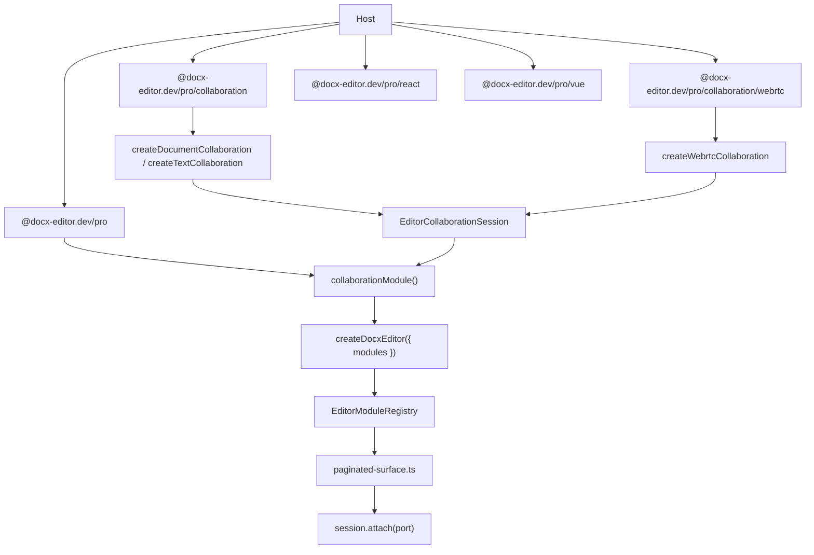

# Design: Pro collaboration module

## Context

Collaboration today is not an `EditorModule`. Hosts pass
`collaboration?: EditorCollaborationSession` on `DocxEditorConfig` in
`packages/core/src/editor/docx-editor-types.ts`. `createDocxEditor` forwards
that session to `mountPaginatedSurface`. Around lines 1281–1287 of
`packages/core/src/editor/paginated-surface.ts` the surface calls
`session.collaborationPort(documentId)` and then `collaboration.attach(port)`.
Undo and redo then call the session, so the Yjs `UndoManager` becomes the undo
authority.

The module seam already exists. `EditorModule` in
`packages/core/src/contracts/modules.ts` is a closed data object with no
lifecycle hooks. `resolveEditorModules` is construction-time only. For
`review`, the first registration wins and later ones are ignored.

`reviewModule(options)` in `packages/pro/src/review/review-module.ts` calls
`rememberLicenseKey(options.licenseKey)` and returns
`{ id: 'review', review: { displayModes, collectReviewItems, revisionItemsOfParagraph } }`.
Licensing is an honor system: `packages/pro/src/license.ts` stores the key,
never validates it, and never touches the network.

The provider-neutral lane `packages/core/src/collaboration/` stays in core. It
is a declared lane in `packages/core/src/__tests__/core-lane-graph.ts` with
`mayImport: ['store']`. That split matches review: vocabulary stays in core,
derivation (here, the Yjs replica) moves to Pro.

`@docx-editor.dev/collaboration-yjs` returns 404 on npm and has no CHANGELOG.
Core's CHANGELOG has no collaboration entry. The surface exists only behind
pending changesets, so this move needs no deprecation shim.

`packages/pro/src/__tests__/package-dependencies.test.ts` currently asserts
that `dependencies` is empty and that `@docx-editor.dev/core` is a peer with a
`~same.minor` range.

## Goals / Non-Goals

**Goals:**

- One Pro install exposes review, custom nodes, and collaboration.
- Hosts enable collaboration the same way they enable review:
  `createDocxEditor({ modules: [collaborationModule({ session })] })`.
- The engine remains provider-neutral. Core still imports no Yjs.
- The engine still resolves to one copy. Core stays a peer of Pro.
- Free-tier editors stay single-user: no attach, local undo, inactive status.

**Non-Goals:**

- Lifecycle hooks on `EditorModule`. The seam stays a data object.
- A deprecation shim for `@docx-editor.dev/collaboration-yjs`.
- Changing replication, presence, journal publish, or the canonical port.
- Server-side license validation or telemetry.
- Moving `packages/core/src/collaboration/` into Pro.

## Decisions

### D1: Collaboration contribution carries the session, not module lifecycle

`EditorModule` stays a plain object. Collaboration still needs `attach`,
`destroy`, status subscriptions, and undo takeover. Those methods already live
on `EditorCollaborationSession`. The contribution stores the session (or a
factory). Core calls the session at the existing surface-mount attach point.

Exact addition to `packages/core/src/contracts/modules.ts`:

```ts
import type { EditorCollaborationSession } from '../collaboration/index.ts';

/**
 * Build one replica when the surface mounts.
 *
 * Core calls this at most once per mount, from the existing attach site in
 * `paginated-surface.ts`. `EditorModule` still has no lifecycle hooks.
 */
export type CollaborationSessionFactory = (documentId: string) => EditorCollaborationSession;

/**
 * What a collaboration module contributes: the replica the surface attaches.
 */
export interface CollaborationModuleContribution {
  /**
   * A ready session, or a factory invoked once at surface mount with the
   * opened package's document id.
   *
   * A ready session is the ordinary path. The host creates the Yjs room, then
   * wraps it with `collaborationModule({ session })`.
   */
  readonly session: EditorCollaborationSession | CollaborationSessionFactory;
}
```

On `EditorModule`:

```ts
  /**
   * Collaboration replica. Absent, the editor stays single-user: local undo
   * stays the authority, and `snapshot().collaborationStatus` is `'inactive'`.
   */
  readonly collaboration?: CollaborationModuleContribution;
```

On `EditorModuleRegistry`:

```ts
  readonly collaboration: CollaborationModuleContribution | null;
```

`resolveEditorModules` uses the review precedent. The first module that
carries `collaboration` wins. Later collaboration contributions are ignored
rather than thrown. A module list assembled from independent sources must not
take the editor down. Silently merging two sessions would leave neither author
able to say which replica attaches.

The import of `EditorCollaborationSession` is type-only. Add
`{ file: 'contracts/modules.ts', to: 'collaboration' }` to
`GRANDFATHERED_TYPE_EDGES` in
`packages/core/src/__tests__/core-lane-imports.test.ts`, next to the existing
store and layout pins for this file. Do not add `collaboration` to
`CORE_LANES.contracts.mayImport`. That array stays empty; the type pin is the
same compile-time exception review already uses.

`collaborationModule()` in `packages/pro/src/collaboration/collaboration-module.ts`:

```ts
export interface CollaborationModuleOptions extends ProLicenseOptions {
  readonly session: EditorCollaborationSession | CollaborationSessionFactory;
}

export function collaborationModule(options: CollaborationModuleOptions): EditorModule {
  rememberLicenseKey(options.licenseKey);
  return {
    id: 'collaboration',
    collaboration: { session: options.session },
  };
}
```

That factory file imports no Yjs. The main `@docx-editor.dev/pro` entry can
re-export it without pulling the CRDT into a review-only bundle.

_Rejected alternatives:_

- Lifecycle hooks (`onAttach` / `onDestroy`) on `EditorModule`. The seam is
  closed and construction-time only. Review does not need hooks. A third
  feature would inherit a plugin system nobody asked for.
- Keep `DocxEditorConfig.collaboration` beside the module. Two enablement
  paths let a host skip `collaborationModule()` and the Pro license header.
- Throw when a second collaboration module registers. Review ignores the
  second so a composed list cannot take the editor down. Collaboration follows
  that rule and says so in `resolveEditorModules`.

### D2: `paginated-surface.ts` attaches from the module, not a bespoke option

Remove `collaboration?: EditorCollaborationSession` from:

- `DocxEditorConfig` in `packages/core/src/editor/docx-editor-types.ts`
- `PaginatedSurfaceOptions` in
  `packages/core/src/editor/paginated-surface-contract.ts`
- React `DocxEditorRoot` and Vue `useDocxEditorRoot` / `DocxEditorRoot`

Add `collaborationModel?: CollaborationModuleContribution` on
`PaginatedSurfaceOptions`, next to `reviewModel`. `createDocxEditor` passes
`modules.collaboration` the same way it already passes `modules.review`.

At the current attach site in `packages/core/src/editor/paginated-surface.ts`
(around lines 1281–1287), resolve the session once:

```ts
const collaborationContribution = options.collaborationModel;
const collaborationSession =
  typeof collaborationContribution?.session === 'function'
    ? collaborationContribution.session(/* opened document id */)
    : collaborationContribution?.session;
```

Then keep today's attach sequence: `session.collaborationPort(documentId)`,
`collaborationSession.attach(port)`, remote-selection subscribe, undo/redo
handover, `gateOperations`, and local-selection publish. Every later read of
`options.collaboration` in that file uses `collaborationSession` instead.

If `collaborationModel` is absent, skip attach. Local history remains the undo
authority (`session.canUndo()` / `session.undo()`). Do not call
`collaborationPort`.

Automation (`packages/core/src/automation/server-host.ts`) and
`@docx-editor.dev/editor-api` use the same module path. They do not keep a
side door that attaches a raw session.

_Rejected alternatives:_

- Resolve the session in `createDocxEditor` and keep passing a session into
  the surface. The surface would still be a bespoke option. The owner asked
  the attach path to gate on the module.
- Leave `PaginatedSurfaceOptions.collaboration` as a testing escape. Tests
  register a stub module, as review tests already do.

### D3: Undo authority handover stays on the session

When a collaboration session is attached, `canUndo` / `canRedo` / `undo` /
`redo` on the surface call the session. The Yjs `UndoManager` is the undo
authority. Core does not import `UndoManager`. The session implementation
owns that object.

When no collaboration module is registered, the canonical store history stays
the undo authority. That is today's single-user path.

`attach` still returns a disposer. The surface calls it on detach, as it does
today. `destroy()` stays host-owned. The host created the room and still
tears it down. Core does not add `destroy` to `EditorModule`.

Flush pending journals on undo, destroy, and page hide stays a session
method. This change does not alter that contract.

### D4: Free-tier refusal and upsell signal

Add `PRO_COLLABORATION_REASON` in
`packages/core/src/editor/opening-editing-mode.ts` next to
`PRO_REVIEW_REASON`:

```ts
export const PRO_COLLABORATION_REASON =
  'realtime collaboration requires the pro collaboration module (@docx-editor.dev/pro)';
```

Collaboration has no document-level markup to scan. `hasReviewContent` can
see `w:ins` / `w:del` / comment refs without a module. A DOCX does not encode
"this file is in a live room" that way.

The always-on detection signal is `snapshot().collaborationStatus`. The field
is `'inactive'` when no collaboration module is registered. It is
version-cached and reference-stable like `hasReviewContent`. A host can
upsell from `'inactive'` without importing Pro.

When a collaboration module is registered, the field is the session's
`status()`: `'initializing' | 'ready' | 'disconnected' | 'error' | 'destroyed'`.

Add `collaborationStatus` to `EditorSnapshot` and to the snapshot equality
table in `packages/core/src/editor/docx-editor-equality.ts` as `'compared'`.
Import `CollaborationStatus` with `import type`. Pin
`{ file: 'contracts/editor.ts', to: 'collaboration' }` in
`GRANDFATHERED_TYPE_EDGES` if that file names the type.

There is no collaboration chrome slot today. `PRO_COLLABORATION_REASON` is
the engine English string tests and any future collab chrome quote. It is
also the reason automation returns if a caller asks to attach a replica
without a registered contribution.

### D5: Packaging topology



Layout:

| Path                                                     | Role                             |
| -------------------------------------------------------- | -------------------------------- |
| `packages/pro/src/collaboration/collaboration-module.ts` | Yjs-free `collaborationModule()` |
| `packages/pro/src/collaboration/*.ts`                    | Moved Yjs implementation         |
| `packages/pro/src/collaboration/webrtc.ts`               | Moved WebRTC wrapper             |
| `packages/pro/src/react/useCollaborationStatus.ts`       | Moved React hook                 |
| `packages/pro/src/vue/useCollaborationStatus.ts`         | Moved Vue composable             |
| `packages/core/src/collaboration/`                       | Unchanged provider-neutral lane  |

`package.json` exports on `@docx-editor.dev/pro`:

- `.` — existing review and custom-nodes surface, plus `collaborationModule`
- `./collaboration` — Yjs session factories and the module factory
- `./collaboration/webrtc` — `createWebrtcCollaboration` and room helpers
- `./react` / `./vue` — existing chrome, plus `useCollaborationStatus`

tsup: add `collaboration/index` and `collaboration/webrtc` to the non-Vue
config in `packages/pro/tsup.config.ts`. Keep `metafile: true` on that
config. Add `yjs`, `y-protocols`, `y-protocols/awareness`, and `y-webrtc` to
`external`. Do not import `./webrtc` from the default collaboration entry.

### D6: Narrowed dependency allowance, not a deleted test

Merging makes Pro stop being a zero-dependency package. That is accepted.

`packages/pro/package.json`:

- `dependencies`: exactly `{ "y-protocols": "^1.0.7" }` (same range as today
  in `@docx-editor.dev/collaboration-yjs`)
- `peerDependencies`: keep core, react, vue, react-dom, vue; add
  `"yjs": "^13.6.32"` and `"y-webrtc": "^10.3.0"`
- `peerDependenciesMeta`: `yjs` and `y-webrtc` are `optional: true`

`yjs` is optional so a review-only install does not pull a CRDT.
`y-webrtc` is optional so a host that uses its own provider does not pull
the signaling client.

`packages/pro/src/__tests__/package-dependencies.test.ts` is narrowed, not
deleted:

1. Keep "the engine is a peer, so the consumer resolves one copy of it".
   `@docx-editor.dev/core` stays a `~same.minor` peer and is never a regular
   dependency.
2. Keep the same assertion for `@docx-editor.dev/react` and
   `@docx-editor.dev/vue`.
3. Replace "there are no runtime dependencies left to nest" with: the only
   `dependencies` key is `y-protocols`.
4. Add: `yjs` and `y-webrtc` are optional peers and never regular
   dependencies. No other package appears in `dependencies`.

The engine-is-peer invariant exists because the engine holds module-level
state: the HarfBuzz shaper and its cache budget, the grapheme boundary
strategy, and layout caches keyed by object identity. Two copies in one tree
do not crash. They load the shaper twice and miss every identity-keyed
cache. A future reader who widens the test to "any dependencies are fine"
would let core nest and recreate that failure.

_Rejected alternatives:_

- Delete `package-dependencies.test.ts`. The one-engine rule would have no
  gate.
- Widen the test to allow any `dependencies`. A later change would add
  `@docx-editor.dev/core` as a regular dependency.
- Keep `@docx-editor.dev/collaboration-yjs` and depend on it from Pro. The
  owner decided on one Pro install.
- Make `yjs` a regular dependency of Pro. Review-only apps would install it.
- Make core a regular dependency now that Pro has other dependencies. That
  reintroduces a second engine copy.

### D7: Licensing and headers

Every new file under `packages/pro/src/collaboration/`,
`packages/pro/src/react/useCollaborationStatus.ts`, and
`packages/pro/src/vue/useCollaborationStatus.ts` carries the Pro copyright
header. `packages/pro/license-check.json` already scans `./src` for `.ts`
and `.tsx`. No glob change is required unless a file type is added.

`collaborationModule` accepts `licenseKey` through `ProLicenseOptions` and
calls `rememberLicenseKey`. A missing or arbitrary key changes no behavior,
emits no warning, and issues no network request.

The standalone package's Apache-2.0 license goes away with the package.
Published collaboration code is `LicenseRef-EigenPal-Pro-Evaluation-1.0`.

### D8: No deprecation shim

The collaboration surface is unreleased. Do not re-export
`@docx-editor.dev/collaboration-yjs`. Do not keep a stub package. Delete
`packages/collaboration-yjs` and `docs/api/docx-editor-collaboration-yjs/`.
Rewrite pending `.changeset/*.md` files so they describe the Pro module.

## Risks / Trade-offs

- [Pro gains a runtime dependency] → Narrow the dependency test to
  `y-protocols` only. Keep core as a peer. Document why in the test file.
- [Main Pro entry accidentally imports Yjs] → Keep `collaborationModule()` in
  a Yjs-free file. Default `./collaboration` must not import `./webrtc`.
- [Two collaboration modules in one `modules` array] → First registration
  wins; later ones are ignored. Same comment as review in
  `resolveEditorModules`.
- [Hosts still pass `collaboration={session}`] → TypeScript fails after the
  prop is removed. Examples and e2e switch to `collaborationModule()`.
- [Lane-graph type import] → Pin a grandfathered type edge. Do not give
  `contracts` a value import of the collaboration lane.
- [API extract against a stale `dist/`] → Run `bun run build:packages`
  before `bun run api:extract`. Extracting a missing collaboration entry
  against old `dist/` deletes other packages' API snapshots.

## Migration Plan

1. Land the core contract and surface gating.
2. Move source into `packages/pro/src/collaboration/` in the same PR.
3. Point examples, e2e, benches, and editor-api at the Pro module.
4. Delete `packages/collaboration-yjs`.
5. Rebuild packages, then extract API snapshots.
6. Rewrite pending changesets.

There is no rollback package on npm. Revert the PR if the move fails gates.

## Open Questions

None. The owner settled merge-into-Pro and moving the adapter hooks. The
session-on-the-contribution shape and the narrowed dependency allowance are
the remaining engineering choices, and this document records them.
