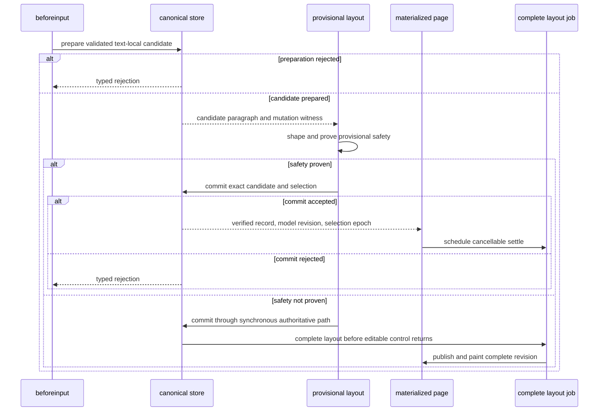

## Context

The current editor already limits detailed DOM materialization and incremental block placement. On the 521-page profiling document, one middle text edit places 11 of 6,540 layout blocks, reuses 517 pages, and materializes four pages. Production Chromium still measures 97.6 ms median from `beforeinput` to the second presentation frame. The corresponding 27-page document measures 16.6 ms.

The remaining cost is revision-wide work around the changed block:

- canonical mutation copies and freezes a wide `w:body` child array;
- index patching and delta validation compare every body child;
- root- or revision-keyed paragraph, review, content-control, note, section, table, drawing, and page indexes rebuild or rescan;
- layout reuses page records but still performs document-wide notes, drawing, revision, and page bookkeeping;
- paint walks every page shell and rebuilds layout-keyed presentation indexes;
- repeated arrays, maps, and layout wrappers create substantial garbage-collection work.

The current input path batches queued characters, commits the canonical tree, runs layout synchronously, publishes a complete `SemanticLayout`, paints, and mirrors selection. Batching improves throughput, but an isolated key still waits for the complete path.

This design must preserve these constraints:

- The canonical tree is the only authored state.
- Every accepted edit commits through validated `TreeDocOp`s.
- Save reads the committed canonical tree only.
- Layout publishes one complete revision or keeps the last complete revision.
- DOM and ProseMirror remain projections.
- Semantic selection and stable text positions remain authoritative.
- Changed attacker-controlled content receives the same validation and escaping rules.
- React, Vue, Pro review, and automation use one engine implementation.

The active `typed-ooxml-paragraph-editor` authority previously used absolute complete-only wording for layout, output, and interaction publication. This change modifies `typed-ooxml-canonical-tree`, `semantic-paragraph-layout`, and `paragraph-editor-binding` to distinguish complete publication from private provisional presentation. Complete `SemanticLayout`, cross-paragraph interaction geometry, review anchors, save authority, and semantic history remain unchanged in authority.

## Goals / Non-Goals

**Goals:**

- Keep warm, text-local canonical mutation independent of total body width.
- Present eligible ordinary typing within one 16.7 ms frame on the reference performance profile.
- Keep complete layout publication atomic and differential-oracle equivalent.
- Preserve exact typed character order, caret position, history, review attribution, save output, and unknown OOXML.
- Move complete-layout settle work off the immediate input frame and make it cancellable and cooperative.
- Reconcile only changed materialized pages and changed presentation indexes.
- Gate the design with deterministic work counters before relying on wall-clock results.
- Keep every public adapter and automation contract compatible.

**Non-Goals:**

- Making DOM, ProseMirror, or a provisional display authoritative.
- Publishing a mixed-revision `SemanticLayout`.
- Weakening XML, package, namespace, relationship, lock, forms, or content validation.
- Using worker layout before font, HarfBuzz, resource, and cache-transfer contracts exist.
- Providing provisional display for every script, object type, or structural operation in the first implementation.
- Changing public save, print, editor, adapter, or package APIs.
- Hiding slow work behind delayed input, dropped input, or stale interaction geometry.
- Replacing structural work gates with hardware-dependent timing gates.

## Decisions

### Decision 1: Separate model, complete layout, and provisional display state

The surface will track three distinct states:

1. `modelRevision`: the latest committed canonical-tree revision.
2. `layoutRevision`: the latest complete, atomically published semantic layout revision.
3. `displayRevision`: the model revision represented by editable document DOM.
4. `provisionalDisplay`: an optional private display patch for a bounded region at `displayRevision`.

`provisionalDisplay` is not a `SemanticLayout`. It is not exposed to layout consumers, page-count readers, print, geometry automation, or adapters. It contains only the committed text, resolved style inputs, provisional line records, DOM ownership evidence, and caret geometry needed for one materialized paragraph or page interval.

One atomic surface transition publishes a committed model revision, its `ModelChange`, mapped model selection, and a monotonic selection epoch. Installed DOM selection carries the same epoch. Native selection evidence from an older epoch is ignored.

The internal snapshot classifies every field by provenance. Document handles, text, formatting derived without geometry, and canonical selection use `modelRevision`. Pages, page count, review geometry, table geometry, and layout-derived selection use `layoutRevision`. Editable DOM uses `displayRevision`. Provisional state never enters a public snapshot. A selector that needs both model and layout data crosses the settle barrier first.

The existing public `revision` remains the model change token. Existing page fields remain tied to complete `layoutRevision`. Internal snapshots carry both revisions so adapters cannot cache an incomplete mixed derivation.

For an accepted editor intent, observable ordering is fixed:

1. The store commits canonical state.
2. The surface maps selection and installs verified provisional or complete DOM.
3. The surface replaces its coherent snapshot.
4. The editor queues public events.
5. The next microtask emits `change`, then `selectionChange`.

Public event handlers always read the completed surface transition. Reentrant editor mutations enqueue after the current transition and receive a later input sequence. Lower-level store subscribers remain store-only observers and cannot assume display completion.

An external store commit immediately suspends document editing and the native caret in its synchronous surface subscription. It restores editing only after `displayRevision` reaches the external `modelRevision`. This prevents editable stale DOM while preserving asynchronous complete layout.

**Alternative considered:** Publish a partially updated `SemanticLayout`.

This would make interaction consumers observe mixed page revisions and would violate current atomic publication rules. The design rejects it.

### Decision 2: Prepare locally, then commit and present

Eligibility and local shaping run against a store-produced candidate paragraph before publication. This preflight cannot mutate canonical state or DOM. It returns a candidate fingerprint, exact local record, and checked geometry proof.

The preflight result includes a private `CandidateChange`: expected predecessor revision, paragraph identity and fingerprint, candidate normalized effects, source layout revision, and every shaping resource fingerprint. Commit is compare-and-swap. Any changed predecessor, paragraph, resource, or layout input discards the candidate and retries or uses the synchronous authoritative path.

Each accepted `beforeinput` intent commits immediately as its own semantic intent and history entry. The same surface transition publishes canonical text and mapped model selection. Only after commit succeeds can output install the precomputed record, and it first verifies the committed paragraph fingerprint. A rejected transaction produces no provisional output.

Presentation and settle work can coalesce across several committed intents. Canonical transactions and history boundaries cannot coalesce.

An ineligible edit retains the current synchronous commit-layout-paint path. A provisional installation failure also completes authoritative presentation synchronously or makes the document surface non-editable until it does. The editor never returns control with editable DOM older than a successful canonical commit.

**Alternative considered:** Draw input-event text before commit.

That can show rejected or unsaved text and makes the display an authored source. The design rejects it.

### Decision 3: Replace wide child-array rebuilding with a bounded-touch canonical sequence

`OoxmlNode.children` remains a public `readonly OoxmlNode[]`. Repeated public reads return the same frozen array for one node, and `Array.isArray(node.children)` remains true. This compatibility contract is not a hot internal storage contract.

High-fanout canonical containers will use one internal persistent child sequence as their authority. `children` becomes a derived, memoized public projection from that sequence. Core lanes cannot read the projection on the typing path. Low-fanout nodes can retain flat internal arrays when counters show no scaling cost.

The sequence must provide:

- stable ordered traversal;
- indexed lookup and replacement;
- immutable snapshots with structural sharing;
- bounded path-copy cost;
- deterministic serialization order;
- cheap prefix, suffix, and changed-chunk identity checks;
- one-way materialization of the compatible frozen public array;
- no mutation of an older revision.

Core store, layout, validation, and serialization lanes will use sequence traversal helpers. The projection cannot become mutation, validation, serialization, or cache authority. A compatibility projection materialization increments a counter and is forbidden during warm typing.

The implementation must first compare a persistent vector, a chunked rope, and a store-owned immutable overlay through the complete transaction. The selected representation must satisfy API extraction, `Array.isArray`, stable projection identity, serialization, memory, and random-operation differential tests. If no representation preserves the public contract, implementation stops and proposes an explicit major API change.

**Alternative considered:** Keep flat arrays and optimize loops.

Every immutable replacement still copies the complete body array. This cannot make mutation independent of body width.

### Decision 4: Carry an internal mutation proof into commit validation

Only sanctioned store mutation primitives can construct an opaque `TreeMutationProof`. Arbitrary replacement roots cannot enter scoped validation. Each primitive emits an exact old-to-new path witness beside `TreeOpEffect`. It identifies:

- the previous and next part roots;
- rebuilt ancestor identities;
- replaced, created, deleted, and moved subtree roots;
- new node identities;
- namespace-context changes;
- package-shell changes;
- the operation impact and dependency keys.

Validation migration has two stages. Flat-array operations first produce operation-owned ancestry, splice-window, identity, namespace, and package-shell evidence. They still use complete fallback where local ancestry checks cannot prove validity.

After sequence selection, each persistent sequence node carries non-security summary metadata for size, identity membership, namespace dependency, and package-shell version. Commit validation checks the local edit witness at every rebuilt sequence node, validates changed nodes and each rebuilt ancestor's local invariants, then reuses prior proof only for object-identical subtrees reached through an unchanged sequence node. It never scans every descendant merely because a high-fanout ancestor was rebuilt.

The validator will avoid a body-wide sibling map. Duplicate identity checks will use the prior validated node index plus created, deleted, and moved identity sets. Namespace changes escalate validation to the complete affected namespace scope. Missing lineage, inconsistent summaries, unsupported proof, or an arbitrary replacement root falls back to complete validation.

Hashes can accelerate comparisons but cannot serve as security evidence. Exact node identity, sequence lineage, and validated path witnesses decide proof reuse.

Text-local replacement of an existing part will skip package relationship and content-type validation only when package structure, relationships, content types, part names, and part membership are unchanged by identity. Any package-shell edit runs complete package invariant checks.

**Alternative considered:** Trust `dirty` node IDs without proof.

An incomplete dirty set could publish malformed content. Sealed mutation primitives and local lineage witnesses make omitted sibling replacement impossible on the scoped path. Differential full validation remains the oracle.

### Decision 5: Make derived indexes persistent revision sidecars

Indexes remain derived and non-authoritative. Baseline profiles first identify aggregates on the eligible typing path. Only a measured document-size cost receives an incremental sidecar. Cold and uncommon reads retain complete rebuilding.

Each immutable tree identity can retain index sidecars that share unchanged entries with the prior tree. Publication revision is provenance, not the cache key. Undo and redo can reuse a sidecar from the restored immutable tree and retag it for the new monotonic publication revision.

`TreeMutationProof` stays private to the store. Published `ModelChange` gains normalized, part-scoped effects for created, deleted, moved, and changed identities, replaced ancestry, package-shell effects, dependency invalidations, and impact. Layout produces `LayoutChangeSet` from actual layout output rather than store guesses.

Store-level indexes patch from `TreeMutationProof` and `ModelChange`:

- node and parent identity;
- paragraph identity and reading order;
- story blocks and section ownership;
- content-control membership and lock ancestry;
- note and field references;
- bookmarks and drawing references;
- review sites, paragraph order, and local review items.

Layout-level indexes patch from page and fragment identity changes:

- paragraph-to-page;
- table, row, and cell placement;
- note references and reserves;
- revision-author slots;
- drawing resource use;
- review geometry ownership;
- page-shell and materialized-page paint state.

Every incremental index has a complete rebuild function. Tests compare both results after randomized operations, undo, redo, split, join, table edits, package edits, and malformed-operation rejection.

History retains sidecars only through bounded weak or tree-owned references. Retained complexity is `O(live index + undoable changes)`, not `O(history × document)`.

**Alternative considered:** Add more root-keyed `WeakMap` caches.

A one-character edit creates a new root and still misses every root-keyed aggregate. Node-local memos remain useful, but aggregate indexes need delta patching.

### Decision 6: Use proof-based provisional eligibility

The first provisional lane covers collapsed, body-story `insertText` operations that meet all conditions:

- The precommit `CandidateChange` predicts `text-local` impact, and the committed `ModelChange` matches it exactly.
- One existing paragraph is dirty, with no created, deleted, moved, split, or joined block.
- The paragraph and its complete prior fragment interval are materialized.
- The paragraph has no unsupported provisional dependency.
- Composition is inactive.
- The insertion does not require a structural review wrapper.
- The local layout function can resolve every style, list, and shaping dependency from stable inputs.
- Candidate grapheme segmentation, glyph IDs, positions, clusters, caret stops, bidirectional levels, visual order, source-to-glyph mapping, and fallback-font identities equal a clean local shape of the candidate.
- The geometry envelope preserves fragment count, page ownership, line breaks, vertical metrics, and flow extent against the previous complete layout.
- The previous complete layout is the direct predecessor of the committed revision, or the existing provisional chain has complete source mapping to it.

The first implementation treats these features as ineligible unless a focused follow-up proves them:

- bidirectional or complex-script reshaping;
- tabs, fields, notes, drawings, inline controls, and page or column breaks;
- comments, tracked changes, or revision display that changes wrapper structure;
- table cells, headers, footers, notes stories, and text boxes;
- paragraph property, list, style, or resource changes;
- deletion, replacement, Enter, join, and other structural input;
- a line-break, line-height, fragment, page, or flow-extent change.

Eligibility must finish before canonical publication and fail closed. Its elapsed time counts in every attempted fast-path sample. An ineligible edit uses the synchronous authoritative path and remains correct.

**Alternative considered:** Paint a glyph overlay from estimated advance widths.

Estimated glyphs can double-paint, break kerning, mishandle graphemes and bidirectional text, and move the caret incorrectly. A locally shaped record with an unchanged geometry proof is narrower but exact.

### Decision 7: Provisional display is a paragraph-local semantic record

The layout lane will expose a DOM-free local function that reshapes one committed paragraph against the exact prior fragment width, style cascade, list marker, font resources, revision display, and shaping configuration.

The result contains source-addressable lines and spans for the dirty paragraph. It also returns exact grapheme, glyph, cluster, caret-stop, bidirectional, fallback-font, and geometry equivalence evidence against the prior complete fragment interval.

The output lane can replace or adopt only that paragraph's DOM inside an already materialized page. It cannot create page shells, change page geometry, move furniture, update page counts, or modify unrelated overlays. The semantic caret uses the provisional line record. The native caret remains suppressed only when provisional geometry is valid.

The provisional DOM is tagged with model revision and source complete-layout revision. The authoritative paint removes the tag and patch in the same task that installs the complete layout.

Review activation, review geometry, table context, object controls, and other layout-derived chrome remain frozen at `layoutRevision` while provisional display exists. Their actions are disabled until a complete latest-revision layout publishes.

### Decision 8: Geometry-dependent operations cross a settle barrier

Plain insertion can continue from model selection and the provisional paragraph. Every geometry operation first captures an intent token containing model revision, selection epoch, and input queue sequence. The surface queues later mutations while settle runs. After latest-revision layout publishes, the operation captures a separate geometry token containing that layout revision and re-hit-tests. It validates the intent token before replay and the geometry token before any resulting commit.

Event handlers that return `void` queue and replay their intent after latest-revision layout publishes. Existing query APIs that already support unavailability return their typed stale result. Print and export await or force completion through their existing asynchronous boundary. A method-by-method matrix must resolve every operation before staged state implementation.

Settle barriers include:

- pointer hit testing and drag selection;
- vertical arrow movement and page navigation;
- table, ruler, drawing, content-control, and review geometry;
- scroll-to-caret and geometry automation;
- print, PDF, screenshot, and paginated export;
- zoom or viewport changes that alter available width;
- switching story scope;
- any structural or property-changing command;
- composition start;
- teardown of a mounted surface.

Save to DOCX does not need layout. It captures one input queue sequence, commits all accepted events through that sequence, excludes later events, and reads the resulting canonical package. Concurrent or reentrant saves at the same sequence share one serialization promise. A save at a later sequence follows it.

IME uses a separate private composition draft anchored to complete latest-revision layout. Intermediate composition text remains outside canonical state, save, layout, history, and automation. `compositionend` commits one semantic intent. Cancellation, blur, detach, or failure removes the draft. Public `Editor.save()` rejects with typed `composition-active` while the draft remains unresolved. Geometry reads return their existing unavailable result.

When composition starts during provisional display, the surface synchronously restores complete latest-revision editable DOM before native composition updates. If it cannot do so, it prevents draft readback, restores canonical DOM, and reports composition cancellation. It never reads composition text from stale painted DOM. This change does not add a hidden asynchronous public contract.

### Decision 9: Make complete settle cooperative and latest-revision-only

After provisional paint, complete layout runs as a cancellable job bound to an immutable `{ packageSnapshot, modelRevision, scope, resourceFingerprints }` input. No continuation reads a later mutable session.

Layout exposes DOM-free resumable iterators. The editor lane injects `now()`, a deadline, `scheduleContinuation()`, cancellation ownership, visibility state, and an optional `isInputPending` hint. Hidden tabs use timer continuations rather than animation frames. Tests inject a deterministic clock and continuation queue. Every long loop checks its deadline; phase boundaries alone are insufficient.

The layout job will separate:

- changed-block preparation and placement;
- convergence checks;
- reused-page remap and finalization;
- note and section bookkeeping;
- drawing and revision index patching;
- page-shell reconciliation planning.

On the reference profile, cooperative slices target 4 ms at p95 and 8 ms maximum. Any non-yielding leaf that breaches 8 ms must be split or excluded from the cooperative lane. The scheduler returns to the browser event loop after every slice and grants at least one settle slice per 50 ms during sustained input. A newer model revision cancels or supersedes older work. Only the newest complete revision can publish.

Job accumulators remain private until publication. Shared cache writes require complete input fingerprints and cannot depend on job liveness. Cancellation checks run before every resumed phase and publication. `finally` releases timers, tasks, animation frames, resource callbacks, temporary sequences, and index builders.

Worker layout remains deferred. The cooperative job preserves current font, HarfBuzz, object-identity, and resource-cache authority on one thread.

**Alternative considered:** Run the current 30 ms settle in one later timer.

That timer still blocks later input and creates visible frame gaps. Deferral without cooperation does not solve interaction latency.

### Decision 10: Reconcile settled output from page and index deltas

Complete layout will use an internal persistent page directory and persistent checkpoint sequence. Both support indexed access, range replacement, cumulative page offsets, and structural sharing without copying every page or checkpoint slot. `SemanticLayout.pages` remains a stable frozen public array projection, but core layout, output, and editor hot paths cannot materialize or scan it.

The layout lane owns an immutable `InternalLayoutRevision` containing model revision, page directory, checkpoint directory, `LayoutChangeSet`, and a lazy public `SemanticLayout` projection. Output receives read-only page accessors plus `LayoutChangeSet`. The editor stores the opaque revision handle and can request public projection. Neither output nor editor can mutate or reconstruct layout directories.

Complete-layout publication will include a `LayoutChangeSet` that identifies:

- changed, created, deleted, remapped, and reused page records;
- changed materialized fragment intervals;
- changed page-shell geometry;
- changed drawing, revision, note, field, and review dependencies;
- changed paragraph-page and table indexes.

Page shells move to normal document flow. Their width and height remain explicit, so unmaterialized shells preserve complete scroll geometry without authored absolute top positions. The page directory supplies semantic cumulative offsets for hit testing and scroll queries. A middle insertion that preserves page sequence changes no later shell style.

`paintSemanticLayout` will preserve unchanged shell and materialized-page DOM. It will scan or rebuild complete-layout resources only when their dependency key changes.

A converged text-local settle must perform `O(log pages + changed pages + changed dependencies)` page-directory and checkpoint work. It cannot copy a complete page array, copy a checkpoint tail, or map every page merely to publish a new revision.

A clean full paint remains the visual and semantic oracle. Differential tests compare DOM-independent paint records, source mappings, and selected serialized DOM attributes.

### Decision 11: Use structural gates and a separate reference latency budget

Continuous integration will gate deterministic counters:

- no wide child sequence materialization for warm text-local mutation;
- no complete node-index or paragraph-index rebuild;
- validation visits only the proved changed scope;
- no package invariant scan for a package-shell-identical text edit;
- no complete-page scan before provisional presentation;
- no complete page-array or checkpoint-tail copy during converged settle;
- page and checkpoint visits bounded by changed intervals plus logarithmic directory work;
- no changed DOM outside the provisional paragraph;
- no stale or mixed layout publication;
- zero dropped, duplicated, or reordered input;
- bounded retained heap after sustained editing.

The repository will also define a reference browser profile for interaction budgets. Shared-runner timing remains informational because CPU scheduling is not stable.

The target reference profile is:

- production Chromium;
- shaped text measurement;
- 1440 × 1000 viewport at 1× scale;
- reduced motion;
- review module and rail enabled;
- the repository-owned 521-page fixture;
- fixed caret position and warm caches.

Every attempted fast-path insertion is timed from trusted `beforeinput`, including eligibility. A sample completes only after the benchmark verifies expected text, caret, model revision, display revision, and source layout revision at the first paint opportunity.

At least 100 isolated samples and 180 unpaced sustained characters run across multiple paragraph lengths, caret positions, style boundaries, and line-edge positions. Eligible insertion must meet 16.7 ms median and 33.4 ms p95. The defined ordinary-typing corpus must achieve at least 80% eligibility before default enablement. Ineligible presentation cannot regress its recorded synchronous baseline by more than 10%.

After 1,000 edits beyond history capacity and three forced collection cycles on the reference profile, retained growth must not exceed the greater of 32 MiB or 10% of opened-document heap. The same run reports authoritative settle latency, cancelled-job buffers, live sequence nodes, sidecar entries, and fallback reasons separately.

## Risks / Trade-offs

- **[Persistent sequence changes a foundational node representation]** → Start with a measured `w:body` prototype, preserve ordered traversal, and require full serialization and random-operation differential oracles.
- **[Compatibility `children` reads materialize a wide array]** → Remove such reads from hot internal lanes, count materializations, and document the compatibility view as a non-hot API.
- **[A mutation proof omits affected structure]** → Seal mutation primitives, verify local sequence lineage, fail closed to complete validation, and fuzz against the oracle.
- **[Provisional eligibility shows incorrect wrap or shaping]** → Require exact local shaping and unchanged geometry proof; reject unsupported scripts and dependencies until proven.
- **[Model revision moves while complete layout remains old]** → Keep provisional state private, tag every display source revision, and settle before geometry-dependent operations.
- **[A long settle repeatedly restarts during typing]** → Coalesce only presentation and settle work, reuse checkpoints, preserve per-intent commits, and guarantee fair idle progress.
- **[Cooperative layout adds overhead to short documents]** → Keep the current synchronous path when no provisional lane is active or measured work fits below the slice budget.
- **[Review or content-control behavior diverges]** → Treat those paragraphs as ineligible first, then add focused local-patch support with exact review and lock tests.
- **[Undo history retains index and sequence graphs]** → Use structural sharing, bounded sidecar retention, heap gates, and explicit cache release on history eviction.
- **[Page-local paint leaves stale resources]** → Dependency-key every global paint resource and compare incremental paint plans with clean full paint.
- **[Timing gates become flaky]** → Gate structural counters in continuous integration and run absolute budgets only on the documented reference profile.
- **[Fast-path restrictions cover too little real typing]** → Record eligibility and refusal counters by reason, then expand only the highest-volume safe classes.

## Migration Plan

1. Add counters, full flame and allocation profiles, scan inventories, and corrected presentation markers.
2. Define revision provenance, per-input history, selection epochs, save linearization, composition drafts, and the complete barrier matrix.
3. Seal mutation primitives and prove scoped validation against complete validation while retaining flat arrays.
4. Define the exact public child-storage compatibility contract.
5. Prototype bounded-touch sequences through the complete transaction and select one from evidence.
6. Add only measured store sidecars and remove remaining warm text-local O(document) store work.
7. Add persistent page and checkpoint directories, `LayoutChangeSet`, and page-local settled paint.
8. Add immutable cooperative jobs, cancellation cleanup, and scheduler fairness.
9. Add local paragraph shaping and exact eligibility proof.
10. Add atomic surface transitions and private provisional state for collapsed insertion only.
11. Expand browser correctness, differential, memory, accessibility, burst, and reference gates.
12. Enable by default only after the full suite, 80% corpus eligibility, zero correctness events, and all performance gates pass.
13. Remove flags after one release cycle without correctness fallback events.

Rollback disables provisional display and returns to synchronous complete layout. The persistent tree and incremental indexes remain only if their full-oracle tests pass independently. No document migration is required.

## Open Questions

- Which persistent sequence wins the complete-transaction prototype while preserving the fixed public array contract?
- Can complete settle reuse a fingerprinted provisional paragraph record without adding a second cache authority?
- Which exact Apple M-series machine and Chromium revision become the maintained reference profile?
